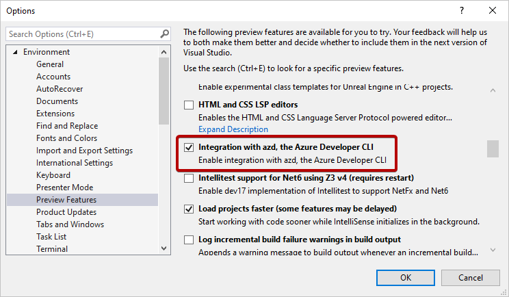

# Debug using Visual Studio

In this article, you learn how to use [Visual Studio](https://code.visualstudio.com/docs) to run and debug apps on your local machine.

## Prerequisites

We'll use the [Todo Application with C# and Azure Cosmos DB API for MongoDB](https://github.com/Azure-Samples/todo-csharp-cosmos-sql) for this tutorial.

By now, you should have your Azure resources provisioned and application deployed. If not, follow the steps in [get-started](get-started.md&pivots=programming-language-csharp). 

## Enable the preview feature

Integration with azd is shippped in version 17.3.0 Preview 2 behind a feature flag. Make sure you enable the preview feature.

1. Open Visual Studio 

1. From the **Tools** menu, select **Options** and then **Preview Features**.

1. Make sure **Integration with azd, the Azure Developer CLI** is enabled

 

## Open the API solution

## Debug an API

The debug configuration **Debug API** automatically runs the API server and attaches the debugger. To test this pattern, do the following steps:

1. From your project's `src/api/src/routes` directory, open `lists.ts`.

1. Set a breakpoint at line 16.

1. In the Activity Bar, select **Run and Debug**, the **Debug API** debug configuration, and the **Start Debugging** arrow.

    

1. From the **View** menu, select **Debug Console**.

1. Wait for the message indicating the debugger is listening on port 3100.

    

1. In your preferred terminal shell, enter the following command: `curl http://localhost:3100/lists`

    

1. When the breakpoint you set earlier is hit, app execution will pause. At this point, you can do standard debugging tasks such inspect variables, look at the call stack, and set additional breakpoints. Press &lt;F5> to continue running the app. The sample app returns an empty list.

