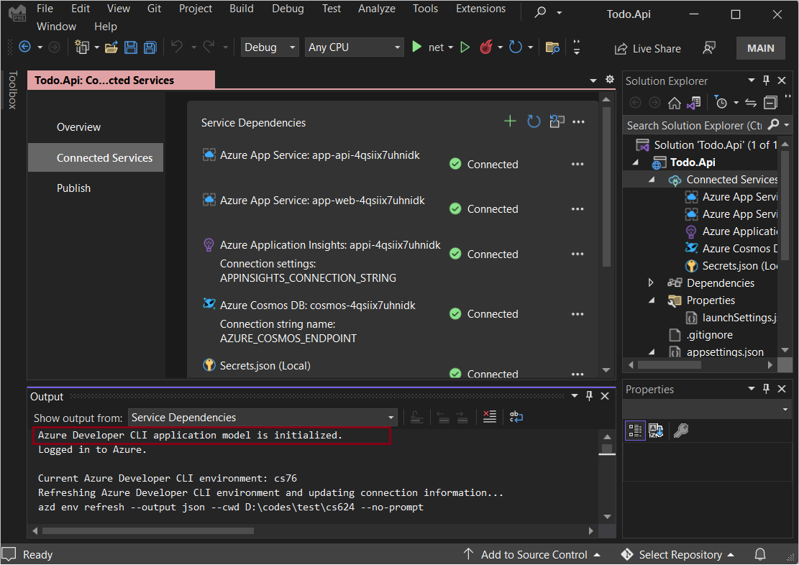

In this article, you learn how to use [Visual Studio](/visualstudio/azure) to run and debug apps on your local machine that were built with Azure Developer CLI (azd) Preview.

## Prerequisites

We'll use the [Todo Application with C# and Azure Cosmos DB API for MongoDB](https://github.com/Azure-Samples/todo-csharp-cosmos-sql) for this tutorial.

By now, you should have your Azure resources provisioned and application deployed. If not, follow the steps in [Get started](../get-started.md?tabs=bare-metal%2Cwindows&pivots=programming-language-csharp) and then return to this article.

## Enable the preview feature

Integration with azd is shipped in version 17.3.0 Preview 2 behind a feature flag. Make sure you have a version later than 17.3.0 Preview 2 and enable the preview feature before you proceed further.

1. Open Visual Studio.

1. From the **Tools** menu, select **Options** and then **Preview Features**.

1. Make sure **Integration with azd, the Azure Developer CLI** is enabled

    

## Open the API solution

1. Open the `Todo.Api.sln` solution in the `/src/api` directory. If you've enabled the azd integration feature, the `azure.yaml` file is detected. At this point, Visual Studio automatically initializes the application model and runs `azd env refresh`.

1. Double-click **Connected Services** to see all the dependencies. Even though the web front-end running on Azure App Service isn't part of the API solution, it's detected and included under **Service Dependencies**

    

## Run and debug

1. From your project's `src/api` directory, open `ListController.cs`.

1. Set a breakpoint at line 20.
    
    

1. Press `<F5>`.

1. Wait for the message indicating the web server is listening on port 3101.

    

1. In your preferred browser, enter the following address: `https://localhost:3101/lists`

1. When the breakpoint you set earlier is hit, app execution will pause. At this point, you can do standard debugging tasks such inspect variables, look at the call stack, and set additional breakpoints. Press `<F5>` to continue running the app. The sample app returns a list (or an empty list [] if you haven't launched the web front-end before.)

    ```
    [{"id":"fb9c1cb3811349b993421fc0e815c4c1","name":"My List","description":null,"createdDate":"2022-06-27T01:10:16.7721172+00:00","updatedDate":null}]
    ```

## Other azd integration

### Manage azd environment

To manage the azd environment, select **...** in the upper-right corner of the **Service Dependencies** pane, and then select one of the following options in the dropdown menu:

- Create a new environment
- Select and set a specific environment as the current active environment
- Deprovision an environment


### Provision environment resources

You can provision Azure resources to your environment.

1. In **Connected Services**

1. Click the icon at the top right to restore/provision environment resources.

    

1. Confirm the environment name, subscription and location.

### Publish your app

If you make any updates, you can publish your app by doing the following steps:

1. In the Solution Explorer, double click **Connected Services**.

1. Select **Publish**.

1. Select **Add a publish profile**.

1. Select a **Target** of **Azure**, and select **Next**.

1. Select **Azure Developer CLI Environment**, and select **Next**.

    

1. Select the environment.

1. Select **Finish**.

## Additional resources

* [Visual Studio Connected Service](/visualstudio/azure/overview-connected-services)
* [Overview of Publish Tool in Visual Studio](/visualstudio/deployment/publish-overview)
