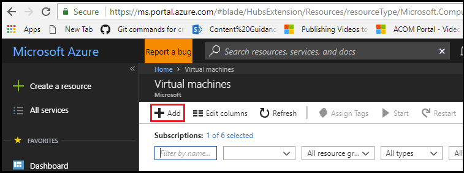
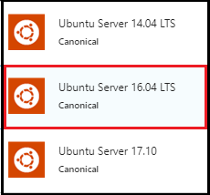
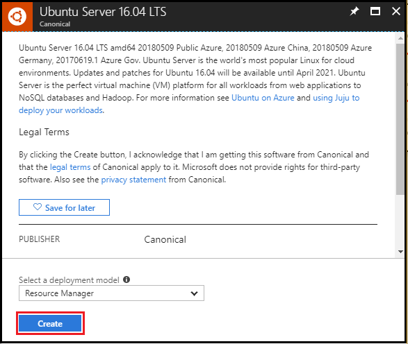
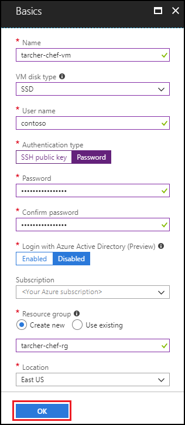
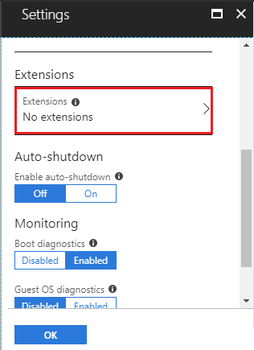
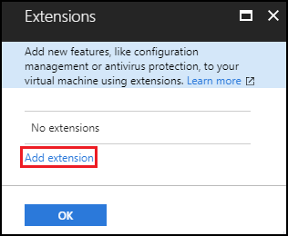
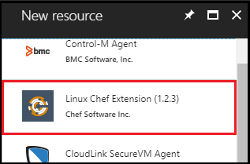
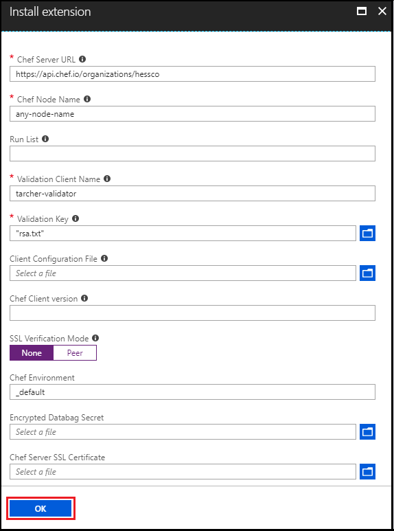
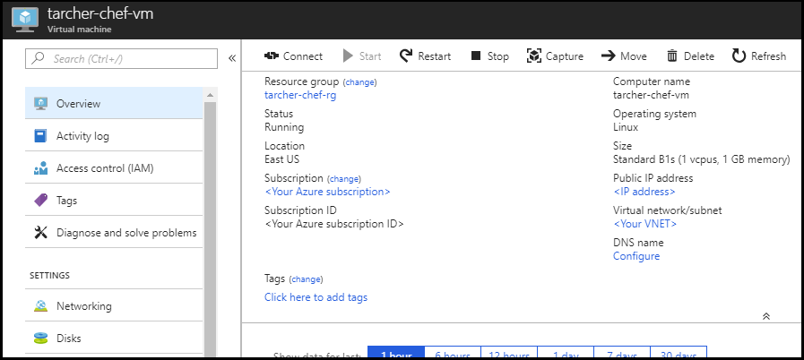

# Install the Chef client from the Azure portal
You can add the Chef client extension directly onto a Linux or Windows machine from the Azure portal. This article walks you through the process using a new Linux virtual machine.

## Prerequisites

- **Azure subscription**: If you don't have an Azure subscription, create a [free account](https://azure.microsoft.com/free/?ref=microsoft.com&utm_source=microsoft.com&utm_medium=docs&utm_campaign=visualstudio) before you begin.

- **Chef**: If you don't have an active Chef account, sign up for a [free trial of Hosted Chef](https://manage.chef.io/signup). To follow along with the instructions in this article, you'll need the following values from your Chef account:
  - organization_validation key
  - rb
  - run_list

## Configure a new virtual machine with Chef

In this section, you'll first use the Azure portal to create a Linux machine. During the process, you'll also see how to install the Chef extension on the new virtual machine.

1. Browse to the [Azure portal](https://portal.azure.com).

1. From the menu on the left, select the **Virtual machines** option. If the **Virtual machines** option is not present, select **All services** and then select **Virtual machines**.

1. On the **Virtual machines** tab, select **Add**.

    

1. On the **Compute** tab, select the desired operating system. For this demo, **Ubuntu Server** is selected.

1. On the **Ubuntu Server** tab, select **Ubuntu Server 16.04 LTS**.

    

1. On the **Ubuntu Server 16.04 LTS** tab, select **Create**.

    

1. On the **Create virtual machine** tab, select **Basics**.

1. On the **Basics** tab, specify the following values, and then select **OK**.

   - **Name** - Enter a name for the new virtual machine.
   - **VM disk type** - Specify either **SSD** or **HDD** for the storage disk type. For more information about virtual machine disk types on Azure, see the article     [Select a disk type](/azure/virtual-machines/windows/disks-types).
   - **User name** - Enter a user name that is granted administrator privileges on the virtual machine.
   - **Authentication type** - Select **Password**. You can also select **SSH public key**, and supply an SSH public key value. For purposes of this demo (and in the screenshots), **Password** is selected.
   - **Password** and **Confirm password** - Enter a password for the user.
   - **Log in with Azure Active Directory** - Select **Disabled**.
   - **Subscription** - Select the desired Azure subscription, if you have more than one.
   - **Resource group** - Enter a name for your resource group.
   - **Location** - Select **East US**.

     

1. On the **Choose a size** tab, select the size for the virtual machine, and then select **Select**.

1. On the **Settings** tab, most of the values will be populated for you based on the values you selected in the previous tabs. Select **Extensions**.

     

1. On the **Extensions** tab, select **Add extension**.

     

1. On the **New resource** tab, select **Linux Chef Extension (1.2.3)**.

     

1. On the **Linux Chef Extension** tab, select **Create**.

1. On the **Install extension** tab, specify the following values, and then select **OK**.

    - **Chef Server URL** - Enter the Chef Server URL that includes the organization name, for example, *https://api.chef.io/organization/mycompany*.
    - **Chef Node name** - Enter the Chef Node name.
    - **Run list** - Enter the Chef run list that is added to the machine. This value can be left blank.
    - **Validation client name** - Enter the Chef Validation Client Name. for example, `tarcher-validator`.
    - **Validation Key** - Select a file containing the validation key used when bootstrapping your machines.
    - **Client configuration file** - Select a configuration file for chef-client. This value can be left blank.
    - **Chef Client version** - Enter the version of the chef client to install. This value can be left blank, which installs the latest version.
    - **SSL Verification Mode** - Select either **None** or **Peer**. *None* was selected for the demo.
    - **Chef Environment** - Enter the Chef environment this node should be a member of. This value can be left blank.
    - **Encrypted data bag secret** - Select a file containing the secret for the encrypted data bag this machine needs to access. This value can be left blank.
    - **Chef Server SSL certificate** - Select the SSL certificate assigned to your Chef Server. This value can be left blank.

      

1. When the **Extensions** tab displays, select **OK**.

1. When the **Settings** tab displays, select **OK**.

1. When the **Create** tab displays, you see a summary of the options you selected and entered. Verify the information as well as the **Terms of use**, and select **Create**.

When the process of creating and deploying the virtual machine with the Chef Extension is complete, a notification indicates the success or failure of the operation. In addition, the resource page for the new virtual machine automatically opens in the Azure portal once it's been created.

## Next steps

> [!div class="nextstepaction"] 
> [Create a Windows virtual machine on Azure using Chef](windows-vm-configure.md)