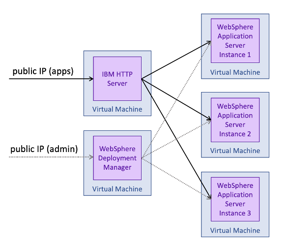
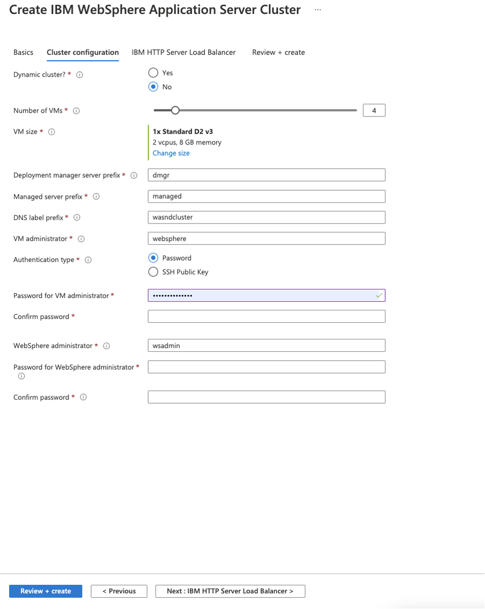
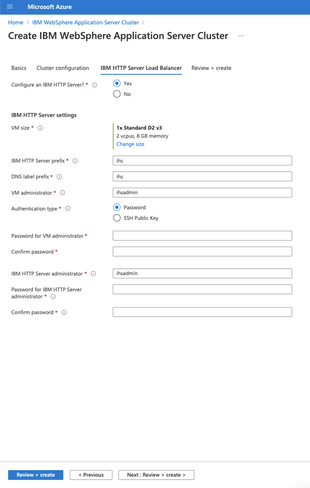
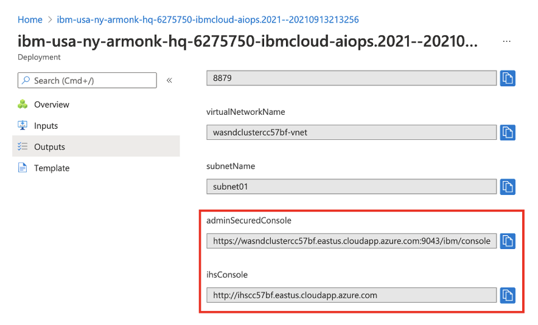
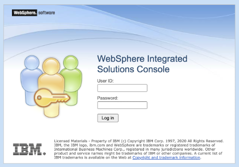
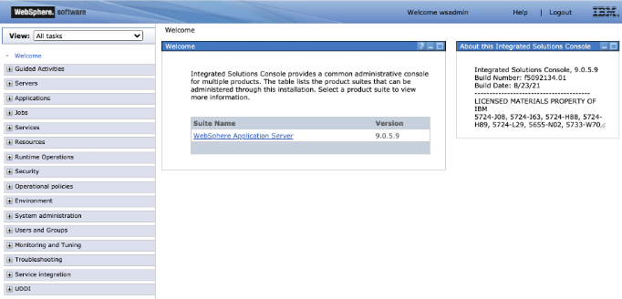
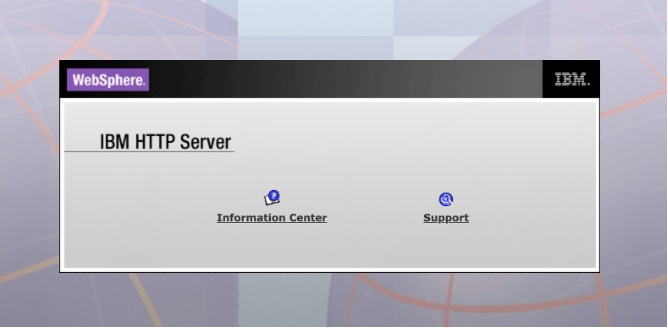
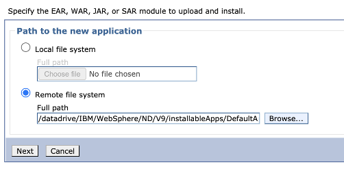
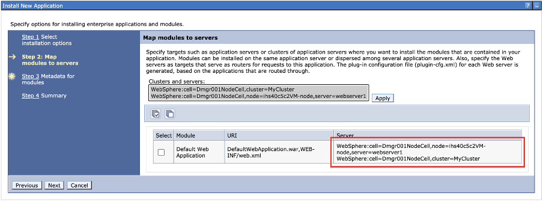

# Deploying WebSphere Application Server (traditional) with High Availability on Azure Virtual Machines

WebSphere Application Server (traditional) Cluster deployment on Azure Virtual Machines is now available through the Microsoft Azure Marketplace: This means that you are now able to quickly and easily provision all the Azure resources necessary to stand up a WebSphere Application Server (traditional) Cluster on Azure Virtual Machines. The automatically provisioned resources include virtual network, storage, network security group, Linux, Java, WebSphere, and IBM HTTP Server (IHS) load balancer.

This article demonstrates how to quickly deploy a cluster of WebSphere Application Server (WAS) instances on Azure Virtual Machines (VMs). You can visit [Microsoft docs](../ee/websphere-family.md) to find out more about this capability and also options for deploying WebSphere Liberty and Open Liberty to Azure Red Hat OpenShift and Azure Kubernetes Service.

## Provisioning a Cluster

You access the WAS cluster option from the [Azure Marketplace](https://azuremarketplace.microsoft.com/) [here](https://aka.ms/websphere-on-azure). This page provides more information regarding the offer and also a video tutorial on how to set up and access the VMs. You’ll need an Azure subscription and an IBM ID that has WebSphere Application Server entitlements associated with it.

When you’re ready to get started, select **Get It Now**. You’ll need to sign in with your Azure account and review and accept the Microsoft terms. You will then be taken to the deployment page.

The **IBM WebSphere Application Server Cluster** deployment page is where you’ll kick off the creating your deployment. By default, the deployment will consist of the following VMs:

* One Deployment Manager instances for managing the applications and application servers.
* One IBM HTTP Server instances for managing load balancing (if you answer “yes” to “Configure an IBM HTTP Server”).
* One or more WebSphere Application Server instances (nodes) for running your applications (defaults to 3 for High Availability).

Each of these VMs is automatically setup with the necessary networking and storage to support the deployment.

To begin defining your deployment, select **Create**.

This will take you to the **Create IBM WebSphere Application Server Cluster** page where you start configuring the deployment.

Each field typically has an information icon which gives you more help with filling it out. The offer is Bring-Your-Own-License (BYOL) and so requires you to have purchased entitlements to WAS. Your entitlement is checked during installation into the VMs. You must provide an IBM ID which is associated with the entitlements. If the ID you provided does not have entitlements, then the deployment will fail to install WAS and you will see error messages that include this text: `The provided IBM ID does not have entitlement to install WebSphere Application Server.`

Once you’ve completed this configuration, select **Next: Cluster configuration**.

This next page lets you configure the virtual machines and WebSphere Application Server cluster. The version of WebSphere which will be installed is the latest along with the most recent fixes to ensure your deployment is up-to-date.

When specifying the cluster configuration, you have the option of creating a Dynamic Cluster which is a server cluster that uses weights and workload management to balance the workloads of its cluster members dynamically, based on performance information that is collected from the cluster members. Stick with the default Static Cluster option for this exercise. Once all the information is filled out, select **Next: IBM HTTP Server Load Balancer**.

This next page gives you the option to deploy the **IBM HTTP Server (IHS) load balancer** into its own VM. IHS is the web server front-end for the cluster of application servers. It receives requests and routes then to one of the server instances. This allows you to have more than one instance of the application processing requests. The benefits of using IHS are that your deployment can scale to higher workloads and be resilient to failures (aka being Highly Available). Without IHS, you will have to set up your own load balancing across your cluster and

Complete the configuration for IHS and select **Review + create**. This will take you to a summary of the deployment and validate that you have completed the configuration. Fix any configuration problems and select **Create** to start the deployment. You will be taken to a page where you can view the progress of the deployment.

The deployment usually takes around 20 minutes.

## Accessing the WAS Administrative Console and IHS Console

Once the cluster deployment has successfully completed, select the **Outputs** section on the left panel to see the admin console and IHS console URLs, along with other details.

Use the copy icon to copy these URLs and paste them into browser address bars.

Once the Administrative Console page has loaded you should see the login page.

Log in using the WebSphere admin credentials you provided when setting up the **Cluster configuration**. After logging in, you will see the following **WebSphere Administrative console** page.

Once the IHS console has loaded, you should see the following page:

## Trying out an Application

Follow these instructions if you’d like to try out an application in the cluster.

1. In the Admin Console, which you logged into earlier, choose **Applications > New Application** and then select **New Enterprise Application**.

2. On the next panel, choose **Remote file system** and select **Browse…**. This will present you with the option to browse the file systems of your installed servers.

3. Choose the system that begins with **Dmgr** and this will take you to the Deployment Manager’s file system. From there, select **V9** and then **installableApps**. In that directory you should see many applications available to install. Select **DefaultApplication.ear** and then select **OK**.

You will be taken back to the page for selecting the application and it should look like this:

Select **Next** and then **Next** to go with the **Fast Path** deployment process.

In the Fast Path wizard, you’ll go with the defaults for everything except **Step 2: map modules to servers**. On that page you need to select the **check box** for the **Default Web Application Module** then **Ctrl-Select** the options under **Clusters and servers** and finally you need to select **Apply**.

You should see new entries under **Server** in the table that look as follows

Once you’ve completed all the steps, you can select **Finish** and then **Save** on the next page.

Next you need to start the application. Go to **Applications > All Applications**. Select the **check box** for **DefaultApplication.ear**, ensure the **Action** is set to **Start**, and select **Submit Action**.

You should see messages that look similar to this. If you see errors, it may be that you were too quick and the app and config have not reached the nodes yet.

You’re now ready to try the app. Point your browser at the DNS name of the IHS deployment and add `/snoop`. You should see information about the server instance that processed the request.

Refreshing the browser will cycle through the server instances using the `round robin` load-balancing policy (the default for the Static Cluster deployment).

## Conclusion and Next Steps

To deploy a WebSphere Application Server (traditional) cluster to Azure Virtual Machines is now easier than ever. All the pain of spinning up VMs, configuring networking, storage, and more are taken care of for you and follow best practices, meaning you can focus on managing your application deployments.

This offering is just the start of the IBM and Microsoft collaboration around WebSphere and Liberty on Azure. Expect to see more Azure Marketplace offers to appear for Liberty in the not-too-distant future.

If you’re interested in keeping up to date with latest developments, visit the [**Contact Me**](https://ibm.biz/WASAzureContactMe) offer and register to be notified when new offers are made available. Also feel free to review and provide feedback on the [offering](https://aka.ms/websphere-on-vms-review).
