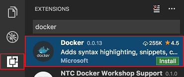
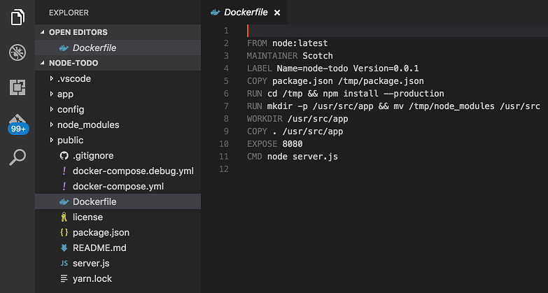
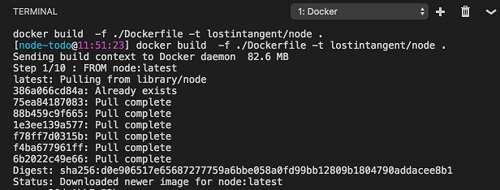

# Create a container image from your local JavaScript project

Running a JavaScript app in a container allows you to deploy a consistent experience for your web app users. Because Docker presents a steep-learning curve, Visual Studio Code provides an extension that simplifies common Docker tasks.

This article includes information for managing your containers with the Docker extension. Alternately, you can use Visual Studio Code to manage your container from [DevContainers](https://code.visualstudio.com/docs/remote/containers-tutorial).

## Prepare your environment 

[Docker](https://www.docker.com/) must be installed and running. Verify this with the following command:

```bash
docker system info
```

This command returns an error if Docker isn't installed and running. If Docker is running, it returns version and configuration information.

```text
Client:
 Context:    default
 Debug Mode: false
 Plugins:
  buildx: Build with BuildKit (Docker Inc., v0.6.3)
  compose: Docker Compose (Docker Inc., v2.1.1)
  scan: Docker Scan (Docker Inc., 0.9.0)

... removed for brevity
``` 


## Create a container

1. Open Visual Studio to an existing JavaScript project. 
1. In the activity bar, select the **Extensions** icon, then search for `docker`, and select the **Docker** [extension](https://marketplace.visualstudio.com/items?itemName=ms-azuretools.vscode-docker).
1. Install the Docker extension, then reload Visual Studio Code.

    

    The Docker extension for Visual Studio Code includes a command for generating a *Dockerfile* and the *docker-compose.yml* file for an existing project.

1. Select the Docker icon in the activity bar, then view the Docker containers in the sidebar.

    :::image type="content" source="../../media/howto-containerize-local-project/docker-extension-activity-bar-side-bar.png" alt-text="Search for `git branch` and select `Git: Create Branch`.":::

## View available Docker commands

To see the available Docker commands, display the command palette (**F1**) and type `docker`.


## Create a Dockerfile in your project

1. If you use source control, such as **git**, make sure you have no other changes. This helps see what files are created for you.

1. Select **Docker: Add docker files to workspace** with the settings for your project. 

    These settings are common for a Node.js project:

    |Setting|Value|
    |--|--|
    |Application platform|Node.js|
    |Package.json|package.json|
    |Port to expose|8080 - or the autodectected value|
    |Include optional docker files (.dockerignore) |yes|

    

    The Docker command generates a complete *Dockerfile* and Docker-compose files that you can begin using immediately.

## Build image from your project

1. Select **F1**, enter `dockerb` at the command palette, and select the **Docker: Build Image** command. 
1. Choose the *Dockerfile* that you just generated. 
1. If your package.json has a name property, that is used as your container's image name. 
    If you don't have a package.json, specify a tag with the format of `ALIAS/IMAGE-NAME` where ALIAS is your Docker alias and IMAGE-NAME is the name for your project's image. An example tag is `diberry/express-web-app`. 
1. Select **Enter** to launch the integrated terminal window that displays the output of your Docker image being built.

    

    The command automated the process of running `docker build` for you.

1. Select the Docker icon in the activity bar, then select **Images** to see the new image in the images list. 
    
    You may also notice other new images in the list. Docker pulls down the image your container is based on.  

## Run local container project

1. Select the Docker icon from the activity bar.
1. Right-click the image name from the list of **Images**, and select **Run**.

    :::image type="content" source="../../media/howto-containerize-local-project/docker-extension-running-container-visual-studio-code.png" alt-text="Right-click the image name from the list of Images, and select Run..":::

## Push local container image to DockerHub

The image needs to be available from a registry in order to create an Azure web app from the image. The image can be publicly available in a community registry or in a private registry accessed with authentication like [Azure Container Registry](/azure/container-registry/). 

To push the image, make sure you have already authenticated with DockerHub by running `docker login` from the CLI and entering your account credentials.

1. In Visual Studio Code, bring up the command palette with F1.
1. Enter `dockerpush`, and select the `Docker: Push` command. 
1. Select the image tag that you just built (for example, `diberry/express-web-app`, and press **Enter**. 
1. The command automates the calling of `docker push` and displays the output in the integrated terminal.

## Push local container image to Azure Container Registry

Read the steps to [authenticate and push to your own Azure Container Registry](../with-azure-cli/create-container-registry-resource.md).

## Next steps

* [Create Azure Container Registry resource](../with-azure-cli/create-container-registry-resource.md)
* Learn how to use [DevContainers](https://code.visualstudio.com/docs/remote/containers-tutorial)