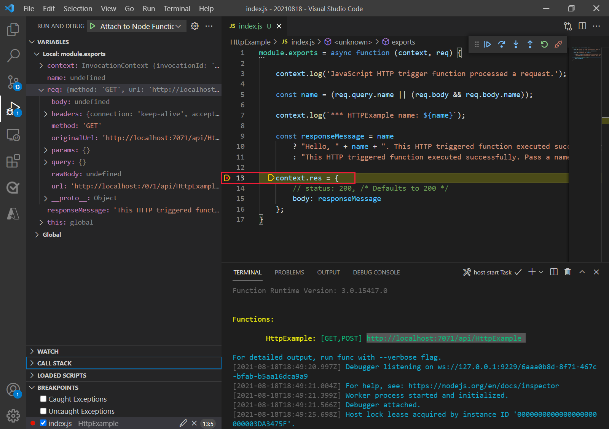

# Test the function locally

[Previous step: Create the Functions app](tutorial-vscode-serverless-node-02.md)

In this step, you run the Azure Functions project locally to test it before deploying to Azure.

When you created the Functions app, the Azure Functions extension automatically added a VS Code launch configuration to your project, which is found in the *.vscode/launch.json* file. This configuration uses the same runtime that runs on Azure, so you can be sure that your source code works before deploying to the cloud.

1. In Visual Studio Code, press **F5** (or use the **Debug** > **Start Debugging** menu command) to launch the debugger and attach to the Azure Functions host. (This command automatically uses the single debug configuration that Azure Functions created.)

1. Output from the Functions Core tools appears in the VS Code **Terminal** panel. Once the host has started, **Alt**+click the local URL shown in the output to open the browser and run the function:

    

1. The code created by the default HTTP trigger template parses a `name` query parameter to customize the response. In your browser, add `?name=<yourname>` to the URL in your browser to see the response output correctly:

    

1. With your function running locally, you can set breakpoints on different parts of the code. (To learn more about breakpoints and debugging in VS Code, see [Debugging](https://code.visualstudio.com/docs/editor/debugging).) Open *index.js*, then click in the margin to the left of line 11 in the editor window. A small red dot appears to indicate a breakpoint. Now remove the `?name=` argument from the URL in the browser. When the browser makes that request, VS Code stops the function code on that breakpoint:

    

> [!Note]
>
> If you encounter an execution policy error in this process, try uninstalling `azure-functions-core-tools@3` with npm, then reinstall the package using Chocolatey in an elevated terminal.

> [!div class="nextstepaction"]
> [I ran the Function app locally](tutorial-vscode-serverless-node-04.md) [I ran into an issue](https://www.research.net/r/PWZWZ52?tutorial=node-deployment-azurefunctions&step=run-app)
