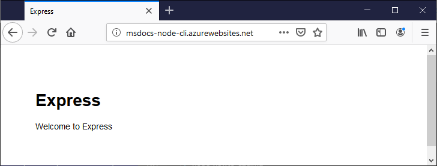

# 4. Deploy the app to App Service

In this step, you deploy your Node.js app code to Azure App Service using a basic process of pushing your local Git repository to Azure.

## Initialize local Git repository

To initialize a local Git repository and make an initial commit, at a terminal or command prompt, run the following command. 

```bash
git init && \
git add -A && \
git commit -m "Initial Commit"
```

## Configure new deployment user and password

1. Create a new user name and password to use in the next step. This user name and password is new and isn't your Azure user name and password. It is created specifically for authorizing deployments to this web app.

1. To [set the user-level deployment credentials with Azure CLI](/azure/app-service/deploy-configure-credentials), run the following command. Replace `username` and `password` with credentials you created in the previous step. 

    ```azurecli
    az webapp deployment user set --user-name <username> --password <password>
    ```

    If your password doesn't meet your Tenant's password requirements, create a password that does and retry the command.

## Get Azure App service endpoint for Git

To [retrieve the Git endpoint with Azure CLI](/cli/azure/webapp/deployment/source) to which we want to push the app code, run the following command. Replace `<your_app_name>` with the name you used when creating the App Service in the previous step:

```azurecli
az webapp deployment source config-local-git --name <your_app_name>
```

The output from the command is similar to the following:

<pre>
{
    "url": "https://username@msdocs-node-cli.scm.azurewebsites.net/msdocs-node-cli.git"
}
</pre>

## Create local Git remote to push to Azure

To set a new remote in Git named `azure`, run the following comman, replacing `REPLACE-WITH-URL-FROM-PREVIOUS-STEP` with your URL from the previous step. 

```bash
git remote add azure REPLACE-WITH-URL-FROM-PREVIOUS-STEP
```

## Make change and deploy to Azure App service from local Git

1. Change the Welcome message, in `./public/client.html`, to `Welcome 2 Express`.

1. Commit the change with the following git command:

    ```bash
    git add . && git commit -m "change the message"
    ```

1. To deploy the app code from the Git repository to the App Service, run the following command. The command prompts you for your credentials:

    ```bash
    git push azure main:master
    ```

    This command pushes the local `main` branch to the Azure `master` branch.  

1. If you are asked for your newly created credential username and password, enter those to allow the process to complete. 

1. As the command runs, it displays a series of messages from the Azure remote host. When the process is complete, refresh the browser in which you have the app's URL open to see the running code:

    

## Next steps

* [Stream logs](tutorial-vscode-azure-cli-node-05.md)
