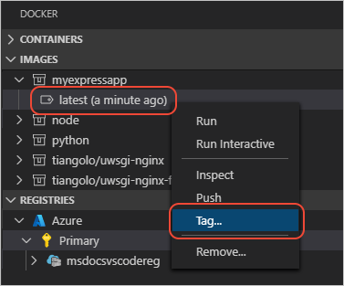
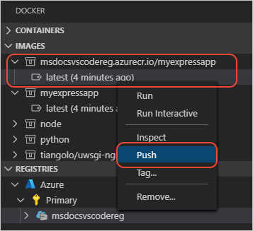
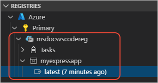

# Create your Node.js application image

[Previous step: Create and run a local Node.js app](tutorial-vscode-docker-node-03.md)

## Add Docker files

1. In Visual Studio Code, open the **Command Palette** (**F1**), type `add docker files to workspace`, then select the **Docker: Add Docker files to workspace** command.

1. When prompted, select **Node.js** for the application type, answer **No** for Docker compose files, then select the port on which your application listens (should be 3000).

1. The command creates a `Dockerfile` along with some configuration files for Docker compose and a `.dockerignore`.

## Build a Docker image

The `Dockerfile` describes the environment for your app including the location of the source files and the command to start the app within a container.

1. Open the **Command Palette** (**F1**) and run **Docker Images: Build Image** to build the image. VS Code uses the Dockerfile in the current folder and gives the image the same name as the current folder.

1. Once completed, the **Terminal** panel of Visual Studio Code opens to run the `docker build` command. The output also shows each step, or layer, that makes up the app environment.

1. Once built, the image appears in the **DOCKER** explorer under **Images**.

    

## Push the image to a registry

1. To push the image to a registry, you must first tag it with the registry name. In the **DOCKER** explorer, right-click the **latest** image.

    

1. In the prompt that follows, complete the tags and press **Enter**.

    By convention, tagging uses the following format:

    `[registry or username]/[image name]:[tag]`

    If you're using the Azure Container Registry, your image name would be similar to the following:

    `msdocsvscodereg.azurecr.io/myexpressapp:latest`

    If you are using Docker Hub, use your Docker Hub username. For example:

    `fiveisprime/myexpressapp:latest`

1. The newly-tagged image appears now in a node under **Images** that includes the registry name. Expand that node, right-click **latest**, and select **Push**.

    

1. The **Terminal** panel shows the `docker push` commands used for this operation. The target registry is determined by the registry specified in the image name. 

1. If the output displays "Authentication required", run `az acr login --name <your registry name>` in the terminal.

1. Once completed, expand the **Registries** node in the Docker extension explorer to see your image in the registry.

    

> [!div class="nextstepaction"]
> [I've created an image for my application](tutorial-vscode-docker-node-05.md) [I ran into an issue](https://www.research.net/r/PWZWZ52?tutorial=docker-extension&step=containerize-app)
