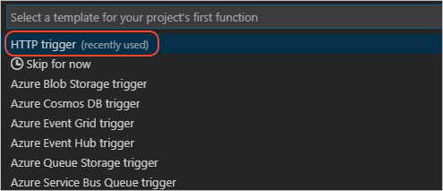

# 2. Create the local Functions app with the Visual Studio Code _Functions_ extension

Create a local Azure Functions (serverless) application that contains an [HTTP trigger](/azure/azure-functions/functions-reference-node#http-triggers-and-bindings) function. 

1. In Visual Studio Code, select the Azure logo to open the **Azure Functions** explorer, then select the **Create New Project** command:

    

1. At the first two prompts, select the current folder, then select **JavaScript** for the language.

1. At the prompt, **Select a template for your project's first function**, select **HTTP Trigger**:

    

1. At the prompt, **Provide a function name**, enter **HttpExample**. (Avoid using the default "HttpTrigger" name because it's the same as the trigger, which can be confusing.)

    

1. At the prompt, **Authorization Level**, select **Anonymous**:

    

1. After a few moments, VS Code completes creation of the project. You have a folder named for the function, *HttpExample*, within which are three files:

    | Filename | Description |
    | --- | --- |
    | *index.js* |  The source code that responds to the HTTP request. |
    | *function.json* | The [binding configuration](/azure/azure-functions/functions-triggers-bindings) for the HTTP trigger. |
    | *sample.dat* | A placeholder data file to demonstrate that you can have other files in the folder. You can delete this file, if desired, as it's not used in this tutorial. |

    :::image type="content" source="../../media/functions-extension/create-function-app-results.png" alt-text="Screenshot of VSCode showing result of creating a function app" lightbox="../../media/functions-extension/create-function-app-results.png":::

## Change the logging message

The basic code to respond to the HTTP request is provided for you. If you are familiar with the HTTP request (the _req_ parameter) and response objects, the function should seem familiar. You return response information with the **context** object on the `res` property.  

<a name="http-function-javascript-template-code"></a>

```javascript
module.exports = async function (context, req) {
    context.log('JavaScript HTTP trigger function processed a request.');

    const name = (req.query.name || (req.body && req.body.name));
    const responseMessage = name
        ? "Hello, " + name + ". This HTTP triggered function executed successfully."
        : "This HTTP triggered function executed successfully. Pass a name in the query string or in the request body for a personalized response.";

    context.res = {
        // status: 200, /* Defaults to 200 */
        body: responseMessage
    };
}
```

Create a new context.log message after the name variable and change it to appear more obvious when scanning the logs.

```javascript
context.log(`*** HTTPExample name: ${name}`);
```

The final function code is:


```javascript
module.exports = async function (context, req) {

    context.log('JavaScript HTTP trigger function processed a request.');

    const name = (req.query.name || (req.body && req.body.name));

    context.log(`*** HTTPExample name: ${name}`);

    const responseMessage = name
        ? "Hello, " + name + ". This HTTP triggered function executed successfully."
        : "This HTTP triggered function executed successfully. Pass a name in the query string or in the request body for a personalized response.";

    context.res = {
        // status: 200, /* Defaults to 200 */
        body: responseMessage
    };
}
```

:::image type="content" source="../../media/functions-extension/vscode-local-function-log.png" alt-text="Screenshot of VSCode showing code with new context.log" lightbox="../../media/functions-extension/vscode-local-function-log.png":::

## Next steps

> [!div class="nextstepaction"]
> [I created the Functions app](tutorial-vscode-serverless-node-test-local.md) [I ran into an issue](https://www.research.net/r/PWZWZ52?tutorial=node-deployment-azurefunctions&step=create-app)
