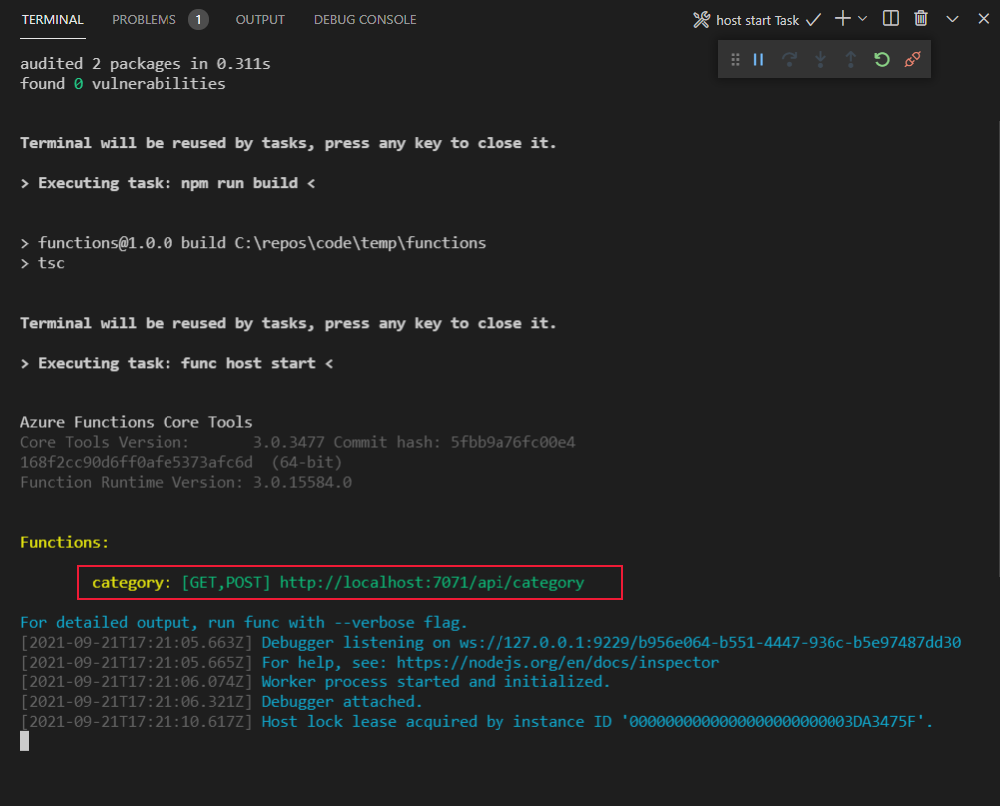

# 3. Run the function locally

Run the Azure Functions project locally to test it before deploying to Azure. Set a break point just before the serverless function returns the response. 

## Run the local serverless function

1. In Visual Studio Code, press <kbd>F5</kbd>  to launch the debugger and attach to the Azure Functions host. 

    You could also use the **Debug** > **Start Debugging** menu command.

1. Output from the Functions Core tools appears in the VS Code **Terminal** panel. 

    

1. To copy the URL of the local function, use the Azure Function extension, right-click the function name, **category**.

    :::image type="content" source="../../media/functions-extension/visual-studio-code-function-extension-get-function-url.png" alt-text="Partial screenshot of Visual Studio Code, in the Azure Explorer, with the Azure Function's button named Copy Function URL highlighted.":::

1. In your browser, enter the URL displayed in the terminal, then add `?name=YOUR-NAME` to the end of URL, replacing `YOUR-NAME` with your name:

    

    Because the function is running locally, your local API doesn't need the function key to work successfully.

1. To see the entire HTTP response, use the following cURL command in a new integrated bash terminal:

    ```bash
    curl http://localhost:7071/api/category?name=john --verbose
    ```

1. The response is:

    ```console
    *   Trying ::1:7071...
    *   Trying 127.0.0.1:7071...
    * Connected to localhost (127.0.0.1) port 7071 (#0)
    > GET /api/category?name=john HTTP/1.1
    > Host: localhost:7071
    > User-Agent: curl/7.75.0
    > Accept: */*
    >
    * Mark bundle as not supporting multiuse
    < HTTP/1.1 200 OK
    < Date: Tue, 21 Sep 2021 17:35:05 GMT
    < Content-Type: text/plain; charset=utf-8
    < Server: Kestrel
    < Transfer-Encoding: chunked
    < Request-Context: appId=cid-v1:e981b763-c455-4e32-852c-73765b048a0f
    <
    Hello, john. This HTTP triggered function executed successfully.* Connection #0 to host localhost left intact
    ```

## Set and stop at break point in serverless app

With your function running locally, set breakpoints on different parts of the code. 

1. Open *index.js*, then click in the margin to the left of last `context.res`, in the editor window. 
1. A small red dot appears to indicate a breakpoint. 
1. Change the `?name=` value for the URL in the integrated bash terminal and resubmit the request to the function. 
1. When the browser makes that request, VS Code stops the function code on that breakpoint:

    :::image type="content" source="../../media/functions-extension/visual-studio-code-function-break-point-request-variables.png" alt-text="Screenshot of Visual Studio Code with breakpoint activated and Closure variables displaying request values.":::

    Expand the **Variables** element named **Closure** to see the request properties. You can view all the properties passed into the function.

1. Stop the debugger in Visual Studio Code, <kbd>Shift</kdb> + <kbd>F5</kbd>. 

## Same Local and Azure Function runtime 

When you created the Functions app, the Azure Functions extension automatically added a VS Code launch configuration to your project, which is found in the *.vscode/launch.json* file. This configuration uses the same runtime that runs on Azure, so you can be sure that your source code works before deploying to the cloud.

## Next steps

> [!div class="nextstepaction"]
> [Deploy the Function app to Azure](tutorial-vscode-serverless-node-deploy-hosting.md)
