# Quickstart: Get started with Jenkins

This quickstart shows how to install [Jenkins](https://jenkins.io) on an Ubuntu Linux VM with the tools and plug-ins configured to work with Azure.

In this quickstart, you'll complete these tasks:

> [!div class="checklist"]
> * Create a setup file that downloads and installs Jenkins
> * Create a resource group
> * Create a virtual machine with the setup file
> * Open port 8080 so that you can SSH into the virtual machine
> * Connect to the virtual machine via SSH
> * Configure a sample Jenkins job based on a sample Java app in GitHub
> * Build the sample Jenkins job

## Prerequisites

[!INCLUDE [open-source-devops-prereqs-azure-subscription.md](../includes/open-source-devops-prereqs-azure-subscription.md)]

## Create a virtual machine

1. Sign in to the [Azure portal](https://portal.azure.com).

1. Open [Azure Cloud Shell](/azure/cloud-shell/overview) and - if not done already - switch to **Bash**.

1. Create a file named `cloud-init-jenkins.txt`.

    ```bash
    code cloud-init-jenkins.txt
    ```

1. Paste the following code into the new file:

    ```json
    #cloud-config
    package_upgrade: true
    runcmd:
      - apt install openjdk-8-jdk -y
      - wget -qO - https://pkg.jenkins.io/debian-stable/jenkins.io.key | sudo apt-key add -
      - sh -c 'echo deb https://pkg.jenkins.io/debian-stable binary/ > /etc/apt/sources.list.d/jenkins.list'
      - apt-get update && apt-get install jenkins -y
      - service jenkins restart
    ```

1. Save the file (**&lt;Ctrl>S**) and exit the editor (**&lt;Ctrl>Q**).

1. Create a resource group using [az group create](/cli/azure/group#az-group-create). You might need to replace the `--location` parameter with the appropriate value for your environment.

    ```azurecli
    az group create --name QuickstartJenkins-rg --location eastus
    ```

1. Create a virtual machine using [az vm create](/cli/azure/vm#az-vm-create).

    ```azurecli
    az vm create --resource-group QuickstartJenkins-rg --name QuickstartJenkins-vm --image UbuntuLTS --admin-username "azureuser" --generate-ssh-keys --custom-data cloud-init-jenkins.txt
    ```

1. Open port 8080 on the new virtual machine using [az vm open](/cli/azure/vm#az-vm-open-port).

    ```azurecli
    az vm open-port --resource-group QuickstartJenkins-rg --name QuickstartJenkins-vm  --port 8080 --priority 1010
    ```

## Configure Jenkins

1. Get the public IP address for the sample virtual machine using [az vm show](/cli/azure/vm#az-vm-show).

    ```azurecli
    az vm show --resource-group QuickstartJenkins-rg --name QuickstartJenkins-vm -d --query [publicIps] --output tsv
    ```

    **Notes**:

    - The `--query` parameter limits the output to the public IP addresses for the virtual machine.

1. Using the IP address retrieved in the previous step, SSH into the virtual machine. You'll need to confirm the connection request.

    ```azurecli
    ssh azureuser@<ip_address>
    ```

    **Notes**:

    - Upon successful connection, the Cloud Shell prompt includes the user name and virtual machine name: `azureuser@QuickstartJenkins-vm`.

1. Verify that Jenkins is running by getting the status of the Jenkins service.

    ```bash
    service jenkins status
    ```

1. Get the autogenerated Jenkins password.

    ```bash
    sudo cat /var/lib/jenkins/secrets/initialAdminPassword
    ```

1. Using the IP address, open the following URL in a browser: `http://<ip_address>:8080`

1. Enter the password you retrieved earlier and select **Continue**.

    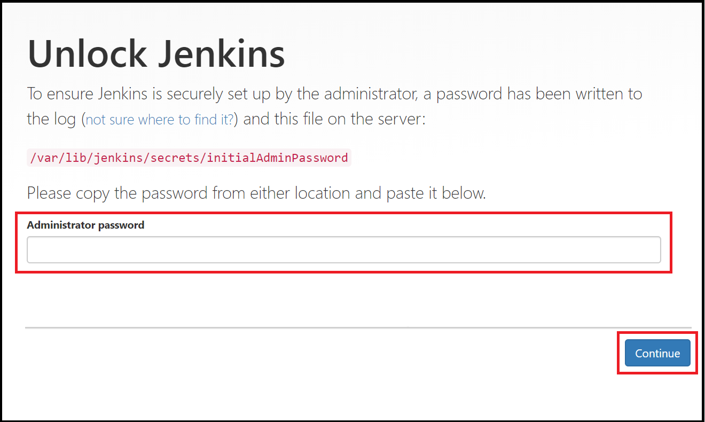

1. Select **Select plugins to install**.

    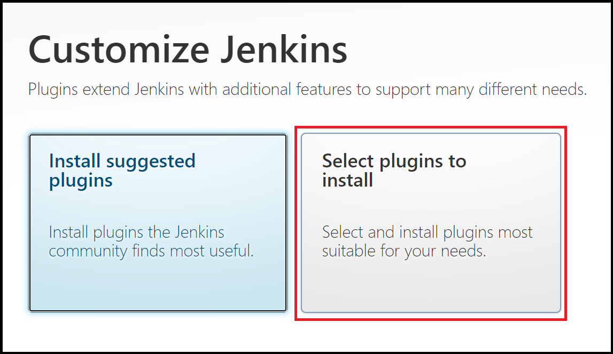

1. In the filter box at the top of the page, enter `github`. Select the GitHub plugin and select **Install**.

1. Enter the information for the first admin user and select **Save and Continue**.

    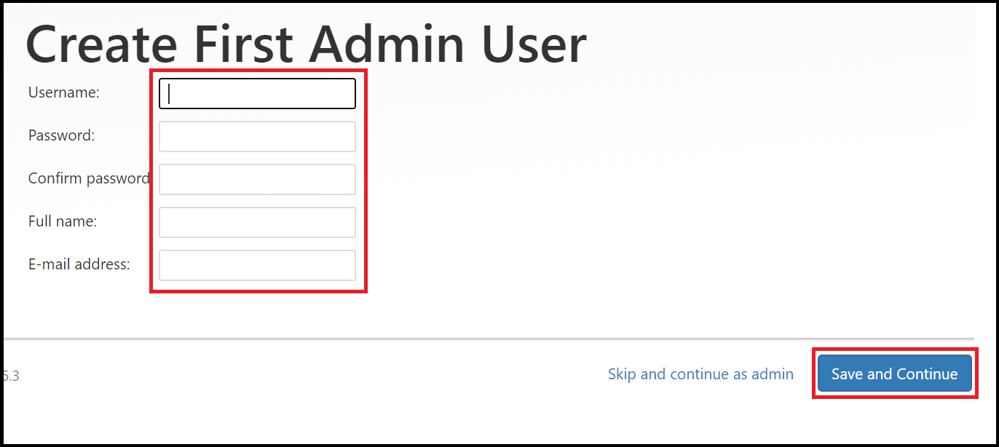

1. On the **Instance Configuration** page, select **Save and Finish**.

    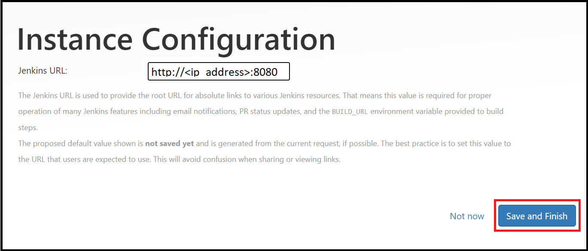

1. Select **Start using Jenkins**.

    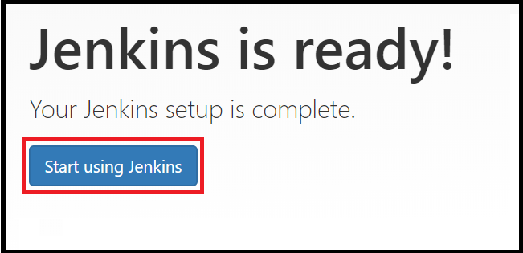

## Create your first job

1. On the Jenkins home page, select **Create a job**.

    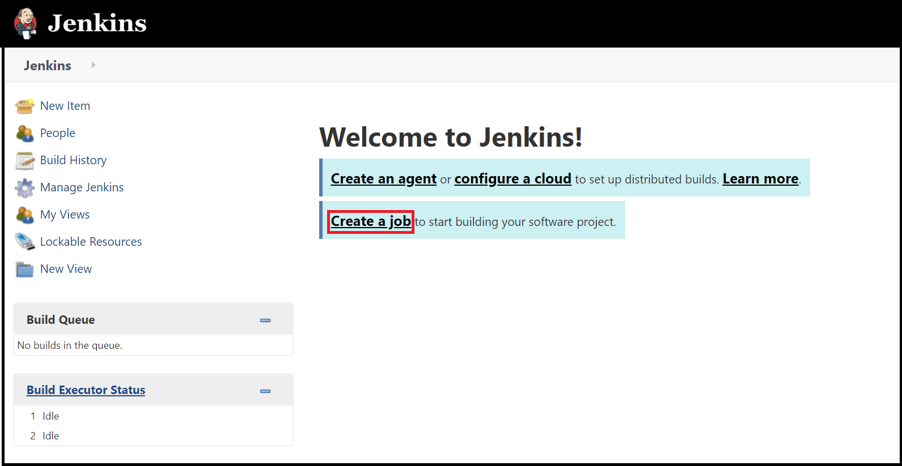

1. Enter a job name of `mySampleApp`, select **Freestyle project**, and select **OK**.

    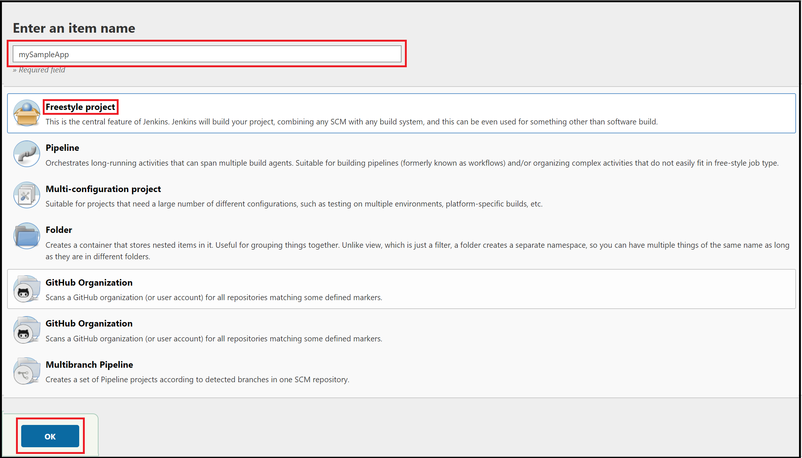

1. Select the **Source Code Management** tab. Enable **Git** and enter the following URL for the **Repository URL** value: `https://github.com/spring-guides/gs-spring-boot.git`

    

1. Select the **Build** tab, then select **Add build step**

    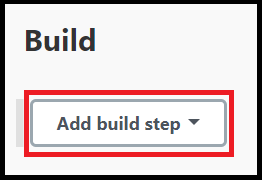

1. From the drop-down menu, select **Invoke Gradle script**.

    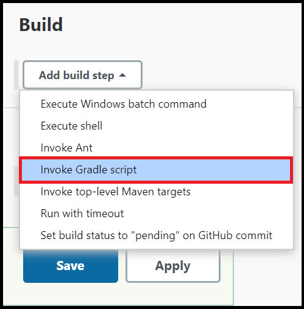

1. Select **Use Gradle Wrapper**, then enter `complete` in **Wrapper location** and `build` for **Tasks**.

    

1. Select **Advanced** and enter `complete` in the **Root Build script** field.

    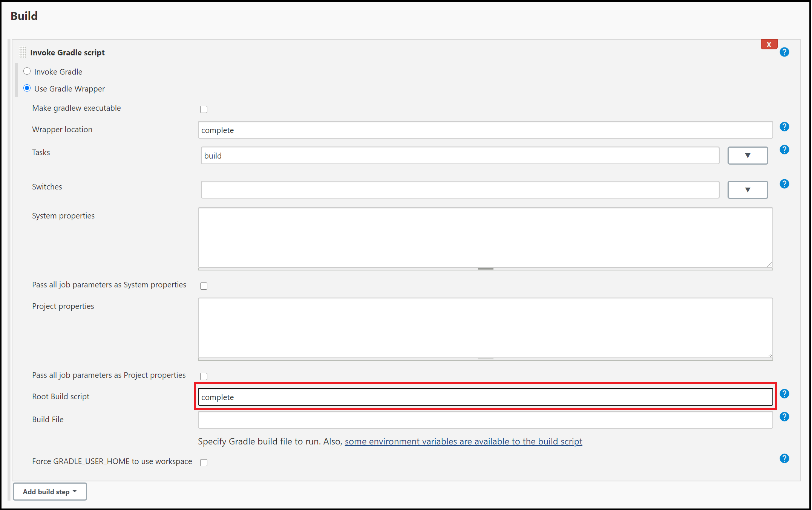

1. Scroll to the bottom of the page, and select **Save**.

## Build the sample Java app

1. When the home page for your project displays, select **Build Now** to compile the code and package the sample app.

    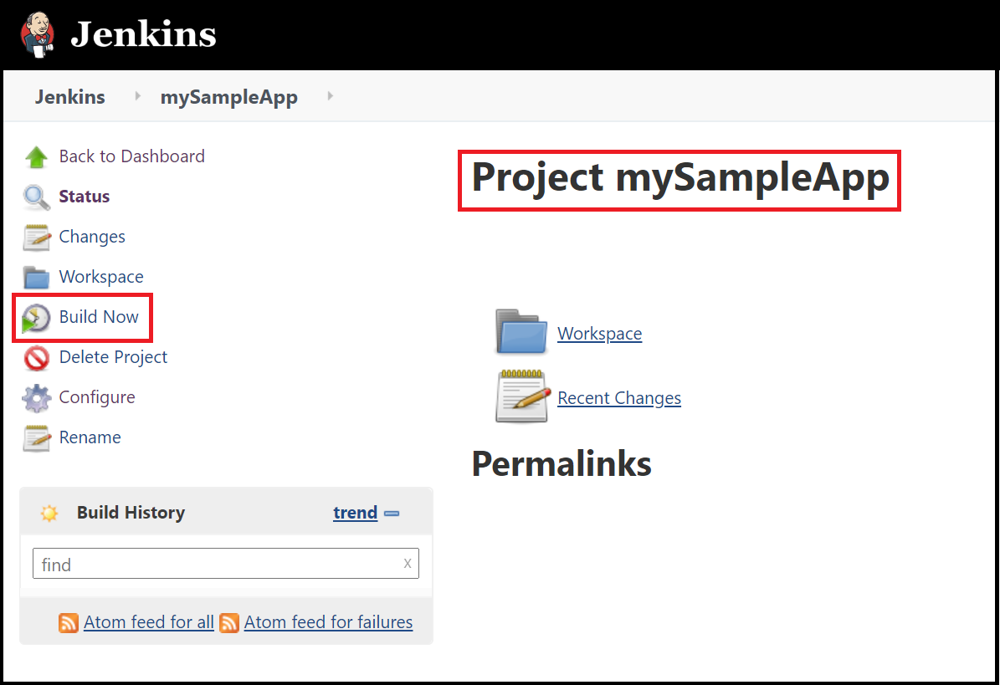

1. A graphic below the **Build History** heading indicates that the job is being built.

    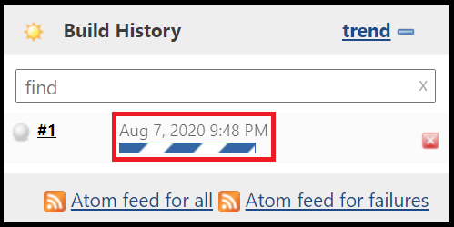

1. When the build completes, select the **Workspace** link.

    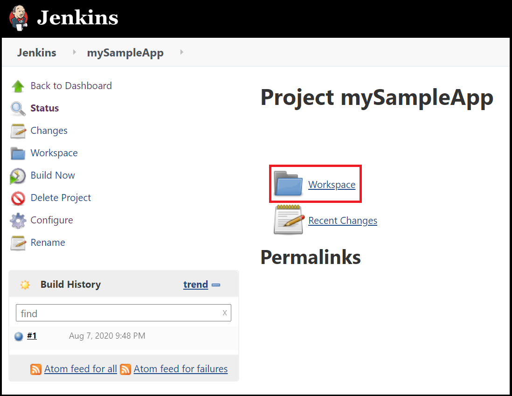

1. Navigate to `complete/build/libs` to see that the `.jar` file was successfully built.

    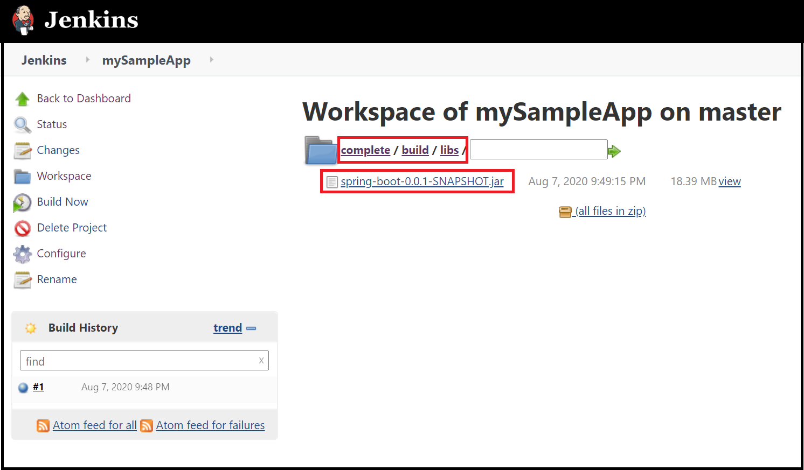

1. Your Jenkins server is now ready to build your own projects in Azure!

## Troubleshooting the Jenkins solution template

If you encounter any bugs with the Jenkins solution template, file an issue in the [Jenkins GitHub repo](https://github.com/azure/jenkins/issues).

## Next Steps

> [!div class="nextstepaction"]
> [Jenkins on Azure](/azure/developer/jenkins)