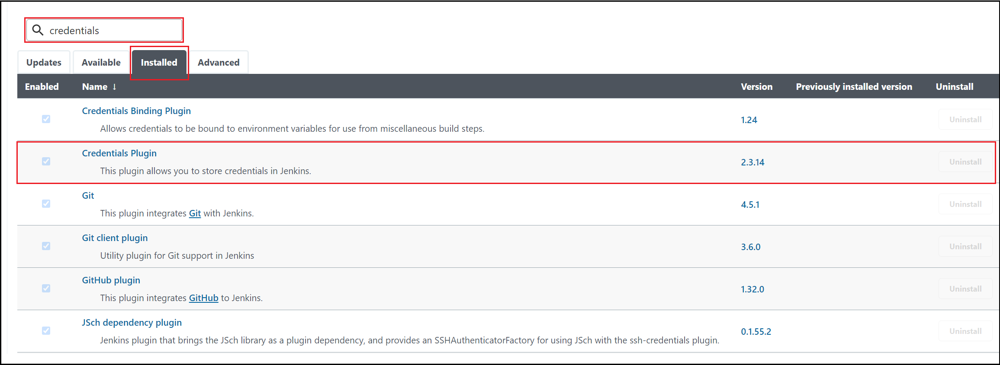

# Tutorial: Deploy to Azure Functions using Jenkins

[!INCLUDE [jenkins-integration-with-azure.md](includes/jenkins-integration-with-azure.md)]

[Azure Functions](/azure/azure-functions/) is a serverless compute service. Using Azure Functions, you can run code on-demand without provisioning or managing infrastructure. This tutorial shows how to deploy a Java function to Azure Functions using the Azure Functions plug-in.

## Prerequisites

- **Azure subscription**: If you don't have an Azure subscription, create a [free account](https://azure.microsoft.com/free/?ref=microsoft.com&utm_source=microsoft.com&utm_medium=docs&utm_campaign=visualstudio) before you begin.
- **Jenkins server**: If you don't have a Jenkins server installed, refer to the article, [Create a Jenkins server on Azure](./configure-on-linux-vm.md).

## View the source code

The source code used for this tutorial is located in the [Visual Studio China GitHub repo](https://github.com/VSChina/odd-or-even-function/blob/master/src/main/java/com/microsoft/azure/Function.java).

## Create a Java function

To create a Java function with the Java runtime stack, use either the [Azure portal](https://portal.azure.com) or the [Azure CLI](/cli/azure/).

The following steps show how to create a Java function using the Azure CLI:

1. Create a resource group, replacing the **&lt;resource_group>** placeholder with your resource group name.

    ```azurecli
    az group create --name <resource_group> --location eastus
    ```

1. Create an Azure storage account, replacing the placeholders with the appropriate values.
 
    ```azurecli
    az storage account create --name <storage_account> --location eastus --resource-group <resource_group> --sku Standard_LRS    
    ```

1. Create the test function app, replacing the placeholders with the appropriate values.

    ```azurecli
    az functionapp create --resource-group <resource_group> --runtime java --consumption-plan-location eastus --name <function_app> --storage-account <storage_account> --functions-version 2
    ```

## Prepare Jenkins server

The following steps explain how to prepare the Jenkins server:

1. Deploy a [Jenkins server](https://azuremarketplace.microsoft.com/marketplace/apps/bitnami.production-jenkins) on Azure. If you don't already have an instance of the Jenkins server installed, the article, [Create a Jenkins server on Azure](./configure-on-linux-vm.md) guides you through the process.

1. Sign in to the Jenkins instance with SSH.

1. On the Jenkins instance, install Az CLI,  version 2.0.67 or higher.

1. Install maven using the following command:

    ```bash
    sudo apt install -y maven
    ```

1. On the Jenkins instance, install the [Azure Functions Core Tools](/azure/azure-functions/functions-run-local) by issuing the following commands at a terminal prompt:

    ```bash
    curl https://packages.microsoft.com/keys/microsoft.asc | gpg --dearmor > microsoft.gpg
    sudo mv microsoft.gpg /etc/apt/trusted.gpg.d/microsoft.gpg
    sudo sh -c 'echo "deb [arch=amd64] https://packages.microsoft.com/repos/microsoft-ubuntu-$(lsb_release -cs)-prod $(lsb_release -cs) main" > /etc/apt/sources.list.d/dotnetdev.list'
    cat /etc/apt/sources.list.d/dotnetdev.list
    sudo apt-get update
    sudo apt-get install azure-functions-core-tools-3
    ```

1. Jenkins needs an Azure service principal to authenticate and access Azure resources. Refer to the [Deploy to Azure App Service](./deploy-to-azure-app-service-using-azure-cli.md) for step-by-step instructions.

1. Make sure the [Credentials plugin](https://plugins.jenkins.io/credentials/) is installed.

    1. From the menu, select **Manage Jenkins**.

    1. Under **System Configuration**, select **Manage Plugins**.

    1. Select the **Installed** tab.

    1. In the **filter** field, enter `credentials`.
    
    1. Verify that the **Credentials Plugin** is installed. If not, you'll need to install it from the **Available** tab.

    

1. From the menu, select **Manage Jenkins**.

1. Under **Security**, select **Manage Credentials**.

1. Under **Credentials**, select **(global)**.

1. From the menu, select **Add Credentials**.

1. Enter the following values for your [Microsoft Azure service principal](/cli/azure/create-an-azure-service-principal-azure-cli?toc=%252fazure%252fazure-resource-manager%252ftoc.json):

    - **Kind**: Verify that the kind is ***Username with password***.
    - **Username**: ***appId*** of the service principal created.
    - **Password**: ***password*** of the service principal created.
    - **ID**: Credential identifier such `as azuresp`.

1. Select **OK**.

## Fork the sample GitHub repo

1. [Sign in to the GitHub repo for the odd or even sample app](https://github.com/VSChina/odd-or-even-function.git).

1. In the upper-right corner in GitHub, choose **Fork**.

1. Follow the prompts to select your GitHub account and finish forking.

## Create a Jenkins Pipeline

In this section, you create the [Jenkins Pipeline](https://jenkins.io/doc/book/pipeline/).

1. In the Jenkins dashboard, create a Pipeline.

1. Enable **Prepare an environment for the run**.

1. In the **Pipeline->Definition** section, select **Pipeline script from SCM**.

1. Enter your GitHub fork's URL and script path ("doc/resources/jenkins/JenkinsFile") to use in the [JenkinsFile example](https://github.com/VSChina/odd-or-even-function/blob/master/doc/resources/jenkins/JenkinsFile).

   ```nodejs
    node {
    withEnv(['AZURE_SUBSCRIPTION_ID=99999999-9999-9999-9999-999999999999',
            'AZURE_TENANT_ID=99999999-9999-9999-9999-999999999999']) {
        stage('Init') {
            cleanWs()
            checkout scm
        }

        stage('Build') {
            sh 'mvn clean package'
        }

        stage('Publish') {
            def RESOURCE_GROUP = '<resource_group>' 
            def FUNC_NAME = '<function_app>'
            // login Azure
            withCredentials([usernamePassword(credentialsId: 'azuresp', passwordVariable: 'AZURE_CLIENT_SECRET', usernameVariable: 'AZURE_CLIENT_ID')]) {
            sh '''
                az login --service-principal -u $AZURE_CLIENT_ID -p $AZURE_CLIENT_SECRET -t $AZURE_TENANT_ID
                az account set -s $AZURE_SUBSCRIPTION_ID
            '''
            }
            sh 'cd $PWD/target/azure-functions/odd-or-even-function-sample && zip -r ../../../archive.zip ./* && cd -'
            sh "az functionapp deployment source config-zip -g $RESOURCE_GROUP -n $FUNC_NAME --src archive.zip"
            sh 'az logout'
            }
        }
    }
    ```

## Build and deploy

It's now time to run the Jenkins job.

1. First, obtain the authorization key via the instructions in the [Azure Functions HTTP triggers and bindings](/azure/azure-functions/functions-bindings-http-webhook-trigger#authorization-keys) article.

1. In your browser, enter the app's URL. Replace the placeholders with the appropriate values and specify a numeric value for **&lt;input_number>** as input for the Java function.

    ```
    https://<function_app>.azurewebsites.net/api/HttpTrigger-Java?code=<authorization_key>&number=<input_number>
    ```
1. You'll see results similar to the following example output (where an odd number - 365 - was used as a test):

    ```output
    The number 365 is Odd.
    ```

## Clean up resources

If you're not going to continue to use this application, delete
the resources you created with the following step:

```azurecli
az group delete -y --no-wait -n <resource_group>
```

## Next steps

> [!div class="nextstepaction"]
> [Azure Functions](/azure/azure-functions/)