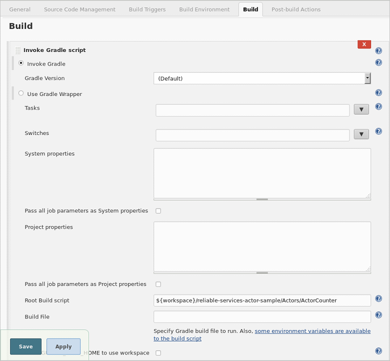
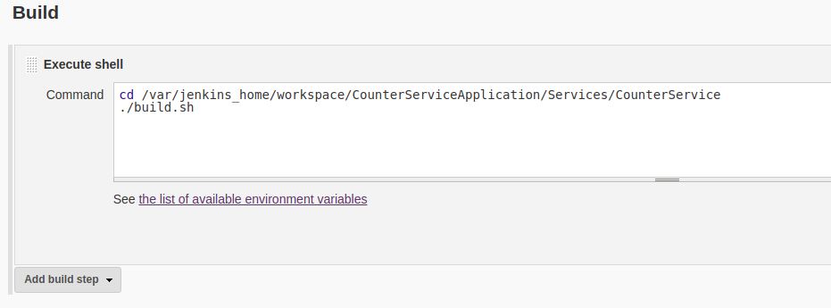
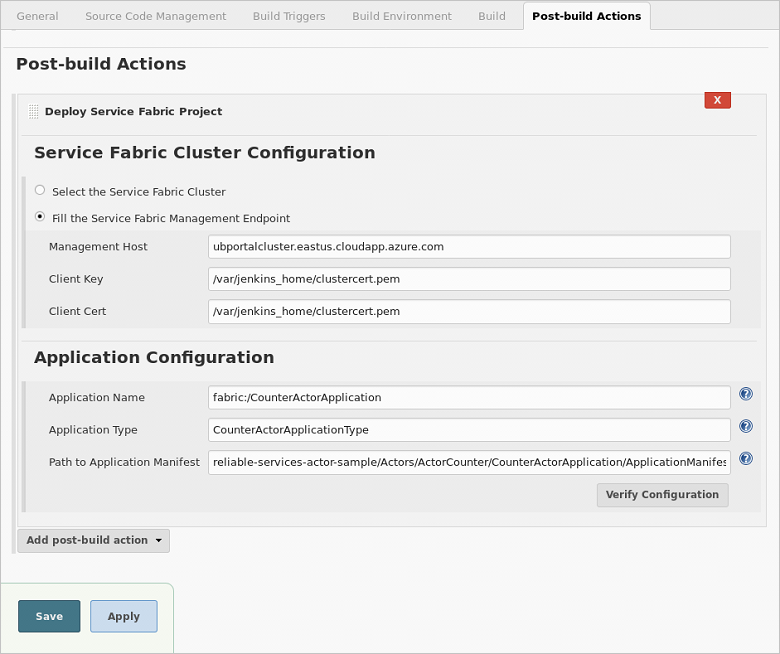
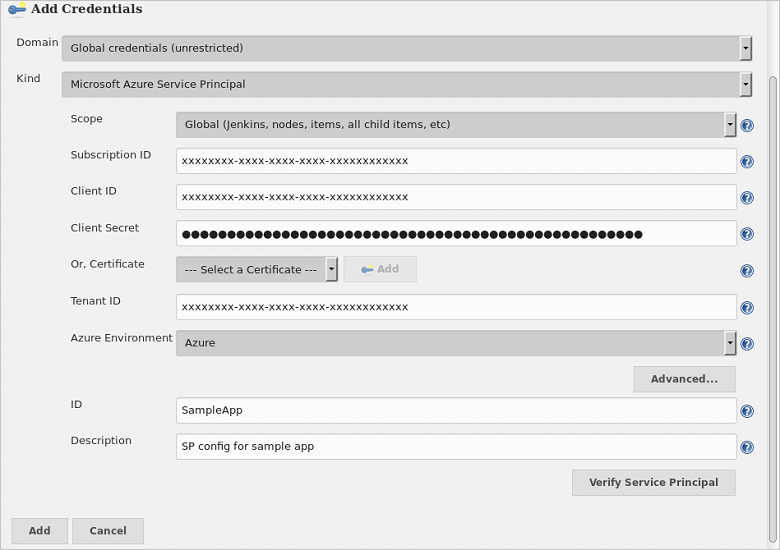
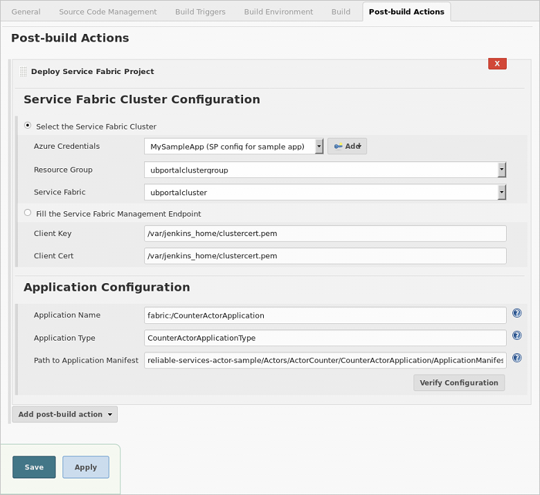

# Tutorial: Deploy to a Service Fabric cluster

[!INCLUDE [jenkins-integration-with-azure.md](includes/jenkins-integration-with-azure.md)]

This tutorial covers several possible ways of setting up your Jenkins environment as well as different ways to deploy your application to a Service Fabric cluster after it has been built. Follow these general steps to successfully configure Jenkins, pull changes from GitHub, build your application, and deploy it to your cluster:

1. Ensure that you install the [Prerequisites](#prerequisites).
1. Then follow the steps in one of these sections to set up Jenkins:
   * [Set up Jenkins inside a Service Fabric cluster](#set-up-jenkins-inside-a-service-fabric-cluster), 
   * [Set up Jenkins outside a Service Fabric cluster](#set-up-jenkins-outside-a-service-fabric-cluster), or
   * [Install the Service Fabric plugin in an existing Jenkins environment](#install-service-fabric-plugin-in-an-existing-jenkins-environment).
1. After you've set up Jenkins, follow the steps in [Create and configure a Jenkins job](#create-and-configure-a-jenkins-job) to set up GitHub to trigger Jenkins when changes are made to your application and to configure your Jenkins job pipeline through the build step to pull the changes from GitHub and build your application. 
1. Finally, configure the Jenkins job post-build step to deploy your application to your Service Fabric cluster. There are two ways to configure Jenkins to deploy your application to a cluster:    
   * For development and test environments, use [Configure deployment using cluster management endpoint](#configure-deployment-using-cluster-management-endpoint). This is the simplest deployment method to set up.
   * For production environments, use [Configure deployment using Azure credentials](#configure-deployment-using-azure-credentials). Microsoft recommends this method for production environments because with Azure credentials you can limit the access that a Jenkins job has to your Azure resources. 

## Prerequisites

- Make sure Git is installed locally. You can install the appropriate Git version from [the Git downloads page](https://git-scm.com/downloads) based on your operating system. If you're new to Git, learn more about it from the [Git documentation](https://git-scm.com/docs).
- This article uses the *Service Fabric Getting Started Sample* on GitHub: [https://github.com/Azure-Samples/service-fabric-java-getting-started](https://github.com/Azure-Samples/service-fabric-java-getting-started) for the application to build and deploy. You can fork this repository to follow along, or, with some modification to the instructions, use your own GitHub project.


## Install Service Fabric plugin in an existing Jenkins environment

If you're adding the Service Fabric plugin to an existing Jenkins environment, you need to do the following steps:

- [Service Fabric CLI (sfctl)](/azure/service-fabric/service-fabric-cli). Install the CLI at the system level rather than at the user level, so Jenkins can run CLI commands. 
- To deploy Java applications, install both [Gradle and Open JDK 8.0](/azure/service-fabric/service-fabric-get-started-linux#set-up-java-development). 
- To deploy .NET Core 2.0 applications, install the [.NET Core 2.0 SDK](/azure/service-fabric/service-fabric-get-started-linux#set-up-net-core-20-development). 

After you've installed the prerequisites needed for your environment, you can search for the Azure Service Fabric Plugin in Jenkins marketplace and install it.

After you've installed the plugin, skip ahead to [Create and configure a Jenkins job](#create-and-configure-a-jenkins-job).

## Set up Jenkins inside a Service Fabric cluster

You can set up Jenkins either inside or outside a Service Fabric cluster. The following sections show how to set it up inside a cluster while using an Azure storage account to save the state of the container instance.

1. Ensure that you have a Service Fabric Linux cluster with Docker installed. Service Fabric clusters running in Azure already have Docker installed. If you're running the cluster locally (OneBox dev environment), check if Docker is installed on your machine with the  `docker info` command. If it is not installed, install it by using the following commands:

   ```sh
   sudo apt-get install wget
   wget -qO- https://get.docker.io/ | sh
   ``` 

   > [!NOTE]
   > Make sure that the 8081 port is specified as a custom endpoint on the cluster. If you are using a local cluster, make sure that port 8081 is open on the host machine and that it has a public-facing IP address.
   >

1. Clone the application, by using the following commands:
   ```sh
   git clone https://github.com/suhuruli/jenkins-container-application.git
   cd jenkins-container-application
   ```

1. Persist the state of the Jenkins container in a file-share:
   1. Create an Azure storage account in the **same region** as your cluster with a name such as `sfjenkinsstorage1`.
   1. Create a **File Share** under the storage Account with a name such as `sfjenkins`.
   1. Click on **Connect** for the file-share and note the values it displays under **Connecting from Linux**, the value should look similar to the one below:

      ```sh
      sudo mount -t cifs //sfjenkinsstorage1.file.core.windows.net/sfjenkins [mount point] -o vers=3.0,username=sfjenkinsstorage1,password=<storage_key>,dir_mode=0777,file_mode=0777
      ```

   > [!NOTE]
   > To mount cifs shares, you need to have the cifs-utils package installed in the cluster nodes.         
   >

1. Update the placeholder values in the `setupentrypoint.sh` script with the azure-storage details from step 2.
   ```sh
   vi JenkinsSF/JenkinsOnSF/Code/setupentrypoint.sh
   ```
   * Replace `[REMOTE_FILE_SHARE_LOCATION]` with the value `//sfjenkinsstorage1.file.core.windows.net/sfjenkins` from the output of the connect in step 2 above.
   * Replace `[FILE_SHARE_CONNECT_OPTIONS_STRING]` with the value `vers=3.0,username=sfjenkinsstorage1,password=GB2NPUCQY9LDGeG9Bci5dJV91T6SrA7OxrYBUsFHyueR62viMrC6NIzyQLCKNz0o7pepGfGY+vTa9gxzEtfZHw==,dir_mode=0777,file_mode=0777` from step 2 above.

1. **Secure Cluster Only:** 
   
   To configure the deployment of applications on a secure cluster from Jenkins, the cluster certificate must be accessible within the Jenkins container. In the *ApplicationManifest.xml* file, under the **ContainerHostPolicies** tag add this certificate reference and update the thumbprint value with that of the cluster certificate.

   ```xml
   <CertificateRef Name="MyCert" X509FindValue="[Thumbprint]"/>
   ```

   Additionally, add the following lines under the **ApplicationManifest** (root) tag in the *ApplicationManifest.xml* file and update the thumbprint value with that of the cluster certificate.

   ```xml
   <Certificates>
     <SecretsCertificate X509FindType="FindByThumbprint" X509FindValue="[Thumbprint]" />
   </Certificates> 
   ```

1. Connect to the cluster and install the container application.

   **Secure Cluster**
   ```sh
   sfctl cluster select --endpoint https://PublicIPorFQDN:19080  --pem [Pem] --no-verify # cluster connect command
   bash Scripts/install.sh
   ```
   The preceding command takes the certificate in PEM format. If your certificate is in PFX format, you can use the following command to convert it. If your PFX file isn't password protected, specify the **passin** parameter as `-passin pass:`.
   ```sh
   openssl pkcs12 -in cert.pfx -out cert.pem -nodes -passin pass:MyPassword1234!
   ``` 
   
   **Unsecure Cluster**
   ```sh
   sfctl cluster select --endpoint http://PublicIPorFQDN:19080 # cluster connect command
   bash Scripts/install.sh
   ```

   This installs a Jenkins container on the cluster, and can be monitored by using the Service Fabric Explorer.

   > [!NOTE]
   > It may take a couple of minutes for the Jenkins image to be downloaded on the cluster.
   >

1. From your browser, go to `http://PublicIPorFQDN:8081`. It provides the path of the initial admin password required to sign in. 
1. Look at the Service Fabric Explorer to determine on which node the Jenkins container is running. Secure Shell (SSH) sign in to this node.
   ```sh
   ssh user@PublicIPorFQDN -p [port]
   ``` 
1. Get the container instance ID by using `docker ps -a`.
1. Secure Shell (SSH) sign in to the container and paste the path you were shown on the Jenkins portal. For example, if in the portal it shows the path `PATH_TO_INITIAL_ADMIN_PASSWORD`, run the following commands:

   ```sh
   docker exec -t -i [first-four-digits-of-container-ID] /bin/bash   # This takes you inside Docker shell
   ```
   ```sh
   cat PATH_TO_INITIAL_ADMIN_PASSWORD # This displays the password value
   ```
1. On the Jenkins Getting Started page, choose the Select plugins to install option, select the **None** checkbox, and click install.
1. Create a user or select to continue as an admin.

After you've set up Jenkins, skip ahead to [Create and configure a Jenkins job](#create-and-configure-a-jenkins-job).  

## Set up Jenkins outside a Service Fabric cluster

You can set up Jenkins either inside or outside of a Service Fabric cluster. The following sections show how to set it up outside a cluster.

1. Make sure that Docker is installed on your machine by running `docker info` in the terminal. The output indicates if the Docker service is running.

1. If Docker is not installed, run the following commands:

    ```sh
    sudo apt-get install wget
    wget -qO- https://get.docker.io/ | sh
    ```

1. Pull the Service Fabric Jenkins container image: `docker pull rapatchi/jenkins:latest`. This image comes with Service Fabric Jenkins plugin pre-installed.
1. Run the container image: `docker run -itd -p 8080:8080 rapatchi/jenkins:latest`
1. Get the ID of the container image instance. You can list all the Docker containers with the command `docker ps –a`
1. Sign in to the Jenkins portal with the following steps:

   1. Sign in to a Jenkins shell from your host. Use the first four digits of the container ID. For example, if the container ID is  `2d24a73b5964`, use `2d24`.

      ```sh
      docker exec -it [first-four-digits-of-container-ID] /bin/bash
      ```
   1. From the Jenkins shell, get the admin password for your container instance:

      ```sh
      cat /var/jenkins_home/secrets/initialAdminPassword
      ```      
   1. To sign in to the Jenkins dashboard, open the following URL in a web browser: `http://<HOST-IP>:8080`. Use the password from the previous step to unlock Jenkins.
   1. (Optional.) After you sign in for the first time, you can create your own user account and use that for the following steps, or you can continue to use the administrator account. If you create a user, you need to continue with that user.
1. Set up GitHub to work with Jenkins by using the steps in [Generating a new SSH key and adding it to the SSH agent](https://help.github.com/articles/generating-a-new-ssh-key-and-adding-it-to-the-ssh-agent/).
   * Use the instructions provided by GitHub to generate the SSH key, and to add the SSH key to the GitHub account that is hosting the repository.
   * Run the commands mentioned in the preceding link in the Jenkins Docker shell (and not on your host).
   * To sign in to the Jenkins shell from your host, use the following command:

      ```sh
      docker exec -t -i [first-four-digits-of-container-ID] /bin/bash
      ```

Make sure that the cluster or machine where the Jenkins container image is hosted has a public-facing IP address. This enables the Jenkins instance to receive notifications from GitHub.

After you've set up Jenkins, continue on to the next section, [Create and configure a Jenkins job](#create-and-configure-a-jenkins-job).

## Create and configure a Jenkins job

The steps in this section show you how to configure a Jenkins job to respond to changes in a GitHub repo, fetch the changes, and build them. At the end of this section, you're directed to the final steps to configure the job to deploy your application based on whether you're deploying to a development/test environment or to a production environment. 

1. On the Jenkins dashboard, click  **New Item**.
1. Enter an item name (for example, **MyJob**). Select **free-style project**, and click **OK**.
1. The Job configuration page opens. (To get to the configuration from the Jenkins dashboard, click the job, and then click **Configure**).

1. On the **General** tab, check the box for **GitHub project**, and specify your GitHub project URL. This URL hosts the Service Fabric Java application that you want to integrate with the Jenkins continuous integration, continuous deployment (CI/CD) flow (for example, `https://github.com/{your-github-account}/service-fabric-java-getting-started`).

1. On the **Source Code Management** tab, select **Git**. Specify the repository URL that hosts the Service Fabric Java application that you want to integrate with the Jenkins CI/CD flow (for example, `https://github.com/{your-github-account}/service-fabric-java-getting-started`). You can also specify which branch to build (for example, `/master`).
1. Configure your *GitHub* repository to talk to Jenkins:

   1. On your GitHub repository page, go to **Settings** > **Integrations and Services**.

   1. Select **Add Service**, type **Jenkins**, and select the **Jenkins-GitHub plugin**.

   1. Enter your Jenkins webhook URL (by default, it should be `http://<PublicIPorFQDN>:8081/github-webhook/`). Click **add/update service**.

   1. A test event is sent to your Jenkins instance. You should see a green check by the webhook in GitHub, and your project will build.

1. On the **Build Triggers** tab in Jenkins, select which build option you want. For this example, you want to trigger a build whenever a push to the repository happens, so select **GitHub hook trigger for GITScm polling**. (Previously, this option was called **Build when a change is pushed to GitHub**.)
1. On the **Build** tab, do one of the following depending on whether you're building a Java application or a .NET Core application:

   * **For Java Applications:** From the **Add build step** drop-down, select **Invoke Gradle Script**. Click **Advanced**. In the advanced menu, specify the path to **Root build script** for your application. It picks up build.gradle from the path specified and works accordingly. For the [ActorCounter application](https://github.com/Azure-Samples/service-fabric-java-getting-started/tree/master/reliable-services-actor-sample/Actors/ActorCounter), this is: `${WORKSPACE}/reliable-services-actor-sample/Actors/ActorCounter`.

     

   * **For .NET Core Applications:** From the **Add build step** drop-down, select **Execute Shell**. In the command box that appears, the directory first needs to be changed to the path where the `build.sh` file is located. Once the directory has been changed, the `build.sh` script can be run to build the application.

      ```sh
      cd /var/jenkins_home/workspace/[Job Name]/[Path to build.sh]  
      ./build.sh
      ```

     The following screenshot shows an example of the commands that are used to build the [Counter Service](https://github.com/Azure-Samples/service-fabric-dotnet-core-getting-started/tree/master/Services/CounterService) sample with a Jenkins job name of `CounterServiceApplication`.

      

1. To configure Jenkins to deploy your app to a Service Fabric cluster in the post-build actions, you need the location of that cluster's certificate in your Jenkins container. Choose one of the following depending on whether your Jenkins container is running inside or outside of your cluster and note the location of the cluster certificate:

   * **For Jenkins running inside your cluster:** The path to the certificate can be found by echoing the value of the *Certificates_JenkinsOnSF_Code_MyCert_PEM* environment variable from within the container.

      ```sh
      echo $Certificates_JenkinsOnSF_Code_MyCert_PEM
      ```
   
   * **For Jenkins running outside your cluster:** Follow these steps to copy the cluster certificate to your container:
     1. Your certificate must be in PEM format. If you don't have a PEM file, you can create one from the certificate PFX file. If your PFX file is not password protected, run the following command from your host:

        ```sh
        openssl pkcs12 -in clustercert.pfx -out clustercert.pem -nodes -passin pass:
        ``` 

        If the PFX file is password protected, include the password in the `-passin` parameter. For example:

        ```sh
        openssl pkcs12 -in clustercert.pfx -out clustercert.pem -nodes -passin pass:MyPassword1234!
        ``` 

     1. To get the container ID for your Jenkins container, run `docker ps` from your host.
     1. Copy the PEM file to your container with the following Docker command:
    
        ```sh
        docker cp clustercert.pem [first-four-digits-of-container-ID]:/var/jenkins_home
        ``` 

You're almost finished! Keep the Jenkins job open. The only remaining task is to configure the post-build steps to deploy your application to your Service Fabric cluster:

* To deploy to a development or test environment, follow the steps in [Configure deployment using cluster management endpoint](#configure-deployment-using-cluster-management-endpoint).
* To deploy to a production environment, follow the steps in [Configure deployment using Azure credentials](#configure-deployment-using-azure-credentials).

## Configure deployment using cluster management endpoint

For development and test environments, you can use the cluster management endpoint to deploy your application. Configuring the post-build action with the cluster management endpoint to deploy your application requires the least amount of set-up. If you're deploying to a production environment, skip ahead to [Configure deployment using Azure credentials](#configure-deployment-using-azure-credentials) to configure an Azure Active Directory service principal to use during deployment.    

1. In the Jenkins job, click the **Post-build Actions** tab. 
1. From the **Post-Build Actions** drop-down, select **Deploy Service Fabric Project**. 
1. Under **Service Fabric Cluster Configuration**, select the **Fill the Service Fabric Management Endpoint** radio button.
1. For **Management Host**, enter the connection endpoint for your cluster; for example `{your-cluster}.eastus.cloudapp.azure.com`.
1. For **Client Key** and **Client Cert**, enter the location of the PEM file in your Jenkins container; for example `/var/jenkins_home/clustercert.pem`. (You copied the location of the certificate the last step of [Create and configure a Jenkins job](#create-and-configure-a-jenkins-job).)
1. Under **Application Configuration**, configure the **Application Name**, **Application Type**, and the (relative) **Path to Application Manifest** fields.

   

1. Click **Verify Configuration**. On successful verification, click **Save**. Your Jenkins job pipeline is now fully configured. Skip ahead to [Next steps](#next-steps) to test your deployment.

## Configure deployment using Azure credentials

For production environments, configuring an Azure credential to deploy your application is strongly recommended. This section shows you how to configure an Azure Active Directory service principal to use to deploy your application in the post-build action. You can assign service principals to roles in your directory to limit the permissions of the Jenkins job. 

For development and test environments, you can configure either Azure credentials or the cluster management endpoint to deploy your application. For details about how to configure a cluster management endpoint, see [Configure deployment using cluster management endpoint](#configure-deployment-using-cluster-management-endpoint).   

1. To create an Azure Active Directory service principal and assign it permissions in your Azure subscription, follow the steps in [Use the portal to create an Azure Active Directory application and service principal](/azure/azure-resource-manager/resource-group-create-service-principal-portal). Pay attention to the following:

   * While following the steps in the topic, be sure to copy and save the following values: *Application ID*, *Application key*, *Directory ID (Tenant ID)*, and *Subscription ID*. You need them to configure the Azure credentials in Jenkins.
   * If you don't have the [required permissions](/azure/azure-resource-manager/resource-group-create-service-principal-portal#required-permissions) on your directory, you'll need to ask an administrator to either grant you the permissions or create the service principal for you, or you'll need to configure the management endpoint for your cluster in the **Post-Build Actions** for your job in Jenkins.
   * In the [Create an Azure Active Directory application](/azure/azure-resource-manager/resource-group-create-service-principal-portal#create-an-azure-active-directory-application) section, you can enter any well-formed URL for the **Sign-on URL**.
   * In the [Assign application to a Role](/azure/azure-resource-manager/resource-group-create-service-principal-portal) section, you can assign your application the *Reader* role on the resource group for your cluster.

1. Back in the Jenkins job, click the **Post-build Actions** tab.
1. From the **Post-Build Actions** drop-down, select **Deploy Service Fabric Project**. 
1. Under **Service Fabric Cluster Configuration**, Click **Select the Service Fabric Cluster**. Click **Add** next to **Azure Credentials**. Click **Jenkins** to select the Jenkins Credentials Provider.
1. In the Jenkins Credentials Provider, select **Microsoft Azure Service Principal** from the **Kind** drop-down.
1. Use the values you saved when setting up your service principal in Step 1 to set the following fields:

   * **Client ID**: *Application ID*
   * **Client Secret**: *Application key*
   * **Tenant ID**: *Directory ID*
   * **Subscription ID**: *Subscription ID*
1. Enter a descriptive **ID** that you use to select the credential in Jenkins and a brief **Description**. Then click **Verify Service Principal**. If the verification succeeds, click **Add**.

   
1. Back under **Service Fabric Cluster Configuration**, make sure that your new credential is selected for **Azure Credentials**. 
1. From the **Resource Group** drop-down, select the resource group of the cluster you want to deploy the application to.
1. From the **Service Fabric** drop-down, select the cluster that you want to deploy the application to.
1. For **Client Key** and **Client Cert**, enter the location of the PEM file in your Jenkins container. For example `/var/jenkins_home/clustercert.pem`. 
1. Under **Application Configuration**, configure the **Application Name**, **Application Type**, and the (relative) **Path to Application Manifest** fields.
    
1. Click **Verify Configuration**. On successful verification, click **Save**. Your Jenkins job pipeline is now fully configured. Continue on to [Next steps](#next-steps) to test your deployment.

## Troubleshooting the Jenkins plugin

If you encounter any bugs with the Jenkins plugins, file an issue in the [Jenkins JIRA](https://issues.jenkins-ci.org/) for the specific component.

## Ideas to try

GitHub and Jenkins are now configured. Consider making some sample change in the `reliable-services-actor-sample/Actors/ActorCounter` project in your fork of the repository, https://github.com/Azure-Samples/service-fabric-java-getting-started. Push your changes to the remote `master` branch (or any branch that you have configured to work with). This triggers the Jenkins job, `MyJob`, that you configured. It fetches the changes from GitHub, builds them, and deploys the application to the cluster you specified in post-build actions.  

## Next steps

> [!div class="nextstepaction"]
> [Jenkins on Azure](/azure/Jenkins/)