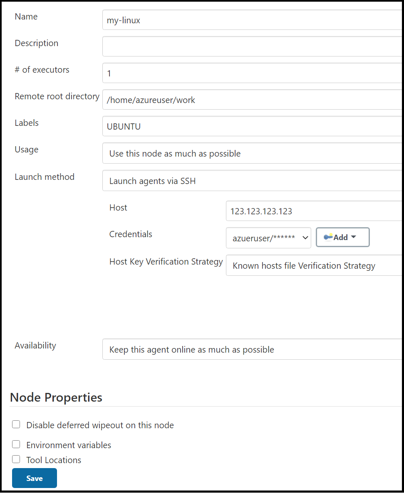
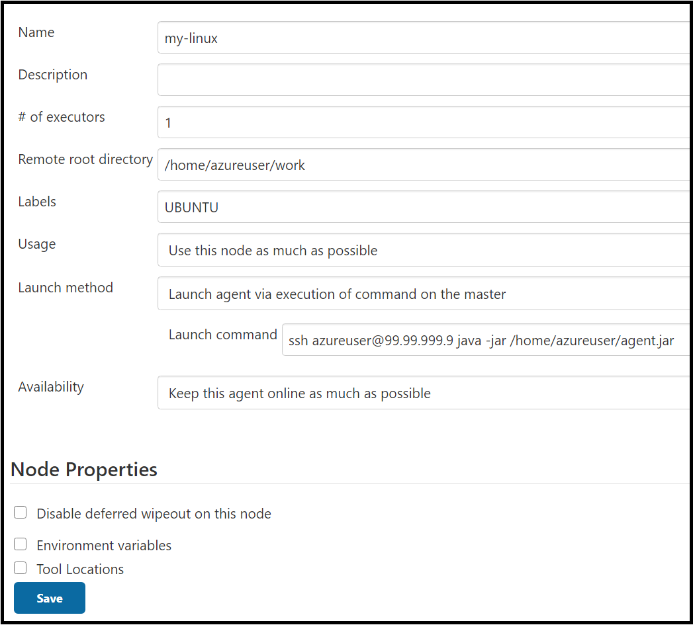

# Tutorial: Scale Jenkins deployments with VM running in Azure

[!INCLUDE [jenkins-integration-with-azure.md](includes/jenkins-integration-with-azure.md)]

This tutorial shows how to create a Linux virtual machines in Azure and add the VM as a work node to Jenkins.

In this tutorial, you will:

> [!div class="checklist"]
> * Create agent machine
> * Add agent to Jenkins
> * Create a new Jenkins freestyle job
> * Run the job on an Azure VM agent

## Prerequisites

- **Jenkins installation**: If you don't have access to a Jenkins installation, [configure Jenkins using Azure CLI](configure-on-linux-vm.md)

## Configure agent virtual machine

1. Use [az group create](/cli/azure/group?#az_group_create) to create an Azure resource group.

    ```azurecli
    az group create --name <resource_group> --location <location>
    ```

1. Use [az vm create](/cli/azure/vm#az_vm_create) to create a virtual machine.

    ```azurecli
    az vm create --resource-group <resource-group> --name <vm_name> --image UbuntuLTS --admin-username azureuser --admin-password "<password>"
    ```

    **Notes**:

    - You can also upload your ssh key with the following command `--ssh-key-value <ssh_path>`.

1. Install the JDK.  

    #### [Linux](#tab/linux)
    
    1. Log in to the virtual machine using an SSH tool.
    
        ```bash
        ssh username@123.123.123.123
        ```
        
    1. Install the JDK with apt. You can also install with other package manager tools such as yum or pacman.
    
        ```bash
        sudo apt-get install -y default-jdk
        ```
    
    1. After installation is complete, run `java -version` to verify the Java environment. The output will include the version numbers associated with various parts of the JDK.
    
    #### [Windows](#tab/windows)
    
    1. Log in to the virtual machine using an SSH tool or using Remote Desktop Connection.
    
    1. [Download the JDK](https://www.oracle.com/java/technologies/javase-downloads.html) that is appropriate for your environment.
    
    1. Install JDK
    
## Add agent to Jenkins

1. From the menu, select **Manage Jenkins**.

1. Under **System Configuration**, select **Manage Nodes and Clouds**.

1. From the menu, select **New Node**.

1. Enter a value for **Node Name**.

1. Select **Permanent Agent**.

1. Select **OK**.

1. Specify values for the following fields:

    - **Name**: Specify a unique name that identifies an agent within the new Jenkins installation. This value can be different from the agent hostname. However, it's convenient to make them the two values the same. The name value is allowed any special character from the following list: `?*/\%!@#$^&|<>[]:;`.

    - **Remote root directory**: An agent needs to have a directory dedicated to Jenkins. Specify the path to this directory on the agent. It is best to use an absolute path, such as `/home/azureuser/work` or `c:\jenkins`. This should be a path local to the agent machine. There is no need for this path to be visible from the master. If you use a relative path, such as ./jenkins-agent, the path will be relative to the working directory provided by the Launch method.

    - **Labels**: Labels are used to group semantically related agents into one logical group. For example, you could define a label of `UBUNTU` for all your agents running the Ubuntu distro of Linux.

    - **Launch method**: There are two options to start the remote Jenkins node: **Launch agent via execution of command on the master** and **Launch agents via SSH**:

        - **Launch agents via SSH**: Specify the values for the following fields:

            - **Host**: VM public IP address or domain name. For example, `123.123.123.123` or `example.com`

            - **Credentials**: Select a credential to be used for logging in to the remote host. You can also select the **Add** button to define a new credential and then select that new credential once it's create.

            - **Host Key Verification Strategy**: Controls how Jenkins verifies the SSH key presented by the remote host whilst connecting.

            

        - **Launch agent via execution of command on the master**:

            - Download the `agent.jar`  from `https://yourjenkinshostname/jnlpJars/agent.jar`. For example, `https://localhost:8443/jnlpJars/agent.jar`.

            - Upload `agent.jar` to your virtual machine

            - Start Jenkins with command `ssh nodeHost java -jar remote_agentjar_path`. For example, `ssh azureuser@99.99.999.9 java -jar /home/azureuser/agent.jar`.

            

1. Select **Save**.

After you define the configurations, Jenkins adds the virtual machine as a new work node.


## Configure Jenkins URL

If you use JNLP, you'll need to configure the Jenkins URL.

1. From the menu, select **Manage Jenkins**.

1. Under **System Configuration**, select **Configure System**.

1. Verify that the **Jenkins URL** is set to the HTTP address of your Jenkins installation - `http://<your_host>.<your_domain>:8080/`.

1. Select **Save**.

## Create a job in Jenkins

1. From the menu, select **New Item**.

1. Enter `demoproject1` for the name.

1. Select **Freestyle project**.

1. Select **OK**.

1. In the **General** tab, choose **Restrict where project can be run** and type `ubuntu` in **Label Expression**. You see a message confirming that the label is served by the cloud configuration created in the previous step.

   

1. In the **Source Code Management** tab, select **Git** and add the following URL into the **Repository URL** field: `https://github.com/spring-projects/spring-petclinic.git`

1. In the **Build** tab, select **Add build step**, then **Invoke top-level Maven targets**. Enter `package` in the **Goals** field.

1. Select **Save**.

## Build the new job on an Azure VM agent

1. Select the job you created in the previous step.

1. Select **Build now**. A new build is queued, but doesn't start until an agent VM is created in your Azure subscription.

1. Once the build is complete, go to **Console output**. You see that the build was performed remotely on an Azure agent.

    

## Next steps

> [!div class="nextstepaction"]
> [CI/CD to Azure App Service](deploy-from-github-to-azure-app-service.md)