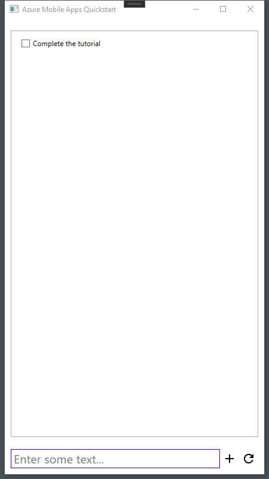

# Build a Windows (WPF) app with Azure Mobile Apps

This tutorial shows you how to add a cloud-based backend service to a Windows Presentation Framework (WPF) desktop app by using Azure Mobile Apps and an Azure mobile app backend.  You will create both a new mobile app backend and a simple *Todo list* app that stores app data in Azure.

You must complete this tutorial before all other Windows (WPF) tutorials about using the Mobile Apps feature in Azure App Service.

> [!NOTE]
> This tutorial has not yet been updated for the v5.0.0 release.

## Prerequisites

To complete this tutorial, you need:

* [Visual Studio 2019](/xamarin/get-started/installation/windows).
* An [Azure account](https://azure.microsoft.com/pricing/free-trial).
* The [Azure CLI](/cli/azure/install-azure-cli).
    * [Log into your Azure account](/cli/azure/authenticate-azure-cli) and [select a subscription](/cli/azure/manage-azure-subscriptions-azure-cli) using the Azure CLI.

This tutorial can only be completed on a Windows system.

## Download the Windows (WPF) quickstart project

The WPF quickstart project is located in the `samples/wpf` folder of the [azure/azure-mobile-apps](https://github.com/azure/azure-mobile-apps) GitHub repository.  You can [download the repository as a ZIP file](https://github.com/Azure/azure-mobile-apps/archive/main.zip), then unpack it.  The files will be created in the `azure-mobile-apps-main` folder.

Once downloaded, open a Terminal and change directory to the location of the files.

[!INCLUDE [deploy-backend](~/mobile-apps/azure-mobile-apps/includes/quickstart-deploy-backend.md)]

## Configure the WPF quickstart project

Open the `ZumoQuickstart` solution in Visual Studio (located at `samples/wpf`).  Edit the `Constants.cs` class to replace the `BackendUrl` with your backend URL.  For example, if your backend URL was `https://zumo-abcd1234.azurewebsites.net`, then the file would look like this:

``` csharp
namespace ZumoQuickstart
{
    /// <summary>
    /// Constants used to configure the application.
    /// </summary>
    public static class Constants
    {
        /// <summary>
        /// The base URL of the backend service within Azure.
        /// </summary>
        public static string BackendUrl { get; } = "https://zumo-abcd1234.azurewebsites.net";
    }
}
```

Save the file.

## Run the app

Select the _Any CPU_ configuration and the _ZumoQuickstart_ target:


Press F5 to build and run the project.

Enter some text in the **Add New Item** field, then press enter or click the add item icon.  The item is added to the list.  Press on the item to set or clear the "completed" flag.



## Next steps

Continue on to implement [offline data synchronization](./offline.md).
