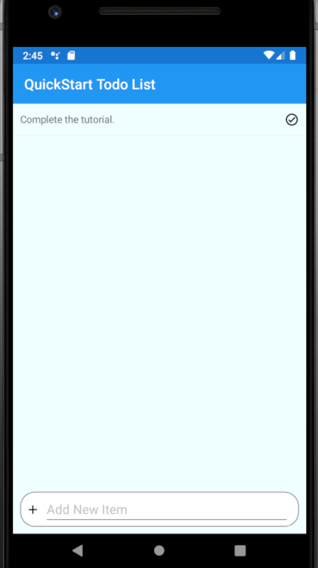
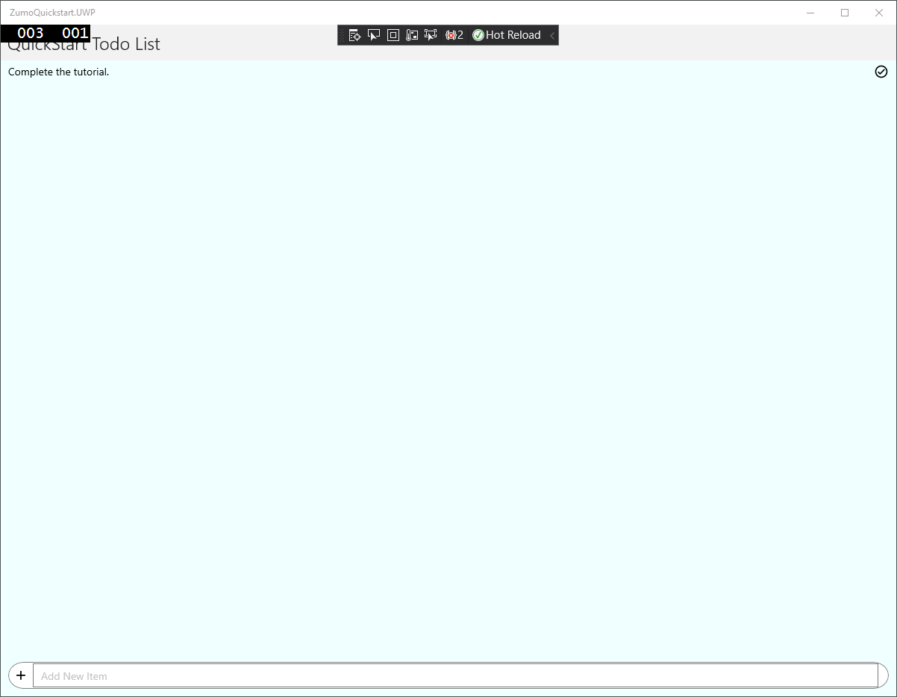

# Build a Xamarin.Forms app with Azure Mobile Apps

This tutorial shows you how to add a cloud-based backend service to a cross-platform mobile app by using Xamarin.Forms and an Azure mobile app backend.  You will create both a new mobile app backend and a simple *Todo list* app that stores app data in Azure.

You must complete this tutorial before other Xamarin Forms tutorials using the Mobile Apps feature in Azure App Service.

## Prerequisites

To complete this tutorial, you need:

* An appropriate IDE:
  * For Windows: install [Visual Studio 2019](https://docs.microsoft.com/xamarin/get-started/installation/windows).
  * For Mac: install [Visual Studio for Mac](https://docs.microsoft.com/visualstudio/mac/installation).

* An [Azure account](https://azure.microsoft.com/pricing/free-trial).
* The [Azure CLI](https://docs.microsoft.com/cli/azure/install-azure-cli).
  * [Log into your Azure account](https://docs.microsoft.com/cli/azure/authenticate-azure-cli) and [select a subscription](https://docs.microsoft.com/cli/azure/manage-azure-subscriptions-azure-cli) using the Azure CLI.
* An [Android Virtual Device](https://developer.android.com/studio/run/managing-avds), with the following settings:
  * Phone: Pixel 4 (includes Play Store)
  * System Image: Pie (API 28, x86, Google Play)
* If compiling for iOS, you must have an available Mac.
  * Install [XCode](https://itunes.apple.com/us/app/xcode/id497799835?mt=12)
  * Open Xcode after installing so that it can add any extra required components.
  * Once open, select **XCode Preferences...** > **Components**, and install an iOS simulator.
  * If completing the tutorial on Windows, follow the guide to [Pair to Mac](https://docs.microsoft.com/xamarin/ios/get-started/installation/windows/connecting-to-mac/).

You can complete this tutorial on Mac or Windows.  A windows system is required to compile and run the Universal Windows Platform (UWP) version. A mac is required to compile the iOS version.

## Download the Xamarin.Forms quickstart project

The Xamarin.Forms quickstart project is located in the `samples/xamarin-forms` folder of the [azure/azure-mobile-apps](https://github.com/azure/azure-mobile-apps) GitHub repository.  You can [download the repository as a ZIP file](https://github.com/Azure/azure-mobile-apps/archive/main.zip), then unpack it.  The files will be created in the `azure-mobile-apps-main` folder.

Once downloaded, open a Terminal and change directory to the location of the files.

[!INCLUDE [deploy-backend](../../includes/quickstart-deploy-backend.md)]

## Configure the Xamarin.Forms quickstart project

Open the `ZumoQuickstart` solution in Visual Studio (located at `samples/xamarin-forms`).  Locate the shared `ZumoQuickstart` project. Edit the `Constants.cs` class to replace the `BackendUrl` with your backend URL.  For example, if your backend URL was `https://zumo-abcd1234.azurewebsites.net`, then the file would look like this:

``` csharp
namespace ZumoQuickstart
{
    /// <summary>
    /// Constants used to configure the application.
    /// </summary>
    public static class Constants
    {
        /// <summary>
        /// The base URL of the backend service within Azure.
        /// </summary>
        public static string BackendUrl { get; } = "https://zumo-abcd1234.azurewebsites.net";
    }
}
```

Save the file.

## Run the Android app

Right-click the `ZumoQuickStart.Android` project and select **Set as Startup Project**.  The "start" button in the top ribbon will show an Android emulator.  Ensure that the _Any CPU_ configuration is selected, and a suitable Android emulator is shown:


Press F5 to build and run the project.  The Android emulator will start, then Visual Studio will install the app, and finally the app will start.

Enter some text in the **Add New Item** field, then press enter or click the add item button.  The item is added to the list.  Click on the item to set or clear the "completed" flag.



## Run the iOS app

> [!NOTE] 
> If you are running Visual Studio on Windows, you **MUST** follow the guide to [Pair to Mac](https://docs.microsoft.com/xamarin/ios/get-started/installation/windows/connecting-to-mac/).  You'll receive errors when compiling or running iOS applications without a paired Mac.

Right-click the `ZumoQuickStart.iOS` project and select **Set as Startup Project**.  The "start" button in the top ribbon will show an iOS device.  Ensure that the _iPhoneSimulator_ configuration is selected:


Press F5 to build and run the project.  The iOS simulator will start, then Visual Studio will install the app, and finally the app will start.  If you have already run the Android version, the items that you entered when running the app will be displayed.

Enter some text in the **Add New Item** field, then press enter or click the add item button.  The item is added to the list.  Click on the item to set or clear the "completed" flag.


## Run the UWP app

> [!NOTE]
> You must be using Visual Studio on Windows to run the UWP version of the app.

Right-click on the `ZumoQuickStart.UWP` project and select **Set as Startup Project**.  The "start" button in the top ribbon will show.  Select the _x86_ configuration and the _Local Machine_:


Press F5 to build and run the project.  If you select



## Next Steps

Continue on to implement [offline data synchronization](./offline.md).
