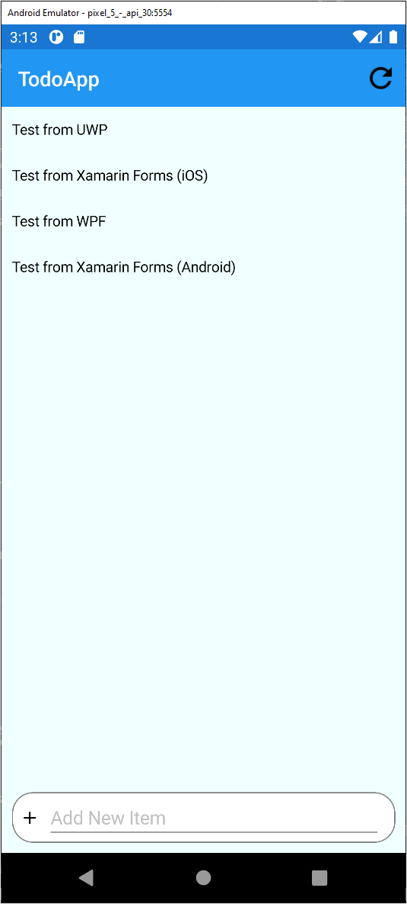
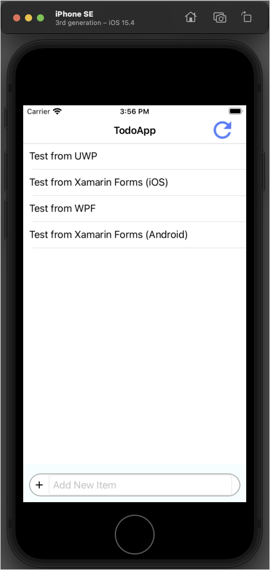

# Build a Xamarin.Forms app with Azure Mobile Apps

This tutorial shows you how to add a cloud-based backend service to a cross-platform mobile app by using Xamarin.Forms and an Azure mobile app backend.  You'll create both a new mobile app backend and a simple *Todo list* app that stores app data in Azure.

You must complete this tutorial before other Xamarin Forms tutorials using the Mobile Apps feature in Azure App Service.

## Prerequisites

To complete this tutorial, you need:

To complete this tutorial, you need:

* [Visual Studio 2022](/visualstudio/install/install-visual-studio?view=vs-2022&preserve-view=true) with the following workloads.
  * ASP.NET and web development
  * Azure development
  * Mobile development with .NET
* An [Azure account](https://azure.microsoft.com/pricing/free-trial).
* The [Azure CLI](/cli/azure/install-azure-cli).
  * Sign in with `az login` and select an appropriate subscription before starting.
* An [Android Virtual Device](https://developer.android.com/studio/run/managing-avds), with the following settings:
  * Phone: Any phone image - we use the Pixel 5 for testing.
  * System Image: Android 11 (API 30 with Google APIs)

If compiling the iOS edition of the app, you must have an available Mac:
  * Install [XCode](https://itunes.apple.com/us/app/xcode/id497799835?mt=12)
  * Open Xcode after installing so that it can add any extra required components.
  * Once open, select **XCode Preferences...** > **Components**, and install an iOS simulator.
  * If completing the tutorial on Windows, follow the guide to [Pair to Mac](/xamarin/ios/get-started/installation/windows/connecting-to-mac/).

You can complete this tutorial on Mac or Windows. A mac is required to compile the iOS version.

## Download the sample app

[!INCLUDE [Instructions to download the sample from GitHub.](~/mobile-apps/azure-mobile-apps/includes/quickstart/windows/download-sample.md)]

## Deploy the backend to Azure

> [!NOTE]
> If you have already deployed the backend from another quick start, you can use the same backend and skip this step.

[!INCLUDE [Instructions for deploying a backend service.](~/mobile-apps/azure-mobile-apps/includes/quickstart/windows/deploy-backend.md)]

## Configure the sample app

[!INCLUDE [Instructions for configuring the sample code.](~/mobile-apps/azure-mobile-apps/includes/quickstart/windows/configure-sample.md)]

## Build and run the Android app

1. In the solutions explorer, expand the `xamarin-forms` folder.
2. Right-click the `TodoApp.Forms.Android` project and select **Set as Startup Project**.
3. In the top bar, select **Any CPU** configuration and the **TodoApp.Forms.Android** target:

   

4. If you see **Android Emulator** instead, you haven't created an Android emulator.  For more information, see [Android emulator setup](/xamarin/android/get-started/installation/android-emulator/).  To create a new Android emulator:

   * Select **Tools** > **Android** > **Android Device Manager**.
   * Select **+ New**.
   * Select the following options on the left-hand side:
     * Name: `quickstart`
     * Base Device: **Pixel 5**
     * Processor: **x86_64**
     * OS: **Android 11.0 - API 30**
     * Google APIs: **Checked**
   * Select **Create**.
   * If necessary, accept the license agreement.  The image will then be downloaded.
   * Once the **Start** button appears, press **Start**.
   * If you're prompted about Hyper-V hardware acceleration, read the documentation to enable hardware acceleration before continuing.  The emulator will be slow without enabling hardware acceleration.

   > [!TIP]
   > Start your Android emulator before continuing.  You can do this by opening the Android Device Manager and pressing **Start** next to your chosen emulator.

5. Press **F5** to build and run the project.

Once the app has started, you'll see an empty list and a text box to add items in the emulator.  You can:

* Enter some text in the box, then press Enter to insert a new item.
* Select an item to set or clear the completed flag.
* Press the refresh icon to reload data from the service.

## Build and run the iOS app

> [!NOTE] 
> If you are running Visual Studio on Windows, you **MUST** follow the guide to [Pair to Mac](/xamarin/ios/get-started/installation/windows/connecting-to-mac/).  You'll receive errors when compiling or running iOS applications without a paired Mac.

1. In the solutions explorer, expand the `xamarin-forms` folder.
2. Right-click the `TodoApp.Forms.iOS` project and select **Set as Startup Project**.
3. In the top bar, select **iPhone Simulator** configuration and the **TodoApp.Forms.iOS** target:

   

<!-- TODO: Running the iOS app -->
4. Select the iPhone Simulator
5. Press **F5** to build and run the project.

Once the app has started, you'll see an empty list and a text box to add items in the emulator.  You can:

* Enter some text in the box, then press Enter to insert a new item.
* Select an item to set or clear the completed flag.
* Press the refresh icon to reload data from the service.

### Troubleshooting

The remote simulator that ships with Visual Studio 2022 is incompatible with XCode 13.3.  You'll receive the following error message:

To work around this issue:

* Disable the remote simulator (Tools / Options / iOS Settings / uncheck “Remote Simulator to Windows”). When unchecked the simulator will run on the Mac instead of on Windows. You can then interact with the simulator directly on your Mac while using the debugger, etc. on Windows. 
* Disable the remote simulator as above, so that the simulator runs on the Mac. Then use a third party remote desktop style app to connect to the Mac desktop from Windows. Remote desktop options include [Devolutions Remote Desktop Manager](https://devolutions.net/remote-desktop-manager) (fast and there’s a free version available), and VNC clients (slower and free).
* Use a physical device to test instead of the simulator.  You can obtain a [free provisioning profile](/xamarin/ios/get-started/installation/device-provisioning/free-provisioning) to complete the authentication tutorial.

## Next steps

Continue the tutorial by [adding authentication to the app](./authentication.md).
