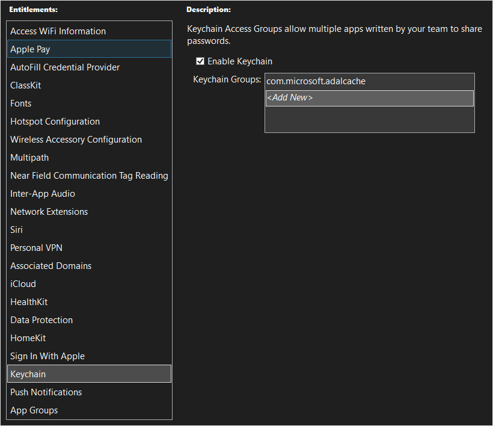
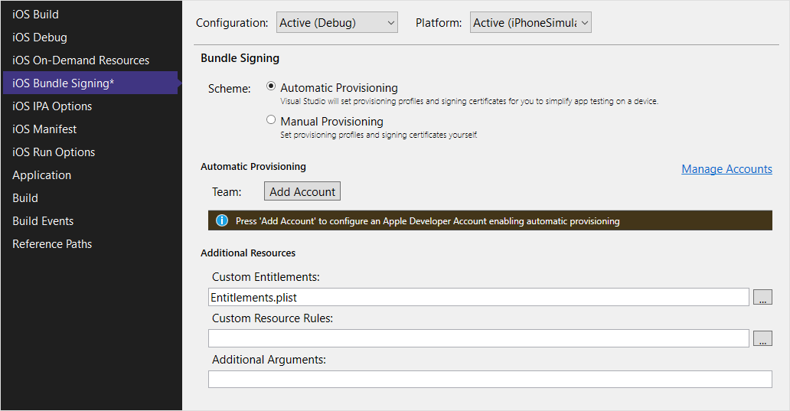

# Add authentication to your Xamarin.iOS app

In this tutorial, you add Microsoft authentication to the TodoApp project using Azure Active Directory. Before completing this tutorial, ensure you've [created the project and deployed the backend](./index.md).

> [!NOTE]
> Since the iOS app requires keychain access, you will need to set up an iOS provisioning profile.  A provisioning profile requires 
> either a real iOS device or a paid Apple Developer Account (if using the simulator).  You can skip this tutorial and move on to 
> adding [offline access to your app](./offline.md) if you cannot use authentication due to this restriction.

> [!TIP]
> Although we use Azure Active Directory for authentication, you can use any authentication library you wish with Azure Mobile Apps.  

[!INCLUDE [Register with AAD for the backend](~/mobile-apps/azure-mobile-apps/includes/quickstart/common/register-aad-backend.md)]

[!INCLUDE [Configure the service for authentication](~/mobile-apps/azure-mobile-apps/includes/quickstart/windows/configure-auth-backend.md)]

## Add authentication to the app

The Microsoft Datasync Framework has built-in support for any authentication provider that uses a Json Web Token (JWT) within a header of the HTTP transaction.  This application will use the [Microsoft Authentication Library (MSAL)](/azure/active-directory/develop/msal-overview) to request such a token and authorize the signed in user to the backend service.

[!INCLUDE [Configure a native app for authentication](~/mobile-apps/azure-mobile-apps/includes/quickstart/common/register-aad-client.md)]

Open the `TodoApp.sln` solution in Visual Studio project as the startup project.

[!INCLUDE [Set up MSAL in Windows](~/mobile-apps/azure-mobile-apps/includes/quickstart/windows/add-msal-library.md)]

Open `ViewControllers\HomeViewController.cs` in the `TodoApp.iOS` project.  Add the following `using` statements:

``` csharp
using Microsoft.Datasync.Client;
using Microsoft.Identity.Client;
using System.Diagnostics;
using System.Linq;
```

In the `HomeViewController` class, add a new property:

``` csharp
public IPublicClientApplication IdentityClient { get; set; }
```

Adjust the constructor to read:

``` csharp
public HomeViewController() {
  Title = "Todo Items";
  TodoService = new RemoteTodoService(GetAuthenticationToken);
  TodoService.TodoItemsUpdated += OnTodoItemsUpdated;
}
```

Add the `GetAuthenticationToken` method to the class:

``` csharp
public async Task<AuthenticationToken> GetAuthenticationToken()
{
    if (IdentityClient == null)
    {
        IdentityClient = PublicClientApplicationBuilder.Create(Constants.ApplicationId)
            .WithAuthority(AzureCloudInstance.AzurePublic, "common")
            .WithRedirectUri($"msal{Constants.ApplicationId}://auth")
            .WithIosKeychainSecurityGroup("com.microsoft.adalcache")
            .Build();
    }

    var accounts = await IdentityClient.GetAccountsAsync();
    AuthenticationResult result = null;
    bool tryInteractiveLogin = false;

    try
    {
        result = await IdentityClient
            .AcquireTokenSilent(Constants.Scopes, accounts.FirstOrDefault())
            .ExecuteAsync();
    }
    catch (MsalUiRequiredException)
    {
        tryInteractiveLogin = true;
    }
    catch (Exception ex)
    {
        Debug.WriteLine($"MSAL Silent Error: {ex.Message}");
    }

    if (tryInteractiveLogin)
    {
        try
        {
            result = await IdentityClient
                .AcquireTokenInteractive(Constants.Scopes)
                .ExecuteAsync()
                .ConfigureAwait(false);
        }
        catch (Exception ex)
        {
            Debug.WriteLine($"MSAL Interactive Error: {ex.Message}");
        }
    }

    return new AuthenticationToken
    {
        DisplayName = result?.Account?.Username ?? "",
        ExpiresOn = result?.ExpiresOn ?? DateTimeOffset.MinValue,
        Token = result?.AccessToken ?? "",
        UserId = result?.Account?.Username ?? ""
    };
}
```

The `GetAuthenticationToken()` method works with the Microsoft Identity Library (MSAL) to get an access token suitable for authorizing the signed-in user to the backend service.  This function is then passed to the `RemoteTodoService` for creating the client.  If the authentication is successful, the `AuthenticationToken` is produced with data necessary to authorize each request.  If not, then an expired bad token is produced instead.

Add the following code to the bottom of the `AppDelegate` class:

``` csharp
[Export("application:openURL:options:")]
public bool OpenUrl(UIApplication app, NSUrl url, NSDictionary options)
{
    AuthenticationContinuationHelper.SetAuthenticationContinuationEventArgs(url);
    return true;
}
```

Open the `Entitlements.plist` file.  Select **Keychain**, then select **Add New** in the keychain groups.  Enter `com.microsoft.adalcache` as the value:



Finally, add the custom entitlements to the project:

1. Right-click on the `TodoApp.Forms.iOS` project, then select **Properties**.
2. Select **iOS Bundle Signing**.
3. Select the **...** button next to the **Custom Entitlements** field.
4. Select `Entitlements`, then select **Open**.
5. Press **Ctrl+S** to save the project.



## Test the app

> [!NOTE]
> Since the iOS app requires keychain access, you will need to set up a provisioning profile.  A provisioning profile requires either a real device or a paid Apple Developer Account (if using the simulator).  

Set `TodoApp.iOS` as the startup project, then press **F5** to build and run the app.  When the app starts, you'll be prompted to sign in to the app.  On the first run, you'll also be asked to consent to the app.  Once authentication is complete, the app runs as normal.

## Next steps

Next, configure your application to operate offline by [implementing an offline store](./offline.md).

## Further reading

* [Quickstart: Protect a web API with the Microsoft identity platform](/azure/active-directory/develop/web-api-quickstart?pivots=devlang-aspnet-core)
* [Considerations for using Xamarin iOS with MSAL.NET](/azure/active-directory/develop/msal-net-xamarin-ios-considerations)
* [Scenario: Mobile application that calls web APIs](/azure/active-directory/develop/scenario-mobile-overview)
