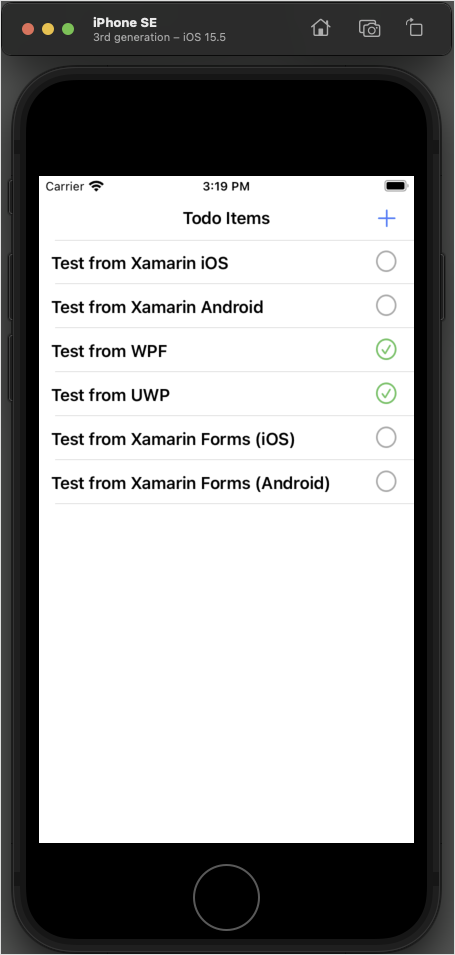

# Build a Xamarin.iOS app with Azure Mobile Apps

This tutorial shows you how to add a cloud-based backend service to an iOS mobile app by using Xamarin.iOS and an Azure mobile apps backend.  You'll create both a new mobile app backend and a simple *Todo list* app that stores app data in Azure.

You must complete this tutorial before other Xamarin.iOS tutorials using the Mobile Apps feature in Azure App Service.

## Prerequisites

To complete this tutorial, you need:

::: zone pivot="vs2022-windows"

* [Visual Studio 2022](/visualstudio/install/install-visual-studio?view=vs-2022&preserve-view=true) with the following workloads.
  * ASP.NET and web development
  * Azure development
  * Mobile development with .NET
* An [Azure account](https://azure.microsoft.com/pricing/free-trial).
* The [Azure CLI](/cli/azure/install-azure-cli).
  * Sign in with `az login` and select an appropriate subscription before starting.
* An available Mac:
  * Install [XCode](https://itunes.apple.com/us/app/xcode/id497799835?mt=12)
  * Open Xcode after installing so that it can add any extra required components.
  * Once open, select **XCode Preferences...** > **Components**, and install an iOS simulator.
  * Follow the guide to [Pair to Mac](/xamarin/ios/get-started/installation/windows/connecting-to-mac/).

You can complete this tutorial on Mac or Windows. A mac is required to compile the iOS version.

::: zone-end

::: zone pivot="vs2022-mac"

* [Visual Studio 2022 for Mac](/visualstudio/mac/installation?view=vsmac-2022&preserve-view=true)
* An [Azure account](https://azure.microsoft.com/pricing/free-trial).
* The [Azure CLI](/cli/azure/install-azure-cli).
  * Sign in with `az login` and select an appropriate subscription before starting.
* Install [XCode](https://itunes.apple.com/us/app/xcode/id497799835?mt=12)
  * Open Xcode after installing so that it can add any extra required components.
  * Once open, select **XCode Preferences...** > **Components**, and install an iOS simulator.

::: zone-end

## Download the sample app

::: zone pivot="vs2022-windows"

[!INCLUDE [Instructions to download the sample from GitHub on Windows.](~/mobile-apps/azure-mobile-apps/includes/quickstart/windows/download-sample.md)]

::: zone-end

::: zone pivot="vs2022-mac"

[!INCLUDE [Instructions to download the sample from GitHub on macOS.](~/mobile-apps/azure-mobile-apps/includes/quickstart/mac/download-sample.md)]

::: zone-end

## Deploy the backend to Azure

> [!NOTE]
> If you have already deployed the backend from another quick start, you can use the same backend and skip this step.

::: zone pivot="vs2022-windows"

[!INCLUDE [Instructions for deploying a backend service on Windows.](~/mobile-apps/azure-mobile-apps/includes/quickstart/windows/deploy-backend.md)]

::: zone-end

::: zone pivot="vs2022-mac"

[!INCLUDE [Instructions for deploying a backend service on macOS.](~/mobile-apps/azure-mobile-apps/includes/quickstart/mac/deploy-back-end.md)]

::: zone-end

## Configure the sample app

::: zone pivot="vs2022-windows"

[!INCLUDE [Instructions for configuring the sample code on Windows.](~/mobile-apps/azure-mobile-apps/includes/quickstart/windows/configure-sample.md)]

::: zone-end

::: zone pivot="vs2022-mac"

[!INCLUDE [Instructions for configuring the sample code on macOS.](~/mobile-apps/azure-mobile-apps/includes/quickstart/mac/configure-sample.md)]

::: zone-end

## Build and run the app

::: zone pivot="vs2022-windows"

1. In the solutions explorer, expand the `xamarin-native` folder.
2. Right-click the `TodoApp.iOS` project and select **Set as Startup Project**.
3. In the top bar, select **iPhone Simulator** configuration and the **TodoApp.iOS** target:

   

4. Select an appropriate iPhone simulator (I've chosen an iPhone SE running iOS 15.5).
5. Press **F5** to build and run the project.

Once the app has started, you'll see an empty list and a text box to add items in the emulator.  You can:

* Press the **+** button to add an item.
* Select an item to set or clear the completed flag.
* Press the refresh icon to reload data from the service.

### Troubleshooting

The remote simulator that ships with Visual Studio 2022 is incompatible with XCode 13.3.  You'll receive the following error message:

To work around this issue:

* Disable the remote simulator (Tools / Options / iOS Settings / uncheck **Remote Simulator to Windows**). When unchecked, the simulator will run on the Mac instead of on Windows. You can then interact with the simulator directly on your Mac while using the debugger, etc. on Windows. 
* Disable the remote simulator as above, so that the simulator runs on the Mac. Then use a remote desktop app to connect to the Mac desktop from Windows. Remote desktop options include [Devolutions Remote Desktop Manager](https://devolutions.net/remote-desktop-manager) (fast and there’s a free version available), and VNC clients (slower and free).
* Use a physical device to test instead of the simulator.  You can obtain a [free provisioning profile](/xamarin/ios/get-started/installation/device-provisioning/free-provisioning) to complete the authentication tutorial.

::: zone-end

::: zone pivot="vs2022-mac"

1. In the solutions explorer, expand the `xamarin-native` folder.
2. Right-click the `TodoApp.iOS` project and select **Set as Startup Project**.
3. In the top bar, select an appropriate iOS simulator:

   

4. In the top menu, select **Debug** > **Start Debugging**.

Once the app has started, you'll see an empty list and a text box to add items in the emulator.  You can:

* Press the **+** button to add an item.
* Select an item to set or clear the completed flag.
* Press the refresh icon to reload data from the service.

::: zone-end

## Next steps

Continue the tutorial by [adding authentication to the app](./authentication.md).
