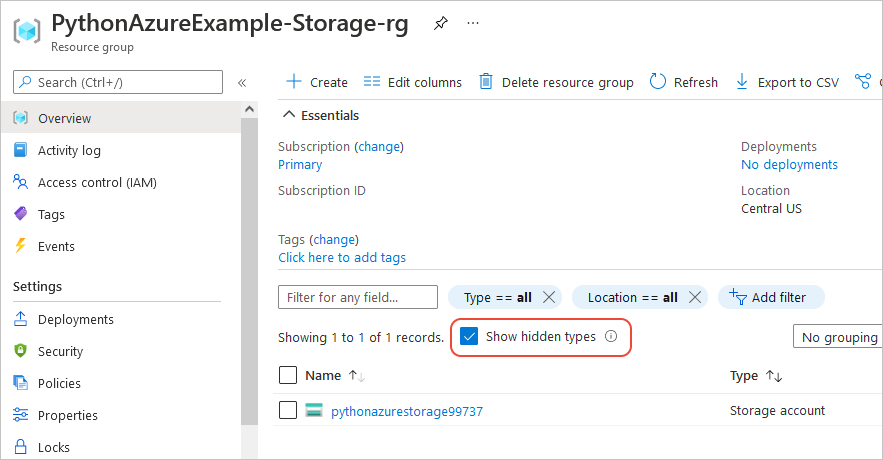
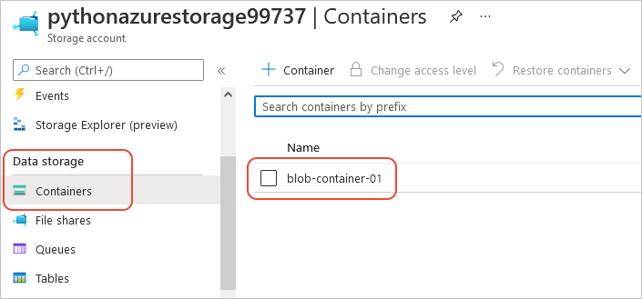

# Example: Use the Azure SDK with Azure Storage

In this article, you learn how to use the Azure SDK management libraries in a Python script to provision a resource group that contains and Azure Storage account and a Blob storage container. (Equivalent Azure CLI commands are given at the end of that section.)

You then learn how to use the Azure SDK client libraries in Python application code to upload a file to that Blob storage container.

All the commands in this article work the same in Linux/Mac OS bash and Windows command shells unless noted.

## 1: Set up your local development environment

If you haven't already, follow all the instructions on [Configure your local Python dev environment for Azure](configure-local-development-environment.md).

Be sure to create a service principal for local development, and create and activate a virtual environment for this project.

## 2: Install the needed management libraries

1. Create a *requirements.txt* file that lists the management libraries used in this example:

    ```txt
    azure-mgmt-resource
    azure-mgmt-storage
    azure-cli-core
    ```

1. In your terminal with the virtual environment activated, install the requirements:

    ```bash
    pip install -r requirements.txt
    ```

## 3: Write code to provision storage resources

Create a Python file named *provision_blob.py* with the following code. The comments explain the details:

```python
import os, random

# Import the needed management objects from the libraries. The azure.common library
# is installed automatically with the other libraries.
from azure.common.client_factory import get_client_from_cli_profile
from azure.mgmt.resource import ResourceManagementClient
from azure.mgmt.storage import StorageManagementClient

# Obtain the management object for resources, using the credentials from the CLI login.
resource_client = get_client_from_cli_profile(ResourceManagementClient)

# Constants we need in multiple places: the resource group name and the region
# in which we provision resources. You can change these values however you want.
RESOURCE_GROUP_NAME = "PythonSDKExample-Storage-rg"
LOCATION = "centralus"

# Step 1: Provision the resource group.
rg_result = resource_client.resource_groups.create_or_update(RESOURCE_GROUP_NAME,
    { "location": LOCATION })

print(f"Provisioned resource group {rg_result.name}")

# For details on the previous code, see Example: Provision a resource group
# at https://docs.microsoft.com/azure/developer/python/azure-sdk-example-resource-group

# Step 2: Provision the storage account, starting with a management object.

storage_client = get_client_from_cli_profile(StorageManagementClient)

# This example uses the CLI profile credentials because we assume the script
# is being used to provision the resource in the same way the Azure CLI would be used.

STORAGE_ACCOUNT_NAME = f"pythonsdkstorage{random.randint(1,100000):05}"

# You can replace the storage account here with any unique name. A random number is used
# by default, but note that the name changes every time you run this script.
# The name must be 3-24 lower case letters and numbers only.


# Check if the account name is available. Storage account names must be unique across
# Azure because they're used in URLs.
availability_result = storage_client.storage_accounts.check_name_availability(STORAGE_ACCOUNT_NAME)

if not availability_result.name_available:
    print(f"Storage name {STORAGE_ACCOUNT_NAME} is already in use. Try another name.")
    exit()

# The name is available, so provision the account
poller = storage_client.storage_accounts.create(RESOURCE_GROUP_NAME, STORAGE_ACCOUNT_NAME,
    {
        "location" : LOCATION,
        "kind": "StorageV2",
        "sku": {"name": "Standard_LRS"}
    }
)

# Long-running operations return a poller object; calling poller.result()
# waits for completion.
account_result = poller.result()
print(f"Provisioned storage account {account_result.name}")

# Step 3: Retrieve the account's primary access key and generate a connection string.
keys = storage_client.storage_accounts.list_keys(RESOURCE_GROUP_NAME, STORAGE_ACCOUNT_NAME)

print(f"Primary key for storage account: {keys.keys[0].value}")

conn_string = f"DefaultEndpointsProtocol=https;EndpointSuffix=core.windows.net;AccountName={STORAGE_ACCOUNT_NAME};AccountKey={keys.keys[0].value}"

print(f"Connection string: {conn_string}")

# Step 4: Provision the blob container in the account (this call is synchronous)
CONTAINER_NAME = "blob-container-01"
container = storage_client.blob_containers.create(RESOURCE_GROUP_NAME, STORAGE_ACCOUNT_NAME, CONTAINER_NAME, {})

# The fourth argument is a required BlobContainer object, but because we don't need any
# special values there, so we just pass empty JSON.

print(f"Provisioned blob container {container.name}")

```

This code uses the CLI-based authentication methods (`get_client_from_cli_profile`) because it demonstrates actions that you might otherwise do with the Azure CLI directly. In both cases you're using the same identity for authentication.

To use such code in a production script, you should instead use `DefaultAzureCredential` (recommended) or a service principal based method as describe in [How to authenticate Python apps with Azure services](azure-sdk-authenticate.md).

## 4. Run the script:

```bash
python provision_blob.py
```

The script will take a minute or two to complete.

## 5: Verify the resources

1. Open the [Azure portal](https://portal.azure.com) to verify that the resource group and storage account were provisioned as expected. You may need to select **Show hidden types** in the resource group to see a storage account provisioned from a Python script:

    

1. Select the storage account, then select **Blob service** > **Containers** in the left-hand menu to verify that the "bloc-container-01" appears:

    

For an additional example using the Azure Storage management library, see the [Manage Python Storage sample](https://docs.microsoft.com/samples/azure-samples/storage-python-manage/storage-python-manage/).

### For reference: equivalent Azure CLI commands

The following Azure CLI commands complete the same provisioning steps as the Python script:

# [bash](#tab/bash)

```azurecli
# Provision the resource group

az group create -n PythonSDKExample-Storage-rg -l centralus

# Provision the storage account

az storage account create -g PythonSDKExample-Storage-rg -l centralus \
    -n pythonsdkstorage12345 --kind StorageV2 --sku Standard_LRS

# Retrieve the connection string

az storage account show-connection-string -g PythonSDKExample-Storage-rg \
    -n pythonsdkstorage12345

# Provision the blob container; NOTE: this command assumes you have an environment variable
# named AZURE_STORAGE_CONNECTION_STRING with the connection string for the storage account.

AZURE_STORAGE_CONNECTION_STRING=<connection_string>
az storage container create --account-name pythonsdkstorage12345 -n blob-container-01
```

# [cmd](#tab/cmd)

```azurecli
# Provision the resource group

az group create -n PythonSDKExample-Storage-rg -l centralus

# Provision the storage account

az storage account create -g PythonSDKExample-Storage-rg -l centralus ^
    -n pythonsdkstorage12345 --kind StorageV2 --sku Standard_LRS

# Retrieve the connection string

az storage account show-connection-string -g PythonSDKExample-Storage-rg ^
    -n pythonsdkstorage12345

# Provision the blob container; NOTE: this command assumes you have an environment variable
# named AZURE_STORAGE_CONNECTION_STRING with the connection string for the storage account.

set AZURE_STORAGE_CONNECTION_STRING=<connection_string>
az storage container create --account-name pythonsdkstorage12345 -n blob-container-01
```

---

## 6: Use resources through the SDK client libraries

The following sections show two ways to access the blob container provisioned in the previous section. These examples specifically upload a file blob to that container using the appropriate SDK client libraries.

Follow the [common steps](#common-steps-for-both-methods) to try the code yourself.

The first method authenticates the app with `DefaultAzureCredential` as described in [How to authentication Python apps](azure-sdk-authenticate.md#authenticate-with-defaultazurecredential). With this method you must first assign the appropriate permissions to the app identity, which is the recommended practice.

The second method uses a connection string to access the storage account directly. Although this method seems simpler, it has two significant drawbacks:

- A connection string inherently authenticates the connecting agent with the Storage *account* rather than with individual resources within that account. As a result, a connection string provides grants broader authorization than may be required.

- A connection string contains an access key in plain text and therefore presents potential vulnerabilities if it's improperly constructed or improperly secured. If such a connection string is exposed it can be used to access a wide range of resources within the Storage account.

For these reasons, production code should use the authentication method. For experimentation, however, it's fine to use the connection string.

### Common steps for both methods

1. In your *requirements.txt* file, add line for the needed client libraries and save the file:

    ```text
    azure-storage-blob
    azure-identity
    ```

1. In your terminal or command prompt, reinstall requirements:

    ```bash
    pip install -r requirements.txt
    ```

1. Create a source file named *sample-source.txt* (as the code expects), with contents like the following:

    ```text
    Hello there, Azure Storage. I'm a friendly file ready to be stored in a blob.
    ```

### Use blob storage with authentication

1. Create an environment variable named `AZURE_STORAGE_BLOB_URL`:

    # [bash](#tab/bash)

    ```bash
    AZURE_STORAGE_BLOB_URL=https://pythonsdkstorage12345.blob.core.windows.net
    ```

    # [cmd](#tab/cmd)

    ```cmd
    set AZURE_STORAGE_BLOB_URL=https://pythonsdkstorage12345.blob.core.windows.net
    ```

    ---

    Replace "pythonsdkstorage12345" with the name of your specific storage account.

1. Create a file named *use_blob_auth.py* with the following code. The comments explain the steps.

    ```python
    import os
    from azure.identity import DefaultAzureCredential

    # Import the client object from the SDK library
    from azure.storage.blob import BlobClient

    credential = DefaultAzureCredential()

    # Retrieve the storage blob service URL, which is of the form
    # https://pythonsdkstorage12345.blob.core.windows.net/
    storage_url = os.environ["AZURE_STORAGE_BLOB_URL"]

    # Create the client object using the storage URL and the credential
    blob_client = BlobClient(storage_url, container_name="blob-container-01", blob_name="sample-blob.txt", credential=credential)

    # Open a local file and upload its contents to Blob Storage
    with open("./sample-source.txt", "rb") as data:
        blob_client.upload_blob(data)
    ```

1. Attempt to run the code (which fails intentionally):

    ```bash
    python use_blob_auth.py
    ```

    Because the local service principal that you're using does not have permission to access the blob container, you see the error: "This request is not authorized to perform this operation using this permission."

1. To grant permissions for the container to the service principal, use the Azure CLI command [az role assignment create](/cli/azure/role/assignment?view=azure-cli-latest#az-role-assignment-create) (it's a long one!):

    # [bash](#tab/bash)

    ```azurecli
    az role assignment create --assignee $AZURE_CLIENT_ID \
        --role "Storage Blob Data Contributor" \
        --scope "/subscriptions/$AZURE_SUBSCRIPTION_ID/resourceGroups/PythonSDKExample-Storage-rg/providers/Microsoft.Storage/storageAccounts/pythonsdkstorage12345/blobServices/default/containers/blob-container-01"
    ```

    # [cmd](#tab/cmd)

    ```azurecli
    az role assignment create --assignee %AZURE_CLIENT_ID% ^
        --role "Storage Blob Data Contributor" ^
        --scope "/subscriptions/%AZURE_SUBSCRIPTION_ID%/resourceGroups/PythonSDKExample-Storage-rg/providers/Microsoft.Storage/storageAccounts/pythonsdkstorage12345/blobServices/default/containers/blob-container-01"
    ```

    ---

    The `--scope` argument identifies where this role assignment applies. In this example, you grant the "Storage Blob Data Contributor" role to the *specific* container named "blob-container-01".

    Replace `pythonsdkstorage12345` with the exact name of your storage account. You can also adjust the name of the resource group and blob container, if necessary. If you use the wrong name, you see the error, "Can not perform requested operation on nested resource. Parent resource 'pythonsdkstorage12345' not found."

    The `--scope` argument in this command also uses the AZURE_CLIENT_ID and AZURE_SUBSCRIPTION_ID environment variables, which you should already have set in your local environment for your service principal by following [Configure your local Python dev environment for Azure](configure-local-development-environment.md).

1. After waiting a minute or two for the permissions to propagate, run the code again to verify that it now works. If you see the permissions error again, wait a little longer, then try the code again.

For more information on scopes and role assignments, see [How to assign role permissions](how-to-assign-role-permissions.md).

### Use blob storage with a connection string

1. Create a Python file named *use_blob_conn_string.py* with the following code. The comments explain the steps.

    ```python
    import os

    # Import the client object from the SDK library
    from azure.storage.blob import BlobClient

    # Retrieve the connection string from an environment variable.
    conn_string = os.environ["AZURE_STORAGE_CONNECTION_STRING"]

    # Create the client object for the resource identified by the connection string,
    # indicating also the blob container and the name of the specific blob we want.
    blob_client = BlobClient.from_connection_string(conn_string, container_name="blob-container-01", blob_name="sample-blob.txt")

    # Open a local file and upload its contents to Blob Storage
    with open("./sample-source.txt", "rb") as data:
        blob_client.upload_blob(data)
    ```

1. Run the code:

    ```bash
    python use_blob_conn_string.py
    ```

Again, although this method is simple, a connection string authorizes all operations in a storage account. With production code it's better to use specific permissions as described in the previous section.

### Verify blob creation

After running the code of either method, go to the [Azure portal](https://portal.azure.com), navigate into the blob container to verify that a new blob exists named *sample-blob.txt* with the same contents as the *sample-source.txt* file:


## 7: Clean up resources

```azurecli
az group delete -n PythonSDKExample-Storage-rg
```

Run this command if you don't need to keep the resources provisioned in this example and would like to avoid ongoing charges in your subscription.

You can also use the [`ResourceManagementClient.resource_groups.delete`](/python/api/azure-mgmt-resource/azure.mgmt.resource.resources.v2019_10_01.operations.resourcegroupsoperations?view=azure-python#delete-resource-group-name--custom-headers-none--raw-false--polling-true----operation-config-) method to delete a resource group from code.

## See also

- [Example: Create a resource group](azure-sdk-example-resource-group.md)
- [Example: Provision a web app and deploy code](azure-sdk-example-web-app.md)
- [Example: Provision a virtual machine](azure-sdk-example-virtual-machines.md)
