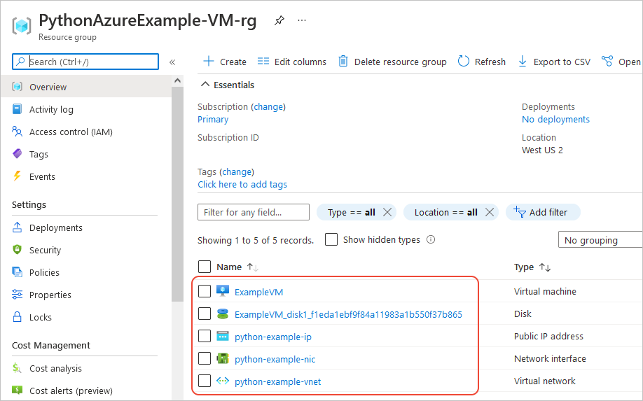

# Example: Use the Azure libraries to provision a virtual machine

This example demonstrates how to use the Azure SDK management libraries in a Python script to create a resource group that contains a Linux virtual machine. ([Equivalent Azure CLI commands](#for-reference-equivalent-azure-cli-commands) are given at the later in this article. If you prefer to use the Azure portal, see [Create a Linux VM](/azure/virtual-machines/linux/quick-create-portal) and [Create a Windows VM](/azure/virtual-machines/windows/quick-create-portal).)

All the commands in this article work the same in Linux/macOS bash and Windows command shells unless noted.

> [!NOTE]
> Provisioning a virtual machine through code is a multi-step process that involves provisioning a number of other resources that the virtual machine requires. If you're simply running such code from the command line, it's much easier to use the [`az vm create`](/cli/azure/vm#az_vm_create) command, which automatically provisions these secondary resources with defaults for any setting you choose to omit. The only required arguments are a resource group, VM name, image name, and login credentials. For more information, see [Quick Create a virtual machine with the Azure CLI](/azure/virtual-machines/scripts/virtual-machines-windows-cli-sample-create-vm-quick-create).

## 1: Set up your local development environment

If you haven't already, **follow all the instructions** on [Configure your local Python dev environment for Azure](configure-local-development-environment.md).

Be sure to create a service principal for local development, and create and activate a virtual environment for this project.

## 2: Install the needed Azure library packages

1. Create a *requirements.txt* file that lists the management libraries used in this example:

    :::code language="txt" source="~/../python-sdk-examples/vm/requirements.txt":::

1. In your terminal or command prompt with the virtual environment activated, install the management libraries listed in *requirements.txt*:

    ```cmd
    pip install -r requirements.txt
    ```

## 3: Write code to provision a virtual machine

Create a Python file named *provision_vm.py* with the following code. The comments explain the details:

:::code language="python" source="~/../python-sdk-examples/vm/provision_vm.py":::

[!INCLUDE [cli-auth-note](includes/cli-auth-note.md)]

### Reference links for classes used in the code

- [AzureCliCredential (azure.identity)](/python/api/azure-identity/azure.identity.azureclicredential)
- [ResourceManagementClient (azure.mgmt.resource)](/python/api/azure-mgmt-resource/azure.mgmt.resource.resourcemanagementclient)
- [NetworkManagementClient (azure.mgmt.network)](/python/api/azure-mgmt-network/azure.mgmt.network.networkmanagementclient)
- [ComputeManagementClient (azure.mgmt.compute)](/python/api/azure-mgmt-compute/azure.mgmt.compute.computemanagementclient)

## 4. Run the script

```cmd
python provision_vm.py
```

The provisioning process takes a few minutes to complete.

## 5. Verify the resources

Open the [Azure portal](https://portal.azure.com), navigate to the "PythonAzureExample-VM-rg" resource group, and note the virtual machine, virtual disk, network security group, public IP address, network interface, and virtual network:



### For reference: equivalent Azure CLI commands

# [cmd](#tab/cmd)

:::code language="azurecli" source="~/../python-sdk-examples/vm/provision.cmd":::

# [bash](#tab/bash)

:::code language="azurecli" source="~/../python-sdk-examples/vm/provision.sh":::

---

## 6: Clean up resources

```azurecli
az group delete -n PythonAzureExample-VM-rg  --no-wait
```

Run this command if you don't need to keep the resources created in this example and would like to avoid ongoing charges in your subscription.

[!INCLUDE [resource_group_begin_delete](includes/resource-group-begin-delete.md)]

## See also

- [Example: Provision a resource group](azure-sdk-example-resource-group.md)
- [Example: List resource groups in a subscription](azure-sdk-example-list-resource-groups.md)
- [Example: Provision Azure Storage](azure-sdk-example-storage.md)
- [Example: Use Azure Storage](azure-sdk-example-storage-use.md)
- [Example: Provision a web app and deploy code](azure-sdk-example-web-app.md)
- [Example: Provision and query a database](azure-sdk-example-database.md)
- [Use Azure Managed Disks with virtual machines](azure-sdk-samples-managed-disks.md)
- [Complete a short survey about the Azure SDK for Python](https://microsoft.qualtrics.com/jfe/form/SV_bNFX0HECjzPWMiG?Q_CHL=docs)

The following resources contain more comprehensive examples using Python to create a virtual machine:

- [Create and manage Windows VMs in Azure using Python](/samples/azure-samples/virtual-machines-python-manage/azure-virtual-machines-management-samples---python). You can use this example to create Linux VMs by changing the `storage_profile` parameter.
- [Azure Virtual Machines Management Samples - Python](https://github.com/Azure-Samples/virtual-machines-python-manage) (GitHub). The sample demonstrates additional management operations like starting and restarting a VM, stopping and deleting a VM, increasing the disk size, and managing data disks.
