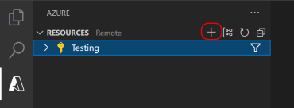
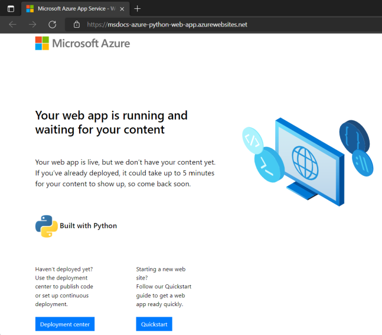

# 3: Create the App Service from Visual Studio Code

[Previous step: prepare your app](tutorial-deploy-app-service-on-linux-02.md)

In this step, you create an **App Service web app** to which you deploy your app. In App Service terminology, a "web app" is a **host** for web app code, not the app code itself.

You do this step before deploying your code so you can configure a custom startup file in step 4.

1. In the **Azure: App Service** explorer, **select the + command** to create a new App Service:

    

    You can alternately use the **Azure App Service: Create New Web App** command from the VS Code Command Palette.

    If you want to control the Azure region (location) in which you create the web app, run the **Azure App Service: Create New Web App...(Advanced)** command from the Command Palette.

1. In the prompts that follow:

    - **Enter a name for your app**, which must be globally unique across all of Azure. To ensure uniqueness, you typically use your name or company name followed by the app name.
    - Select **Python 3.8** as the runtime stack.
    - Select **Basic (B1)** for the pricing tier, which provides a good balance between cost and performance for development work.

    If you're using the **Advanced** option to select the region, select **Create new resource group** after entering the app name, followed by a name for the group. After selecting the **Python 3.8** runtime stack, select an Azure location. Then follow the prompts to create an App Service Plan before selecting the pricing tier.

1. When a message appears indicating that the new App Service was created, select **View Output** to switch to the **Output** window in VS Code:

    

1. To confirm that the App Service is running properly, expand your subscription in the **Azure: App Service** explorer, right-click the App Service name, and select **Browse website**:

    

1. Because you haven't deployed your own code to the App Service yet (which you do in the next step), only a default app appears:

    

---

## (Optional) Upload an environment variable definitions file

If you have an environment variable definitions file, you can use that file to configure the App Service environment as well. (To learn more about such files, which typically have the *.env* extension, refer to [Visual Studio Code - Python Environments](https://code.visualstudio.com/docs/python/environments#_environment-variable-definitions-file).)

1. In the **Azure: App Service** explorer, expand the node for the desired App Service, then right-click the **Application Settings** node and select **Upload Local Settings**.

1. VS Code prompts you for the location of your *.env* file, then uploads it to the App Service.

1. Once the upload is complete, you can expand the **Application Settings** node to see the individual values. You can also view them on the Azure portal by navigating to the App Service and selecting **Configuration**.

    These Application settings appear to your code as environment variables.

> [!TIP]
> If you create settings directly on the Azure portal, you can save them in a definitions file by right-clicking the **Application Settings** node and selecting **Download Remote Settings**. This process makes sure that you have those settings in your repository and not only on the portal.

> [!div class="nextstepaction"]
> [I created the App Service - continue to step 4 >>>](tutorial-deploy-app-service-on-linux-04.md)

[Having issues? Let us know.](https://aka.ms/FlaskVSCQuickstartHelp)
