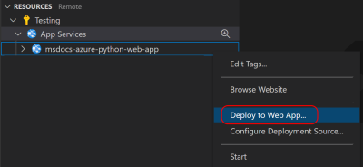
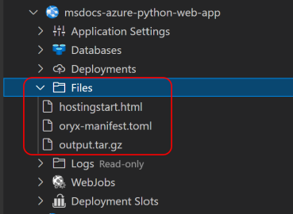

# 5: Deploy your Python web app to Azure App Service on Linux

[Previous step: configure a custom startup file](tutorial-deploy-app-service-on-linux-04.md)

Use this procedure to deploy your Python app to an Azure App Service.

1. In Visual Studio Code, in the Azure Resource explorer, right click on the App Service and select **Deploy to Web App...**.
 
   

1. In the prompts that follow, provide the following details:

    - For **Select the folder to deploy**, select your current app folder.
    - In the confirmation dialog box, select **Deploy**.
    - If prompted to update your build configuration to run build commands, select **Yes**.
    - If prompted about overwriting the existing deployment, select **Deploy**.
    - If prompted to "Always deploy the workspace", select **Yes**.

1. While the deployment process is underway, you can view progress in the VS Code **Output** window.

    

1. When deployment is complete after a few minutes (depending on how many dependencies need to be installed), the message below appears. Select the **Browse Website** button to view the running site.

    

    An example of the web app deployed is shown below.

    

1. If you still see the default app, wait a minute or two for the container to restart after the deployment and try again. If you're using a custom startup command and have verified its correctness, then continue to next step to check the logs.

1. To verify that your files are deployed and check logs, expand the App Service you deployed, then expand **Files**:

    

    The file *oryx-manifest.toml* is used by the App Service build system and the file *hostingstart.html* is the default app page.

    The *Logs* folder contains logs that can help in troubleshooting deployment problems. For more details lon logs, go to the next article in this tutorial.

> [!div class="nextstepaction"]
> [I deployed my app - continue to step 6 >>>](tutorial-deploy-app-service-on-linux-06.md)

[Having issues? Let us know.](https://aka.ms/FlaskVSCQuickstartHelp)
