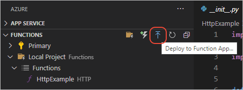
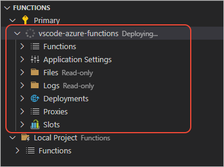

# 5: Deploy Azure Functions in Python

[Previous step: debug locally](tutorial-vs-code-serverless-python-04.md)

In this article, you use the Azure Functions extension to create a function app in Azure, along with other required Azure resources. A function app lets you group functions as a logic unit for easier management, deployment, and sharing of resources.

A function app requires an Azure Storage account for data and a [hosting plan](/azure/azure-functions/functions-scale#hosting-plan-support). All of these resources are organized within a single resource group.

1. In the **Azure: Functions** explorer, select the **Deploy to Function App** command, or open the Command Palette (**F1**) and select the **Azure Functions: Deploy to Function App** command. Again, the function app is where your Python project runs in Azure.

    

1. When prompted, select **Create New Function App in Azure**, and provide a name that's unique across Azure (typically using your personal or company name along with other unique identifiers; you can use letters, numbers, and hyphens).

    If you previously created a Function App, its name appears in this list of options.

1. When prompted, select a Python version and Azure location.

1. The extension performs the following actions, which you can observe in Visual Studio Code popup messages and the **Output** window (the process takes a few minutes):

    - Create a resource group using the name you gave (removing hyphens) in the location you selected.
    - In that resource group, create the storage account, hosting plan, and function app. By default, a [Consumption plan](/azure/azure-functions/functions-scale#consumption-plan) is created. To run your functions in a dedicated plan, you need to [enable publishing with advanced create options](/azure/azure-functions/functions-develop-vs-code).
    - Deploy your code to the function app.

    The **Azure: Functions** explorer also shows progress:

    

1. Once deployment is complete, the Azure Functions extension displays a message with buttons for three additional actions:

    

    For **Stream logs** and **Upload settings**, see the next sections.

1. Select **View output** to switch to the **Output** window. The output shows the public endpoint on Azure (the URL of your specific endpoint will match the name you specified for the function app):

    <pre>
    HTTP Trigger Urls:

          HttpExample: https://vscode-azure-functions.azurewebsites.net/api/HttpExample
    </pre>

    Use this endpoint to run the same tests you did locally, using URL parameters and/or requests with JSON data in the request body. The results of the public endpoint should match the results of the local endpoint you tested previously in [part 4](tutorial-vs-code-serverless-python-04.md).

## Stream logs

Support for log streaming is currently in development, as described on [Issue 589](https://github.com/microsoft/vscode-azurefunctions/issues/589) for the Azure Functions extension. The **Stream logs** button in the deployment message popup will eventually connect the log output on Azure to Visual Studio Code. You will also be able to start and stop the log stream on the **Azure Functions** explorer by right-clicking the Functions project and selecting **Start streaming logs** or **Stop streaming logs**.

At present, however, these commands aren't yet operational. Log streaming is instead available in a browser by running the following command, replacing `<app_name>` with the name of your Functions app on Azure:

```
# Replace <app_name> with the name of your Functions app on Azure
func azure functionapp logstream <app_name> --browser
```

## Sync local settings to Azure

The **Upload settings** button in the deployment message popup applies any changes you've made to your *local.settings.json* file to Azure. You can also invoke the command on the **Azure Functions** explorer by expanding the Functions project node, right-clicking **Application Settings**, and selecting **Upload local settings**. You can also use the Command Palette to select the **Azure Functions: Upload Local Settings** command.

Uploading settings updates any existing settings and adds any new settings defined in *local.settings.json*. Uploading doesn't remove any settings from Azure that aren't listed in the local file. To remove those settings, expand the **Applications Settings** node in the **Azure Functions** explorer, right-click the setting, and select **Delete Setting**. You can also edit settings directly on the Azure portal.

To apply any changes you make through the portal or through the **Azure Explorer** to the *local.settings.json* file, right-click the **Application Settings** node and select the **Download remote settings** command. You can also use the Command Palette to select the **Azure Functions: Download Remote Settings** command.

> [!div class="nextstepaction"]
> [I deployed the functions - continue to step 6 >>>](tutorial-vs-code-serverless-python-06.md)
