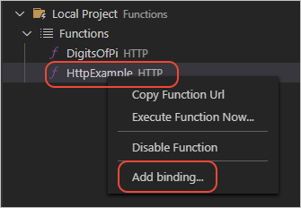

# 7: Add a storage binding for Azure Functions in Python

[Previous step: deploy a second function](tutorial-vs-code-serverless-python-06.md)

A _binding_ lets you connect your function code to resources, such as Azure storage, without writing any data access code.

A binding is defined in the *function.json* file and can represent both input and output. A function can use multiple input and output bindings, but only one trigger. To learn more, see [Azure Functions triggers and bindings concepts](/azure/azure-functions/functions-triggers-bindings).

In this section, you add a storage binding to the HttpExample function created earlier in this tutorial. The function uses this binding to write messages to storage with each request. (The storage in question uses the same default storage account used by the function app. If you plan on making heavy use of storage, however, you would want to consider creating a separate account.)

1. Sync the remote settings for your Azure Functions project into your *local.settings.json* file by opening the Command Palette and selecting **Azure Functions: Download Remote Settings**.

    Open *local.settings.json* and check that it contains a value for `AzureWebJobsStorage`. That value is the connection string for the storage account.

1. Under **Local Project** in the Azure Functions explorer, right-click the `HttpExample` function and select **Add binding**:

    

1. In the prompts that follow in Visual Studio Code, select or provide the following values:

    | Prompt | Value to provide |
    | --- | --- |
    | Select binding direction | out |
    | Select binding with direction "out" | Azure Queue Storage |
    | The name used to identify this binding in your code | msg |
    | The queue to which the message will be sent | outqueue |
    | Select setting from *local.settings.json* (asking for the storage connection) | AzureWebJobsStorage |

1. After making these selections, verify that the following binding is added to your *function.json* file:

    ```json
        {
          "type": "queue",
          "direction": "out",
          "name": "msg",
          "queueName": "outqueue",
          "connection": "AzureWebJobsStorage"
        }
    ```

1. Now that you've configured the binding, you can use it in your function code. Again, the newly defined binding appears in your code as an argument to the `main` function in *\_\_init\_\_.py*.

    For example, you can modify the *\_\_init\_\_.py* file in HttpExample to match the following, which shows using the `msg` argument to write a timestamped message with the name used in the request. The comments explain the specific changes:

    ```python
    import logging
    import datetime  # MODIFICATION: added import
    import azure.functions as func

    # MODIFICATION: the added binding appears as an argument; func.Out[func.QueueMessage]
    # is the appropriate type for an output binding with "type": "queue" (in function.json).
    def main(req: func.HttpRequest, msg: func.Out[func.QueueMessage]) -> func.HttpResponse:
        logging.info('Python HTTP trigger function processed a request.')

        name = req.params.get('name')
        if not name:
            try:
                req_body = req.get_json()
            except ValueError:
                pass
            else:
                name = req_body.get('name')

        if name:
            # MODIFICATION: write the a message to the message queue, using msg.set
            msg.set(f"Request made for {name} at {datetime.datetime.now()}")

            return func.HttpResponse(f"Hello, {name}. This HTTP triggered function executed successfully.")
        else:
            return func.HttpResponse(
                 "Please pass a name on the query string or in the request body",
                 status_code=400
            )
    ```

1. To test these changes locally, start the debugger again in Visual Studio Code by pressing F5 or selecting the **Run** > **Start Debugging** menu command.

    As before the **Output** window should show the endpoints in your project.

1. In a browser, visit the URL `http://localhost:7071/api/HttpExample?name=VS%20Code` to create a request to the HttpExample endpoint, which should also write a message to the queue.

1. To verify that the message was written to the "outqueue" queue (as named in the binding), you can use one of three methods:

    1. Sign into the [Azure portal](https://portal.azure.com), and navigate to the resource group containing your functions project. Within that resource group, local and navigate into the storage account for the project, then navigate into **Queues**. On that page, navigate into "outqueue", which should display all the logged messages.

    1. Navigate and examine the queue with either the Azure Storage Explorer, which integrates with Visual Studio, as described on [Connect Functions to Azure Storage using Visual Studio Code](/azure/azure-functions/functions-add-output-binding-storage-queue-vs-code), especially the [Examine the output queue](/azure/azure-functions/functions-add-output-binding-storage-queue-vs-code#examine-the-output-queue) section.

    1. Use the Azure CLI to query the storage queue, as described on [Query the storage queue](/azure/azure-functions/functions-add-output-binding-storage-queue-cli?pivots=programming-language-python).

1. To test in the cloud, redeploy the code by using the **Deploy to Function App** in the **Azure: Functions** explorer. If prompted, select the Function App created previously. Once deployment finishes (it takes a few minutes!), the **Output** window again shows the public endpoints with which you can repeat your tests.

> [!div class="nextstepaction"]
> [I added a storage binding - continue to step 8 >>>](tutorial-vs-code-serverless-python-08.md)

[Having issues? Let us know.](https://aka.ms/python-functions-qs-ms-survey)
