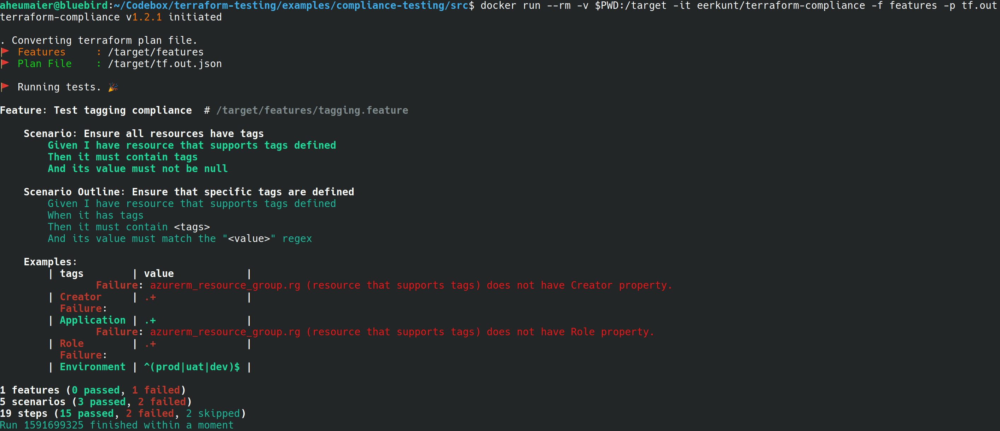
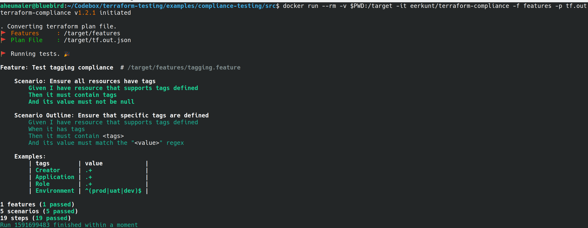

# Tutorial: Compliance testing with Terraform and Azure

[!INCLUDE [terraform-intro.md](includes/terraform-intro.md)]

In this article, you learn how to do the following tasks:

> [!div class="checklist"]
> * Understand when to use compliance testing
> * Learn how to do a compliance check

[!INCLUDE [hashicorp-support.md](includes/hashicorp-support.md)]

## Prerequisites

[!INCLUDE [open-source-devops-prereqs-azure-subscription.md](../includes/open-source-devops-prereqs-azure-subscription.md)]
- **Install Terraform**: Based on your environment, [download and install Terraform](https://www.terraform.io/downloads.html).
- **Docker**: [Install Docker](https://docs.docker.com/get-docker/)
- **Terraform-compliance**: [Install the Terraform compliance tool](https://terraform-compliance.com/pages/installation/docker).
- **Fork the testing samples**: Fork the [Terraform sample project on GitHub](https://github.com/Azure/terraform) and clone it to your dev/test machine.

## When to use Compliance Testing

Compliance testing is a nonfunctional testing technique to determine if a system meets prescribed standards. Compliance testing is also known as *conformance testing*,

Most software teams do an analysis to check that the standards are properly enforced and implemented. Often working simultaneously to improve the standards that, in turn, lead to increased quality.

Compliance testing ensures the conformity of the deliverables of each phase of the development lifecycle.

Compliance checks should be integrated into the development cycle at the beginning of the projects. Attempting to add compliance checks at a later stage becomes increasingly more difficult when the requirement itself is not adequately documented.

## Understanding compliance checks

Doing compliance checks is straight forward. A set of standards and procedures is developed and documented for each phase of the development lifecycle. Deliverables of each phase are compared against the documented standards. The results of the test are any "gaps" in not conforming to the predetermined standards. Compliance testing is done through the inspection process and the outcome of the review process should be documented.

Let's take a look at a specific example.

A common problem is when environments are broken due to multiple developers applying incompatible or contradictory changes. For example, let's say one person works on a change and applies resources such as creating a VM in a test environment. Then, another person applies a different version of the code that provisions different version of that VM. What is needed here is some sort of oversight or control in ensuring consistency and conformity to stated rules.

One way to address this issue would be to define a policy of tagging the resources - such as with `role` and `creator` tags. This is where [Terraform-compliance](https://terraform-compliance.com) helps. Terraform-compliance focuses on *negative testing*. Negative testing is the process of ensuring that a system can gracefully handle unexpected input or unwanted behavior. *Fuzzing* is a type of negative testing where a system that receives input is tested to ensure that it can safely handle inappropriate or unexpected input. 

Fortunately, Terraform is an abstraction layer for any API that creates, updates, or destroys cloud-infrastructure entities. Terraform also provides the capability to ensure everything is up-to-date between the local configuration and the remote API responses. Since Terraform is mostly used against Cloud APIs, we still need a way to ensure the code deployed against the infrastructure follows specific policies. Terraform-compliance - a free and open-source tool - provides this functionality for Terraform configurations.

Using the VM example mentioned before, a sample compliance policy might take the form, "If you creating an Azure resource, it must contain a tag". The Terraform-compliance tool provides a test framework where you create policies like this and then run them against your Terraform execution plan.

Terraform-compliance allows you to apply BDD, or *behavior-driven development*, principles. BDD is a collaborative process where all stakeholders work together to define what a system should do. These stakeholders generally include the developers and testers as well as anyone with a vested interest in - or who will be impacted by - the system being developed. The main goal of BDD is to encourage teams (or virtual teams) to build concrete examples that articulate a common understanding of how the system should behave.

## Looking at an example

Previously in this article, you read about a compliance-testing example of creating a VM for a test environment. This section shows how to translate that example into a BDD Feature and Scenario. The rule is first expressed using *Cucumber*, which is a tool used to support BDD.

```Cucumber
if you are working with Azure, you should not create a resource, without having any tags
```

The previous rule is translated as follows:

```Cucumber
Given I have resources that supports tags defined
Then it must contain tags
And its value must not be null
```

The Terraform HCL code would then adhere to the rule as follows.

```hcl
resource "random_uuid" "uuid" {}

resource "azurerm_resource_group" "rg" {
  name     = "rg-hello-tf-${random_uuid.uuid.result}"
  location = var.location

  tags = {
    environment = "dev"
    application = "Azure Compliance"
  } 
}
```

The first policy could be written as a [BDD feature scenario](https://gherkin.io/docs/gherkin/reference/) as follows:

```Cucumber
Feature: Test tagging compliance  # /target/src/features/tagging.feature
    Scenario: Ensure all resources have tags
        Given I have resource that supports tags defined
        Then it must contain tags
        And its value must not be null
```

The following code shows a test for a specific tag:

```Cucumber
Scenario Outline: Ensure that specific tags are defined
    Given I have resource that supports tags defined
    When it has tags
    Then it must contain <tags>
    And its value must match the "<value>" regex

    Examples:
      | tags        | value              |
      | Creator     | .+                 |
      | Application | .+                 |
      | Role        | .+                 |
      | Environment | ^(prod\|uat\|dev)$ |
```

## Running the sample

In this section, you will download and test the example.

1. 


The example shown in this article is available for download in the [Azure Terraform GitHub repository](https://github.com/Azure/terrraform/tree/compliance-testing/examples/master).

After you clone or copy the repo to your local system, change directories as follows:

```bash 
cd ./terraform-testing/examples/compliance-testing/src
```


... we create a terraform planfile in `./src/` we going to test against.

```bash
cd src/ 
terraform init 
terraform validate 
terraform plan -out tf.out 
terraform apply -target=random_uuid.uuid
docker pull eerkunt/terraform-compliance
```

Now we are ready to run the tests suite.

```bash 
docker run --rm -v $PWD:/target -it eerkunt/terraform-compliance -f features -p tf.out
```

### From Red to Green

This should result in a failing test run. We see our first rule of requiring existence of tags succeed but we don't comply with the full spec of tags: `Role` and `Creator` tags are missing:



Make the test green again by adding all required tags to `main.tf`:

```hcl 
  tags = {
    Environment = "dev"
    Application = "Azure Compliance"
    Creator     = "Azure Compliance"
    Role        = "Azure Compliance"
  } 

```

Let's update the plan file again to reflect the updated state:

```bash 
terraform validate 
terraform plan -out tf.out 
```

Now, we should be green when running the tests suite again. We see our first rule of requiring existence of tags suceed and now we also provide the full spec of tags too:



## Next steps

> [!div class="nextstepaction"]
> [Create and run end-to-end tests in Terraform projects](best-practices-end-to-end-testing.md)
