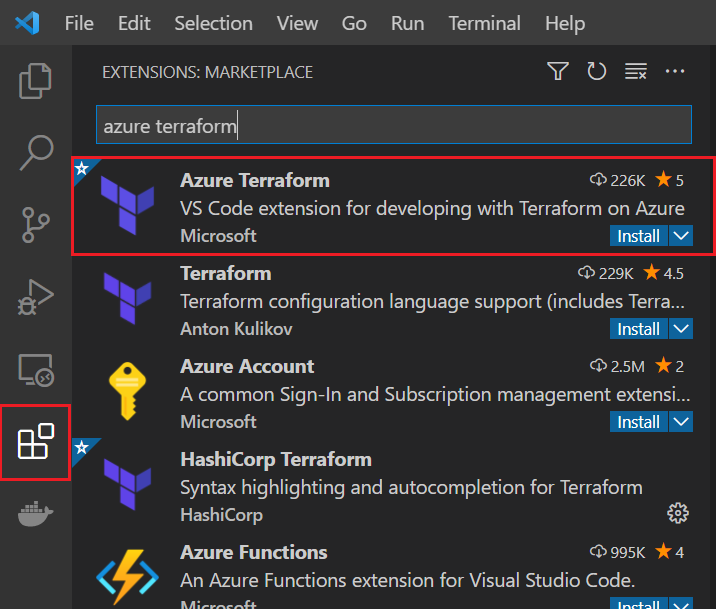

# Get Started: Install the Azure Terraform Visual Studio Code extension

The Visual Studio Code Terraform extension enables you to work with Terraform from the editor. With this extension, you can author, test, and run Terraform configurations.

In this article, you learn how to:
> [!div class="checklist"]

> * Install the Terraform Visual Studio Code extension for Azure services
> * Create an Azure resource group to hold other Azure resources
> * Verify (using Azure CLI and Azure PowerShell within Visual Studio Code) the resource group was created
> * Delete the resource group when finished using it

## 1. Configure your environment

[!INCLUDE [open-source-devops-prereqs-azure-subscription.md](../includes/open-source-devops-prereqs-azure-subscription.md)]

[!INCLUDE [configure-terraform.md](includes/configure-terraform.md)]

- [Install Node.js](https://nodejs.org/).

- [Install GraphViz](https://graphviz.org/) to use the Terraform visualize function.

## 2. Install the Azure Terraform Visual Studio Code extension

1. Launch Visual Studio Code.

1. From the left menu, select **Extensions**, and enter `Azure Terraform` in the search text box.

	
    :::image type="content" source="media/configure-vs-code-extension-for-terraform/search-for-azure-terraform-extension.png" alt-text="Search Visual Studio Code extensions in Marketplace.":::

1. From the list of extensions, locate the `Azure Terraform` extension. (It should be the first extension listed.)

1. If the extension isn't yet installed,  select the extension's **Install** option.

    **Key points:**
    - When you select **Install** for the Azure Terraform extension, Visual Studio Code automatically installs the Azure Account extension.
    - Azure Account is a dependency file for the Azure Terraform extension. This file is used to authenticate to Azure and Azure-related code extensions.

1. To confirm the installation of the extensions, enter `@installed` in the search text box. Both the Azure Terraform extension and the Azure Account extension will appear in the list of installed extensions.

    

You can now run all supported Terraform commands in your Cloud Shell environment from within Visual Studio Code.

## 3. Implement the Terraform code

1. Create a directory in which to test and run the sample Terraform code and make it the current directory.

1. Create a file named `main.tf` and insert the following code:

    [!code-terraform[master](../../terraform_samples/quickstart/101-resource-group/main.tf)]

1. Create a file named `variables.tf` to contain the project variables and insert the following code:

    [!code-terraform[master](../../terraform_samples/quickstart/101-resource-group/variables.tf)]

## 4. Initialize Terraform within Visual Studio Code

1. From the Explorer pane on the left, double-click the `main.tf` file to open it.

1. From the **View** menu, select **Command Palette...**.

1. In the Command Palette text box, start entering `Azure Terraform: Init` and select it when it displays.

1. Follow the prompts to install any dependencies - such as the latest supported version of nodejs.

1. If this is the first time you're using Cloud Shell with your default Azure subscription, follow the prompts to configure the environment.

## 5. Create a Terraform execution plan within Visual Studio Code

The [terraform plan](https://www.terraform.io/docs/commands/plan.html) command is used to check whether the execution plan for a set of changes will do what you intended.

From the menu bar, select **View** > **Command Palette** > **Azure Terraform: plan**.

## 6. Apply a Terraform execution plan within Visual Studio Code

Once you're ready to apply the execution plan to your cloud infrastructure, you run [terraform apply](https://www.terraform.io/docs/commands/apply.html).

1. From the menu bar, select **View** > **Command Palette** > **Azure Terraform: apply**.

    

1. Enter `yes`.

    

## 7. Verify the results

To see if your new Azure resource group was successfully created, open the Azure portal and select **Resource groups** in the left navigation pane.

    

## 8. Clean up resources

1. From the menu bar, select **View** > **Command Palette** > **Azure Terraform: destroy**.

    

1. Enter *yes*.

    

1. To confirm that Terraform successfully destroyed your new resource group, select **Refresh** on the Azure portal **Resource groups** page. Your resource group will no longer be listed.

    

## Troubleshoot Terraform on Azure

[Troubleshoot common problems when using Terraform on Azure](troubleshoot.md)

## Next steps

> [!div class="nextstepaction"]
> [List of the Terraform modules available for Azure (and other supported providers)](https://registry.terraform.io/)