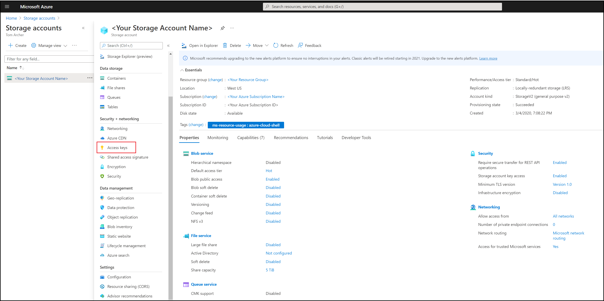
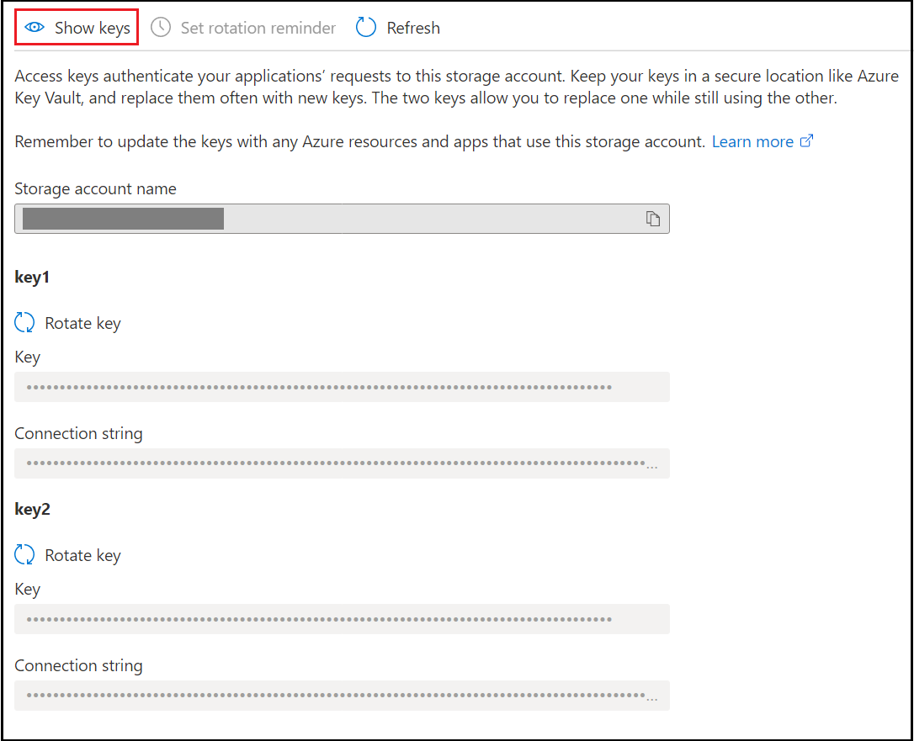
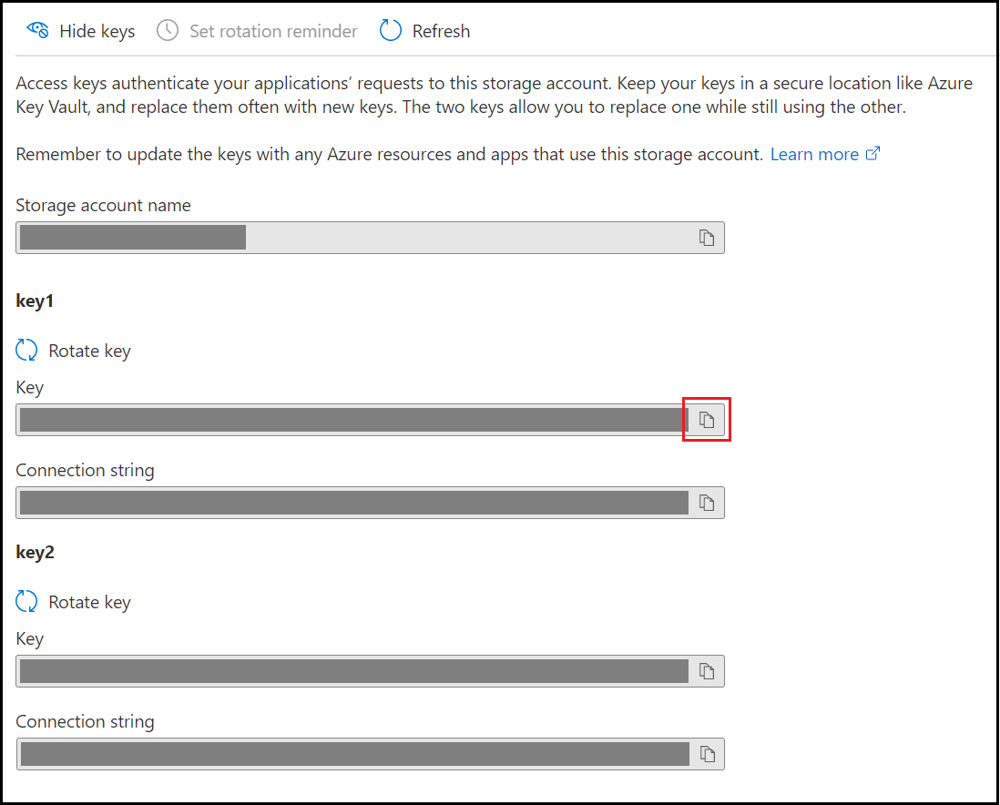

# Create an Application Gateway Ingress Controller in Azure Kubernetes Service using Terraform

Article tested with following software/versions:
- [Terraform v1.1.4](https://releases.hashicorp.com/terraform/)
- [AzureRM Provider v.2.94.0](https://registry.terraform.io/providers/hashicorp/azurerm/latest/docs)

[Azure Kubernetes Service (AKS)](/azure/aks/) manages your hosted Kubernetes environment. AKS makes it quick and easy to deploy and manage containerized applications without container orchestration expertise. AKS also eliminates the burden of taking applications offline for operational and maintenance tasks. Using AKS, you can do such tasks as provisioning, upgrading, and scaling resources on-demand.

An Application Gateway Ingress Controller (AGIC) provides various features for Kubernetes services. These features include reverse proxy, configurable traffic routing, and TLS termination. Kubernetes Ingress resources are used to configure the Ingress rules for individual Kubernetes services. An Ingress controller allows a single IP address to route traffic to multiple services in a Kubernetes cluster. All this functionality is provided by Azure [Application Gateway](/azure/Application-Gateway/), making it an ideal Ingress controller for Kubernetes on Azure.

In this article, you learn how:
> [!div class="checklist"]

> * Create a [Kubernetes](https://www.redhat.com/en/topics/containers/what-is-kubernetes) cluster using AKS with Application Gateway as Ingress controller
> * Define a Kubernetes cluster
> * Create Application Gateway resource
> * Create a Kubernetes cluster
> * Test the availability of a Kubernetes cluster

## 1. Configure your environment

[!INCLUDE [open-source-devops-prereqs-azure-subscription.md](../includes/open-source-devops-prereqs-azure-subscription.md)]

[!INCLUDE [configure-terraform.md](includes/configure-terraform.md)]

- **Azure service principal:** If you don't have a service principal, [create a service principal](authenticate-to-azure.md#create-a-service-principal). Make note of the `appId`, `display_name`, `password`, and `tenant`.

- **Service principal object ID**: Run the following command to get the object ID of the service principal: `az ad sp list --display-name "<display_name>" --query "[].{\"Object ID\":objectId}" --output table`

- **Install Helm**: [Helm](https://helm.sh/docs/intro/install/) is the Kubernetes package manager.

## 2. Configure Azure storage to store Terraform state

Terraform tracks state locally via the `terraform.tfstate` file. This pattern works well in a single-person environment. However, in a more practical multi-person environment, you need to track state on the server using [Azure storage](/azure/storage/). In this section, you learn to retrieve the necessary storage account information and create a storage container. The Terraform state information is then stored in that container.

1. Use one of the following options to create an Azure storage account:

    - [Create a storage account (via the Azure portal)](/azure/storage/common/storage-account-create?tabs=azure-portal)
    - [Create a storage account (via Azure CLI)](/azure/storage/common/storage-account-create?tabs=azure-cli)
    - [Create a storage account (via Azure PowerShell)](/azure/storage/common/storage-account-create?tabs=azure-powershell)

1. Browse to the [Azure portal](https://portal.azure.com).

1. Under **Azure services**, select **Storage accounts**. (If the **Storage accounts** option isn't visible on the main page, select **More services** to locate the option.)

1. On the **Storage accounts** page, On the Storage accounts page, select the storage account where Terraform will store the state information.

1. On the **Storage account** page, in the left menu, select **Access keys**.

    

1. On the **Access keys** page, select **Show keys** to display the key values.

    

1. Locate the **key1** **key** on the page and select the icon to its right to copy the key value to the clipboard.

    

1. From a command line prompt, run [az storage container create](/cli/azure/storage/container#az_storage_container_create). This command creates a container in your Azure storage account. Replace the placeholders with the appropriate values for your Azure storage account.

    ```azurecli
    az storage container create -n tfstate --account-name <storage_account_name> --account-key <storage_account_key>
    ```

1. When the command successfully completes, it displays a JSON block with a key of **"created"** and a value of **true**. You can also run [az storage container list](/cli/azure/storage/container#az_storage_container_list) to verify the container was successfully created.

    ```azurecli
    az storage container list --account-name <storage_account_name> --account-key <storage_account_key>
    ```

## 3. Implement the Terraform code

1. Create a directory in which to test the sample Terraform code and make it the current directory.

1. Create a file named `providers.tf` and insert the following code.

    [!code-terraform[UserStory1871520-2](../../terraform_samples/quickstart/201-k8s-cluster-with-aks-applicationgateway-ingress/providers.tf)]

    **Key points:**

    - Set `resource_group_name` to the resource group of the storage account.
    - Set `storage_account_name` to the storage account name.

1. Create a file named `main.tf` and insert the following code:

    [!code-terraform[UserStory1871520-2](../../terraform_samples/quickstart/201-k8s-cluster-with-aks-applicationgateway-ingress/main.tf)]

    **Key points:**

    - With AKS, you pay only for the worker nodes.
    - The `agent_pool_profile record` includes the number of worker nodes to create and the type of worker nodes.
    - If you need to scale up or scale down the cluster in the future, modify the `count` value in `agent_pool_profile record` record.

1. Create a file named `variables.tf` and insert the following code:

    [!code-terraform[UserStory1871520-2](../../terraform_samples/quickstart/201-k8s-cluster-with-aks-applicationgateway-ingress/variables.tf)]

    **Key points:**

    - Most of these variables are set to default values. Verify the values work for your environment and change if necessary.
    - For example, RBAC is disabled by default. Change the `aks_enable_rbac` block's `default` value to `true` if you want to enable RBAC. Knowing the RBAC disposition is necessary when you reach the [Install Azure AD Pod Identity](#8-install-azure-ad-pod-identity) section.

1. Create a file named `output.tf` and insert the following code.

    [!code-terraform[UserStory1871520-2](../../terraform_samples/quickstart/201-k8s-cluster-with-aks-applicationgateway-ingress/output.tf)]

    **Key points:**

    - [Terraform outputs](https://www.terraform.io/docs/configuration/outputs.html) allow you to define values that are highlighted to the user when Terraform applies a plan.
    - These values can be queried using the `terraform output` command.
    - In this section, you create an output file that allows access to the cluster with [kubectl](https://kubernetes.io/docs/reference/kubectl/overview/).

1. Create a file named `terraform.tfvars` and insert the following code.

    [!code-terraform[UserStory1871520-2](../../terraform_samples/quickstart/201-k8s-cluster-with-aks-applicationgateway-ingress/terraform.tfvars)]

    **Key points:**

    - Set `resource_group_name` to the resource group where the storage account exists.
    - Set `location` to the resource group location.
    - Set `aks_service_principal_app_id` to the service principal `appId` value.
    - Set `aks_service_principal_client_secret` to the service principal `password` value.
    - Set `aks_service_principal_object_id` to the service principal object ID. (The Azure CLI command for obtaining this value is in the [Configure your environment](#1-configure-your-environment) section.)

## 4. Initialize Terraform

[!INCLUDE [terraform-init.md](includes/terraform-init.md)]

## 5. Create a Terraform execution plan

[!INCLUDE [terraform-plan.md](includes/terraform-plan.md)]

## 6. Apply a Terraform execution plan

[!INCLUDE [terraform-apply-plan.md](includes/terraform-apply-plan.md)]

## 7. Verify the results: Test the Kubernetes cluster

The Kubernetes tools can be used to verify the newly created cluster.

1. Run [az aks get-credentials](/cli/azure/aks#az-aks-get-credentials) to get the Kubernetes configuration and access credentials from Azure.

    ```azcli
    az aks get-credentials --name <aks_cluster_name>  --resource-group <resource_group_name>
    ```

1. Verify the health of the cluster.

    ```bash
    kubectl get nodes
    ```

    **Key points:**

    - The details of your worker nodes are displayed with a status of **Ready**.

    

## 8. Install Azure AD Pod Identity

Azure Active Directory Pod Identity provides token-based access to [Azure Resource Manager](/azure/azure-resource-manager/resource-group-overview).

[Azure AD Pod Identity](https://github.com/Azure/aad-pod-identity) adds the following components to your Kubernetes cluster:

  - Kubernetes [CRDs](https://kubernetes.io/docs/tasks/access-kubernetes-api/custom-resources/custom-resource-definitions/): `AzureIdentity`, `AzureAssignedIdentity`, `AzureIdentityBinding`
  - [Managed Identity Controller (MIC)](https://github.com/Azure/aad-pod-identity#managed-identity-controllermic) component
  - [Node Managed Identity (NMI)](https://github.com/Azure/aad-pod-identity#node-managed-identitynmi) component

To install Azure AD Pod Identity to your cluster, you need to know if RBAC is enabled or disabled. Enabling or disabling RBAC is done in the `variables.tf` file via the `aks_enable_rbac` block's `default` value.

- If RBAC is **enabled**, run the following command:

    ```cmd
    kubectl create -f https://raw.githubusercontent.com/Azure/aad-pod-identity/master/deploy/infra/deployment-rbac.yaml
    ```

- If RBAC is **disabled**, run the following command:

    ```cmd
    kubectl create -f https://raw.githubusercontent.com/Azure/aad-pod-identity/master/deploy/infra/deployment.yaml
    ```

## 9. Install Helm

Use Helm to install the `application-gateway-kubernetes-ingress` package:

1. Run the following helm commands to add the AGIC Helm repo.

``` cmd
helm repo add application-gateway-kubernetes-ingress https://appgwingress.blob.core.windows.net/ingress-azure-helm-package/
```

1. Update the AGIC Helm repo.

``` cmd
helm repo update
```

## 10. Install AGIC Helm Chart

1. Download `helm-config.yaml` to configure AGIC:

    ```bash
    wget https://raw.githubusercontent.com/Azure/application-gateway-kubernetes-ingress/master/docs/examples/sample-helm-config.yaml -O helm-config.yaml
    ```

1. Edit the `helm-config.yaml` and enter appropriate values for `appgw` and `armAuth` sections.

    ```bash
    code helm-config.yaml
    ```

    The values are described as follows:

    - `verbosityLevel`: Sets the verbosity level of the AGIC logging infrastructure. See [Logging Levels](https://github.com/Azure/application-gateway-kubernetes-ingress/blob/463a87213bbc3106af6fce0f4023477216d2ad78/docs/troubleshooting.md#logging-levels) for possible values.
    - `appgw.subscriptionId`: The Azure Subscription ID for the App Gateway. Example: `a123b234-a3b4-557d-b2df-a0bc12de1234`
    - `appgw.resourceGroup`: Name of the Azure Resource Group in which App Gateway was created. 
    - `appgw.name`: Name of the Application Gateway. Example: `applicationgateway1`.
    - `appgw.shared`: This boolean flag should be defaulted to `false`. Set to `true` should you need a [Shared App Gateway](https://github.com/Azure/application-gateway-kubernetes-ingress/blob/072626cb4e37f7b7a1b0c4578c38d1eadc3e8701/docs/setup/install-existing.md#multi-cluster--shared-app-gateway).
    - `kubernetes.watchNamespace`: Specify the name space, which AGIC should watch. The namespace can be a single string value, or a comma-separated list of namespaces. Leaving this variable commented out, or setting it to blank or empty string results in Ingress controller observing all accessible namespaces.
    - `armAuth.type`: A value of either `aadPodIdentity` or `servicePrincipal`.
    - `armAuth.identityResourceID`: Resource ID of the managed identity.
    - `armAuth.identityClientId`: The Client ID of the Identity.
    - `armAuth.secretJSON`: Only needed when Service Principal Secret type is chosen (when `armAuth.type` has been set to `servicePrincipal`).

    **Key points:**

    - The `identityResourceID`  value is created in the terraform script and can be found by running: `echo "$(terraform output identity_resource_id)"`.
    - The `identityClientID` value is created in the terraform script and can be found by running: `echo "$(terraform output identity_client_id)"`.
    - The `<resource-group>` value is the resource group of your App Gateway.
    - The `<identity-name>` value is the name of the created identity.
    - All identities for a given subscription can be listed using: `az identity list`.

1. Install the Application Gateway Ingress controller package:

    ```bash
    helm install -f helm-config.yaml application-gateway-kubernetes-ingress/ingress-azure --generate-name
    ```

## 11. Install a sample app

Once you have the App Gateway, AKS, and AGIC installed, install a sample app.

1. Use the curl command to download the YAML file:

    ```cmd
    curl https://raw.githubusercontent.com/Azure/application-gateway-kubernetes-ingress/master/docs/examples/aspnetapp.yaml -o aspnetapp.yaml
    ```

2. Apply the YAML file:

    ```cmd
    kubectl apply -f aspnetapp.yaml
    ```

## 12. Clean up resources

[!INCLUDE [terraform-plan-destroy.md](includes/terraform-plan-destroy.md)]

## Troubleshoot Terraform on Azure

[Troubleshoot common problems when using Terraform on Azure](troubleshoot.md)

## Next steps

> [!div class="nextstepaction"]
> [Application Gateway Ingress Controller](https://azure.github.io/application-gateway-kubernetes-ingress/)
