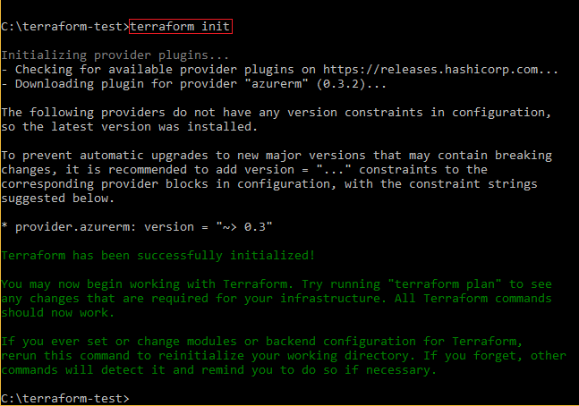

# Create an Azure VM cluster with Terraform and HCL

In this tutorial, you see how to create a small compute cluster using [HCL](https://www.terraform.io/docs/configuration/syntax.html). 

You'll learn how to do the following tasks:

> [!div class="checklist"]
> * Set up Azure authentication.
> * Create a Terraform configuration file.
> * Use a Terraform configuration file to create a load balancer.
> * Use a Terraform configuration file to deploy two Linux VMs in an availability set.
> * Initialize Terraform.
> * Create a Terraform execution plan.
> * Apply the Terraform execution plan to create the Azure resources.

[!INCLUDE [hashicorp-support.md](includes/hashicorp-support.md)]

## Prerequisites

[!INCLUDE [open-source-devops-prereqs-azure-subscription.md](../includes/open-source-devops-prereqs-azure-subscription.md)]

## 1. Create a Terraform configuration file

In this section, you create a file that contains resource definitions for your infrastructure.

1. Create a new file named `main.tf`. 

2. Copy following sample resource definitions into the newly created `main.tf` file: 

   ```hcl
   resource "azurerm_resource_group" "test" {
    name     = "acctestrg"
    location = "West US 2"
   }

   resource "azurerm_virtual_network" "test" {
    name                = "acctvn"
    address_space       = ["10.0.0.0/16"]
    location            = azurerm_resource_group.test.location
    resource_group_name = azurerm_resource_group.test.name
   }

   resource "azurerm_subnet" "test" {
    name                 = "acctsub"
    resource_group_name  = azurerm_resource_group.test.name
    virtual_network_name = azurerm_virtual_network.test.name
    address_prefix       = "10.0.2.0/24"
   }

   resource "azurerm_public_ip" "test" {
    name                         = "publicIPForLB"
    location                     = azurerm_resource_group.test.location
    resource_group_name          = azurerm_resource_group.test.name
    allocation_method            = "Static"
   }

   resource "azurerm_lb" "test" {
    name                = "loadBalancer"
    location            = azurerm_resource_group.test.location
    resource_group_name = azurerm_resource_group.test.name

    frontend_ip_configuration {
      name                 = "publicIPAddress"
      public_ip_address_id = azurerm_public_ip.test.id
    }
   }

   resource "azurerm_lb_backend_address_pool" "test" {
    resource_group_name = azurerm_resource_group.test.name
    loadbalancer_id     = azurerm_lb.test.id
    name                = "BackEndAddressPool"
   }

   resource "azurerm_network_interface" "test" {
    count               = 2
    name                = "acctni${count.index}"
    location            = azurerm_resource_group.test.location
    resource_group_name = azurerm_resource_group.test.name

    ip_configuration {
      name                          = "testConfiguration"
      subnet_id                     = azurerm_subnet.test.id
      private_ip_address_allocation = "dynamic"
    }
   }

   resource "azurerm_managed_disk" "test" {
    count                = 2
    name                 = "datadisk_existing_${count.index}"
    location             = azurerm_resource_group.test.location
    resource_group_name  = azurerm_resource_group.test.name
    storage_account_type = "Standard_LRS"
    create_option        = "Empty"
    disk_size_gb         = "1023"
   }

   resource "azurerm_availability_set" "avset" {
    name                         = "avset"
    location                     = azurerm_resource_group.test.location
    resource_group_name          = azurerm_resource_group.test.name
    platform_fault_domain_count  = 2
    platform_update_domain_count = 2
    managed                      = true
   }

   resource "azurerm_virtual_machine" "test" {
    count                 = 2
    name                  = "acctvm${count.index}"
    location              = azurerm_resource_group.test.location
    availability_set_id   = azurerm_availability_set.avset.id
    resource_group_name   = azurerm_resource_group.test.name
    network_interface_ids = [element(azurerm_network_interface.test.*.id, count.index)]
    vm_size               = "Standard_DS1_v2"

    # Uncomment this line to delete the OS disk automatically when deleting the VM
    # delete_os_disk_on_termination = true

    # Uncomment this line to delete the data disks automatically when deleting the VM
    # delete_data_disks_on_termination = true

    storage_image_reference {
      publisher = "Canonical"
      offer     = "UbuntuServer"
      sku       = "16.04-LTS"
      version   = "latest"
    }

    storage_os_disk {
      name              = "myosdisk${count.index}"
      caching           = "ReadWrite"
      create_option     = "FromImage"
      managed_disk_type = "Standard_LRS"
    }

    # Optional data disks
    storage_data_disk {
      name              = "datadisk_new_${count.index}"
      managed_disk_type = "Standard_LRS"
      create_option     = "Empty"
      lun               = 0
      disk_size_gb      = "1023"
    }

    storage_data_disk {
      name            = element(azurerm_managed_disk.test.*.name, count.index)
      managed_disk_id = element(azurerm_managed_disk.test.*.id, count.index)
      create_option   = "Attach"
      lun             = 1
      disk_size_gb    = element(azurerm_managed_disk.test.*.disk_size_gb, count.index)
    }

    os_profile {
      computer_name  = "hostname"
      admin_username = "testadmin"
      admin_password = "Password1234!"
    }

    os_profile_linux_config {
      disable_password_authentication = false
    }

    tags = {
      environment = "staging"
    }
   }
   ```

## 2. Initialize Terraform

The [terraform init command](https://www.terraform.io/docs/commands/init.html) is used to initialize a directory that contains the Terraform configuration files - the files you created with the previous sections. It's a good practice to always run the `terraform init` command after writing a new Terraform configuration. 

> [!TIP]
> The `terraform init` command is idempotent meaning that it can be called repeatedly while producing the same result. Therefore, if you're working in a collaborative environment, and you think the configuration files might have been changed, it's always a good idea to call the `terraform init` command before executing or applying a plan.

To initialize Terraform, run the following command:

  ```bash
  terraform init
  ```

  

## 3. Create a Terraform execution plan

The [terraform plan command](https://www.terraform.io/docs/commands/plan.html) is used to create an execution plan. To generate an execution plan, Terraform aggregates all the `.tf` files in the current directory. 

The [-out parameter](https://www.terraform.io/docs/commands/plan.html#out-path) saves the execution plan to an output file. This feature addresses concurrency issues common in multi-dev environments. One such problem solved by the output file is the following scenario:

1. Dev 1 creates the configuration file.
1. Dev 2 modifies the configuration file.
1. Dev 1 applies (runs) the configuration file.
1. Dev 1 gets unexpected results not knowing that Dev 2 modified the configuration.

Dev 1 specifying an output file prevents Dev 2 from affecting Dev 1. 

If you don't need to save your execution plan, run the following command:

  ```bash
  terraform plan
  ```

If you need to save your execution plan, run the following command. Replace the placeholders with appropriate values for your environment.

  ```bash
  terraform plan -out=<path>
  ```

Another useful parameter is [-var-file](https://www.terraform.io/docs/commands/plan.html#var-file-foo).

By default Terraform tried to find your variables file as follows:
- File named `terraform.tfvars`
- File named with using the following pattern: `*.auto.tfvars`

However, your variables file need not follow either of the two preceding conventions. In that case, specify your variables file name with the `-var-file` parameter where your variable file name does not carry an extension. The following example illustrates this point:

```hcl
terraform plan -var-file <my-variables-file>
```

Terraform determines the actions necessary to achieve the state specified in the configuration file.


## 4. Apply the Terraform execution plan

The final step of this tutorial is to use the [terraform apply command](https://www.terraform.io/docs/commands/apply.html) to apply the set of actions generated by the `terraform plan` command.

If you want to apply the latest execution plan, run the following command:

  ```bash
  terraform apply
  ```

If you want to apply a previously saved execution plan, run the following command. Replace the placeholders with appropriate values for your environment:

  ```bash
  terraform apply <path>
  ```


## Next steps

> [!div class="nextstepaction"] 
> [Create an Azure virtual machine scale set using Terraform](create-vm-scaleset-network-disks-hcl.md)