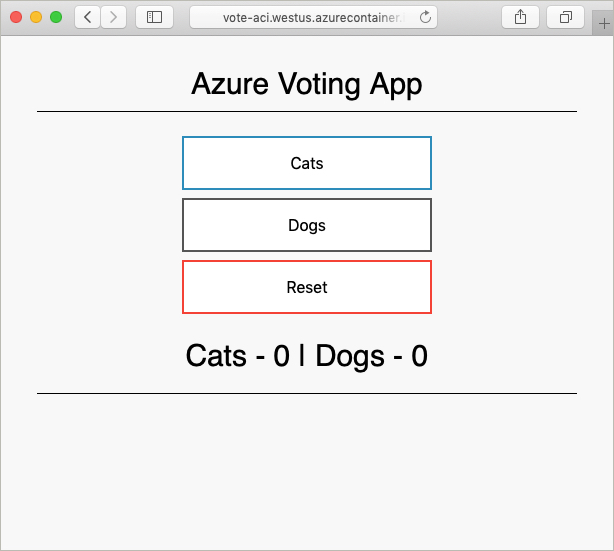

# Quickstart: Deploy an Azure Cosmos DB to Azure Container Instances

Article tested with the following Terraform and Terraform provider versions:

- [Terraform v1.2.7](https://releases.hashicorp.com/terraform/)
- [AzureRM Provider v.3.20.0](https://registry.terraform.io/providers/hashicorp/azurerm/latest/docs)

[!INCLUDE [Terraform abstract](./includes/abstract.md)]

This article shows how to use Terraform to deploy an Azure Cosmos DB to Azure Container Instances.

In this article, you learn how to:
> [!div class="checklist"]

> * Create an Azure Cosmos DB instance
> * Create an Azure Container Instance
> * Create an app that works across these two resources

> [!NOTE]
> The example code in this article is located in the [Microsoft Terraform GitHub repo](https://github.com/Azure/terraform/tree/UserStory1983164/quickstart/101-cosmos-db-azure-container-instance).

## Prerequisites

[!INCLUDE [open-source-devops-prereqs-azure-subscription.md](../includes/open-source-devops-prereqs-azure-subscription.md)]

[!INCLUDE [configure-terraform.md](includes/configure-terraform.md)]

## Implement the Terraform code

1. Create a directory in which to test the sample Terraform code and make it the current directory.

1. Create a file named `providers.tf` and insert the following code:

    [!code-terraform[UserStory1983164](~/../terraform_samples/quickstart/101-cosmos-db-azure-container-instance/providers.tf)]

1. Create a file named `main.tf` and insert the following code:

    [!code-terraform[UserStory1983164](~/../terraform_samples/quickstart/101-cosmos-db-azure-container-instance/main.tf)]

1. Create a file named `aci.tf` and insert the following code:

    [!code-terraform[UserStory1983164](~/../terraform_samples/quickstart/101-cosmos-db-azure-container-instance/aci.tf)]

1. Create a file named `variables.tf` and insert the following code:

    [!code-terraform[UserStory1983164](~/../terraform_samples/quickstart/101-cosmos-db-azure-container-instance/variables.tf)]

1. Create a file named `outputs.tf` and insert the following code:

    [!code-terraform[UserStory1983164](~/../terraform_samples/quickstart/101-cosmos-db-azure-container-instance/outputs.tf)]

## Initialize Terraform

[!INCLUDE [terraform-init.md](includes/terraform-init.md)]

## Create a Terraform execution plan

[!INCLUDE [terraform-plan.md](includes/terraform-plan.md)]

## Apply a Terraform execution plan

[!INCLUDE [terraform-apply-plan.md](includes/terraform-apply-plan.md)]

## Verify the results

1. Get the resource group name.

  ```console
  echo "$(terraform output resource_group_name)"
  ```

1. Get the Cosmos DB account name.

  ```console
  echo "$(terraform output cosmosdb_account_name)"
  ```

1. Run [az cosmosdb sql database list](/cli/azure/cosmosdb/sql/database#az-cosmosdb-sql-database-list)/

  ```azurecli
  az cosmosdb sql database list \
    --resource-group <resource_group_name> \
    --acount-name <cosmosdb_account_name>
  ```
  
## Test application

1. Get the Cosmos DB account name.

  ```console
  echo "$(terraform output dns)"
  ```

1. Browse to the URL indicated in the previous step. You should see results similar to the following output:

  

## Clean up resources

[!INCLUDE [terraform-plan-destroy.md](includes/terraform-plan-destroy.md)]

## Troubleshoot Terraform on Azure

[Troubleshoot common problems when using Terraform on Azure](troubleshoot.md)

## Next steps

> [!div class="nextstepaction"] 
> [Learn more about using Terraform in Azure](/azure/terraform)
