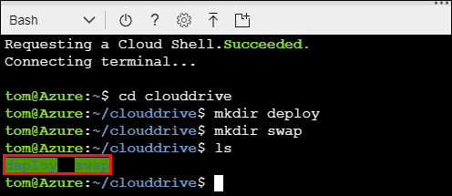
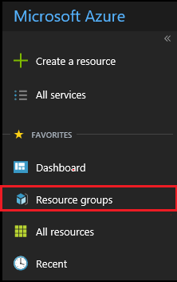
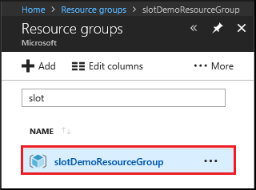
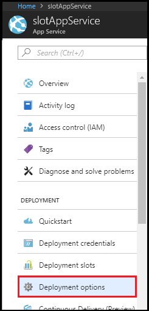
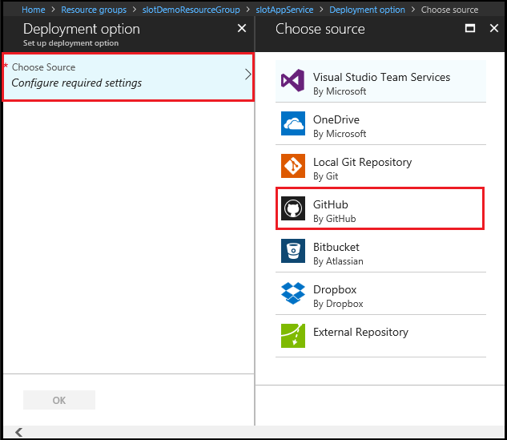
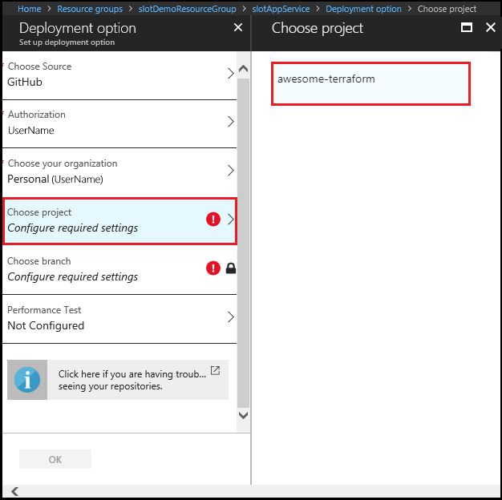
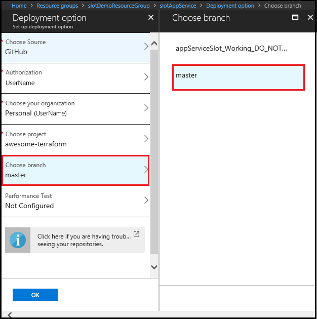
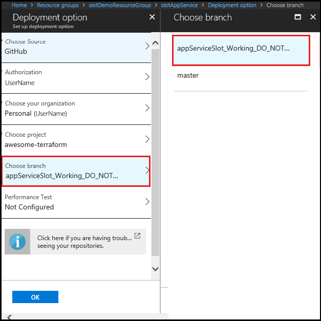
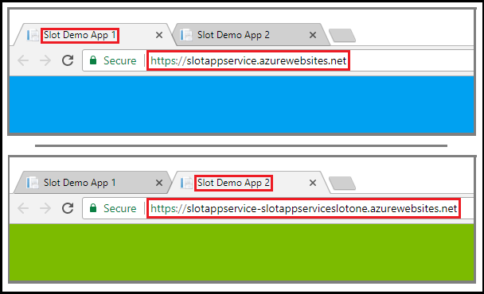
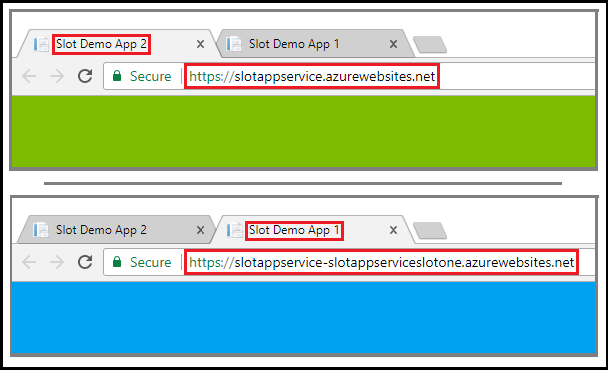

# Tutorial: Provision infrastructure with Azure deployment slots using Terraform

You can use [Azure deployment slots](/azure/app-service/deploy-staging-slots) to swap between different versions of your app. That ability helps you minimize the impact of broken deployments. 

This article illustrates an example use of deployment slots by walking you through the deployment of two apps via GitHub and Azure. One app is hosted in a production slot. The second app is hosted in a staging slot. (The names "production" and "staging" are arbitrary. They can be whatever is appropriate for your scenario.) After you configure your deployment slots, you use Terraform to swap between the two slots as needed.

[!INCLUDE [hashicorp-support.md](includes/hashicorp-support.md)]

## Prerequisites

[!INCLUDE [open-source-devops-prereqs-azure-subscription.md](../includes/open-source-devops-prereqs-azure-subscription.md)]
- **GitHub account**: You need a [GitHub](https://www.github.com) account to fork and use the test GitHub repo.

## Create and apply the Terraform plan

1. Browse to the [Azure portal](https://portal.azure.com).

1. Open [Azure Cloud Shell](/azure/cloud-shell/overview). If you didn't select an environment previously, select **Bash** as your environment.

    

1. Change directories to the `clouddrive` directory.

    ```bash
    cd clouddrive
    ```

1. Create a directory named `deploy`.

    ```bash
    mkdir deploy
    ```

1. Create a directory named `swap`.

    ```bash
    mkdir swap
    ```

1. Use the `ls` bash command to verify that you successfully created both directories.

    

1. Change directories to the `deploy` directory.

    ```bash
    cd deploy
    ```

1. In Cloud Shell, create a file named `deploy.tf`.

    ```bash
    code deploy.tf
    ```

1. Paste the following code into the editor:

    ```hcl
    # Configure the Azure provider
    provider "azurerm" { 
        # The "feature" block is required for AzureRM provider 2.x. 
        # If you are using version 1.x, the "features" block is not allowed.
        version = "~>2.0"
        features {}
    }

    resource "azurerm_resource_group" "slotDemo" {
        name = "slotDemoResourceGroup"
        location = "westus2"
    }

    resource "azurerm_app_service_plan" "slotDemo" {
        name                = "slotAppServicePlan"
        location            = azurerm_resource_group.slotDemo.location
        resource_group_name = azurerm_resource_group.slotDemo.name
        sku {
            tier = "Standard"
            size = "S1"
        }
    }

    resource "azurerm_app_service" "slotDemo" {
        name                = "slotAppService"
        location            = azurerm_resource_group.slotDemo.location
        resource_group_name = azurerm_resource_group.slotDemo.name
        app_service_plan_id = azurerm_app_service_plan.slotDemo.id
    }

    resource "azurerm_app_service_slot" "slotDemo" {
        name                = "slotAppServiceSlotOne"
        location            = azurerm_resource_group.slotDemo.location
        resource_group_name = azurerm_resource_group.slotDemo.name
        app_service_plan_id = azurerm_app_service_plan.slotDemo.id
        app_service_name    = azurerm_app_service.slotDemo.name
    }
    ```

1. Save the file (**&lt;Ctrl>S**) and exit the editor (**&lt;Ctrl>Q**).

1. Now that you've created the file, verify its contents.

    ```bash
    cat deploy.tf
    ```

1. Initialize Terraform.

    ```bash
    terraform init
    ```

1. Create the Terraform plan.

    ```bash
    terraform plan
    ```

1. Provision the resources that are defined in the `deploy.tf` configuration file. (Confirm the action by entering `yes` at the prompt.)

    ```bash
    terraform apply
    ```

1. Close the Cloud Shell window.

1. On the main menu of the Azure portal, select **Resource groups**.

    

1. On the **Resource groups** tab, select **slotDemoResourceGroup**.

    

You now see all the resources that Terraform has created.


## Fork the test project

Before you can test the creation and swapping in and out of the deployment slots, you need to fork the test project from GitHub.

1. Browse to the [awesome-terraform repo on GitHub](https://github.com/Azure/awesome-terraform).

1. Fork the **awesome-terraform** repo.

    

1. Follow any prompts to fork to your environment.

## Deploy from GitHub to your deployment slots

After you fork the test project repo, configure the deployment slots via the following steps:

1. On the main menu of the Azure portal, select **Resource groups**.

1. Select **slotDemoResourceGroup**.

1. Select **slotAppService**.

1. Select **Deployment options**.

    

1. On the **Deployment option** tab, select **Choose Source**, and then select **GitHub**.

    

1. After Azure makes the connection and displays all the options, select **Authorization**.

1. On the **Authorization** tab, select **Authorize**, and supply the credentials that Azure needs to access your GitHub account. 

1. After Azure validates your GitHub credentials, a message appears and says that the authorization process has finished. Select **OK** to close the **Authorization** tab.

1. Select **Choose your organization** and select your organization.

1. Select **Choose project**.

1. On the **Choose project** tab, select the **awesome-terraform** project.

    

1. Select **Choose branch**.

1. On the **Choose branch** tab, select **master**.

    

1. On the **Deployment option** tab, select **OK**.

At this point, you've deployed the production slot. To deploy the staging slot, do the previous steps with the following modifications:

- In step 3, select the **slotAppServiceSlotOne** resource.

- In step 13, select the working branch instead of the master branch.

    

## Test the app deployments

In the previous sections, you set up two slots--**slotAppService** and **slotAppServiceSlotOne**--to deploy from different branches in GitHub. Let's preview the web apps to validate that they were successfully deployed.

1. On the main menu of the Azure portal, select **Resource groups**.

1. Select **slotDemoResourceGroup**.

1. Select either **slotAppService** or **slotAppServiceSlotOne**.

1. On the overview page, select **URL**.

    

1. Depending on the selected app, you see the following results:
    - **slotAppService** web app - Blue page with a page title of **Slot Demo App 1**. 
    - **slotAppServiceSlotOne** web app - Green page with a page title of **Slot Demo App 2**.

    

## Swap the two deployment slots

To test swapping the two deployment slots, do the following steps:
 
1. Switch to the browser tab that's running **slotAppService** (the app with the blue page). 

1. Return to the Azure portal on a separate tab.

1. Open Cloud Shell.

1. Change directories to the **clouddrive/swap** directory.

    ```bash
    cd clouddrive/swap
    ```

1. In Cloud Shell, create a file named `swap.tf`.

    ```bash
    code swap.tf
    ```

1. Paste the following code into the editor:

    ```hcl
    # Configure the Azure provider
    provider "azurerm" { 
        # The "feature" block is required for AzureRM provider 2.x. 
        # If you are using version 1.x, the "features" block is not allowed.
        version = "~>2.0"
        features {}
    }

    # Swap the production slot and the staging slot
    resource "azurerm_app_service_active_slot" "slotDemoActiveSlot" {
        resource_group_name   = "slotDemoResourceGroup"
        app_service_name      = "slotAppService"
        app_service_slot_name = "slotappServiceSlotOne"
    }
    ```

1. Save the file (**&lt;Ctrl>S**) and exit the editor (**&lt;Ctrl>Q**).

1. Initialize Terraform.

    ```bash
    terraform init
    ```

1. Create the Terraform plan.

    ```bash
    terraform plan
    ```

1. Provision the resources that are defined in the `swap.tf` configuration file. (Confirm the action by entering `yes` at the prompt.)

    ```bash
    terraform apply
    ```

1. After Terraform has swapped the slots, return to the browser. Refresh the page. 

The web app in your **slotAppServiceSlotOne** staging slot has been swapped with the production slot and is now rendered in green. 



To return to the original production version of the app, reapply the Terraform plan that you created from the `swap.tf` configuration file.

```bash
terraform apply
```

After the app is swapped, you see the original configuration.

## Next steps

> [!div class="nextstepaction"] 
> [Learn more about using Terraform in Azure](/azure/terraform)