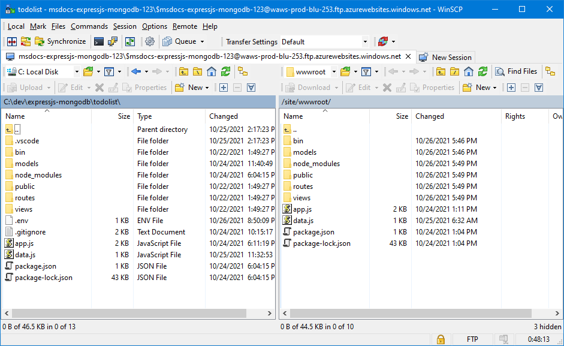

You can deploy your application code to Azure using FTPS (FTP over SSL). Unlike other forms of deployment, FTPS does not offer any form of build automation.  This means When deploying using FTPS, you are responsible for deploying all assets such as source code files, node modules and any other assets your application needs to run.

No configuration is necessary to enable FTPS. The FTPS endpoint for your app is already active. You do need to obtain the FTPS endpoint and FTPS credentials to use which can be done from the Azure portal or the Azure CLI.

### [Azure portal](#tab/deploy-instructions-azportal)

| Instructions    | Screenshot |
|:----------------|-----------:|
| [!INCLUDE [Deploy from VS Code 1](<./deploy-ftps-azportal-1.md>)] | :::image type="content" source="../media/deploy-ftps-azportal-1-240px.png" alt-text="A screenshot showing how to navigate to a web app using the search box in Azure portal." lightbox="../media/deploy-ftps-azportal-1.png"::: |
| [!INCLUDE [Deploy from VS Code 2](<./deploy-ftps-azportal-2.md>)] | :::image type="content" source="../media/deploy-ftps-azportal-2-240px.png" alt-text="A screenshot showing te location of the deployment page and how to configure a web app for local Git deployment in the Azure portal." lightbox="../media/deploy-ftps-azportal-2.png"::: |

### [Azure CLI](#tab/deploy-instructions-azcli)

First, use the [az webapp deployment list-publishing-profiles](/cli/azure/webapp/deployment#az_webapp_deployment_list_publishing_profiles) command to get the FTPS endpoint for the application.

```azurecli
az webapp deployment list-publishing-profiles \
    --name $APP_SERVICE_NAME \
    --resource-group $RESOURCE_GROUP_NAME \
    --query "[?publishMethod == 'FTP'].publishUrl" \
    --output tsv  
```

Then, get the application scoped user credentials by using the [az webapp deployment list-publishing-credentials](/cli/azure/webapp/deployment#az_webapp_deployment_list_publishing_credentials) command.

```azurecli
az webapp deployment list-publishing-credentials \
    --name $APP_SERVICE_NAME \
    --resource-group $RESOURCE_GROUP_NAME \
    --query "{Username:join(\`\u005C\`, [name,publishingUserName]), Password:publishingPassword}" \
    --output table
```

---

The FTPS endpoint and credentials can be used from any FTPS client. After connecting via FTPS, you will be in the *wwwroot* directory.  Copy any necessary files and directories to Azure to deploy the application.  Files and folders that start withe a `.` such as `.vscode`, `.gitignore` and `.env` should not be copied to Azure.


