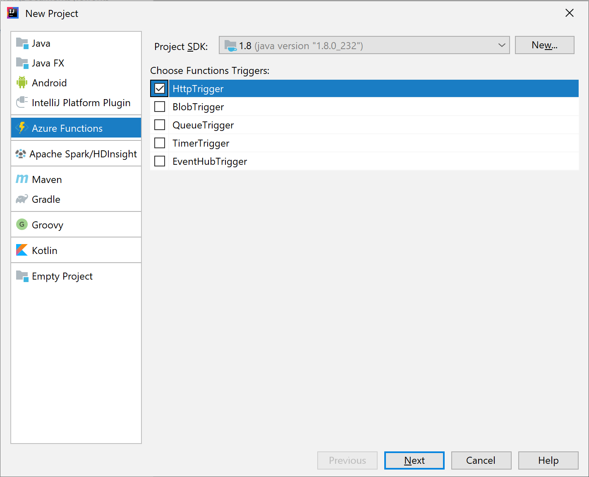
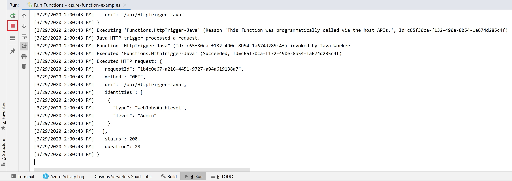
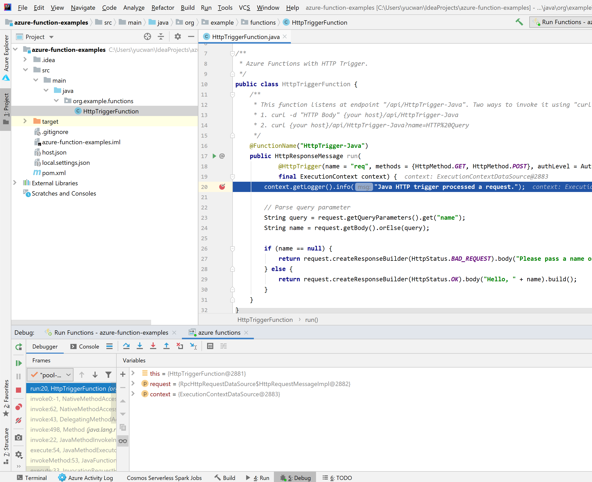
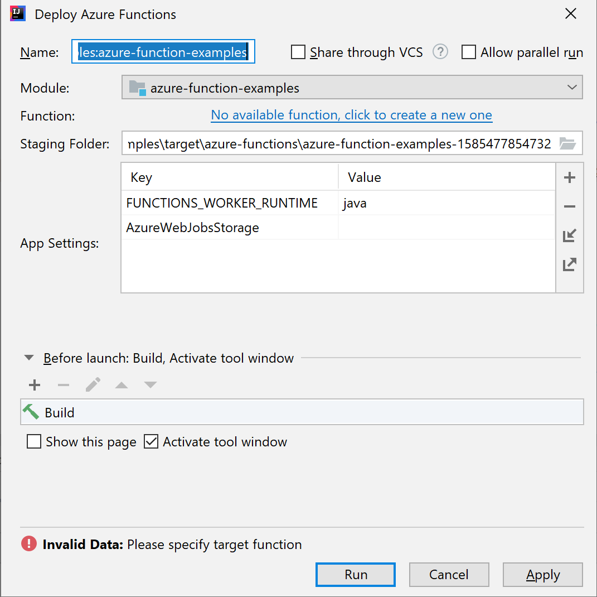
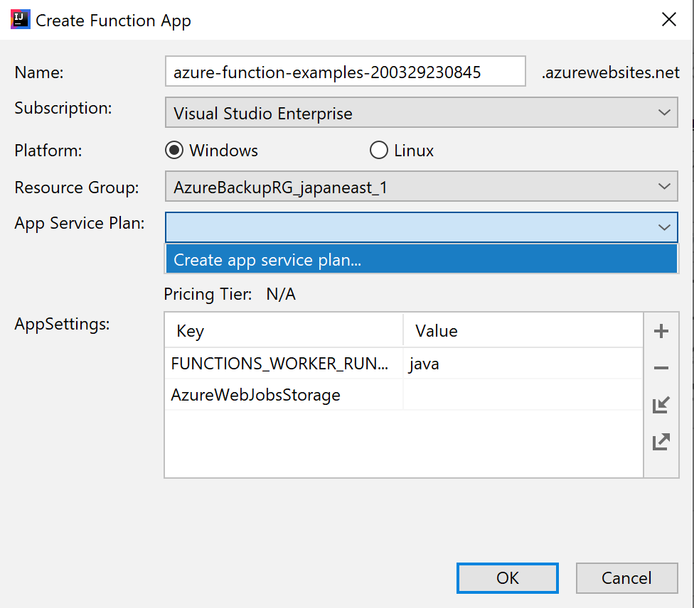
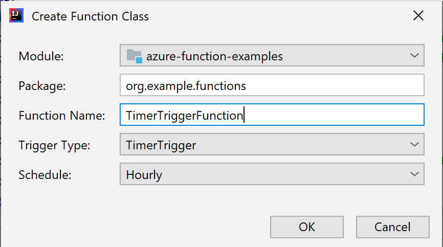

# Quickstart: Create an Azure Functions project using IntelliJ IDEA

In this article, you use IntelliJ IDEA to create a function that responds to HTTP requests. After testing the code locally, you deploy it to the serverless environment of Azure Functions. Completing this quickstart incurs a small cost of a few USD cents or less in your Azure account.

## Configure your environment

Before you get started, make sure you have the following requirements in place:

+ An Azure account with an active subscription. [Create an account for free](https://azure.microsoft.com/free/?ref=microsoft.com&utm_source=microsoft.com&utm_medium=docs&utm_campaign=visualstudio).
+ An [Azure supported Java Development Kit (JDK)](https://aka.ms/azure-jdks) for Java 8
+ An [IntelliJ IDEA](https://www.jetbrains.com/idea/download/) Ultimate Edition or Community Edition installed
+ [Maven 3.5.0+](https://maven.apache.org/download.cgi)
+ Latest [Function Core Tools](https://github.com/Azure/azure-functions-core-tools)

## Installation and Sign-in

1. In IntelliJ IDEA's Settings/Preferences dialog (Ctrl+Alt+S), select **Plugins**. Then, find the **Azure Toolkit for IntelliJ** in the **Marketplace** and click **Install**. After installed, click **Restart** to activate the plugin. 

   ![Azure Toolkit for IntelliJ plugin in Marketplace][marketplace]

2. To sign in to your Azure account, open sidebar **Azure Explorer**, and then click the **Azure Sign In** icon in the bar on top (or from IDEA menu **Tools/Azure/Azure Sign in**).

   ![The IntelliJ Azure Sign In command][I01]

3. In the **Azure Sign In** window, select **Device Login**, and then click **Sign in** ([other sign in options](azure-toolkit-for-intellij-sign-in-instructions.md)).

   ![The Azure Sign In window with device login selected][I02]

4. Click **Copy&Open** in **Azure Device Login** dialog .

   ![The Azure Login Dialog window][I03]

5. In the browser, paste your device code (which has been copied when you click **Copy&Open** in last step) and then click **Next**.

   ![The device login browser][I04]

6. In the **Select Subscriptions** dialog box, select the subscriptions that you want to use, and then click **OK**.

   ![The Select Subscriptions dialog box][I05]

## Create your local project

In this section, you use Azure Toolkit for IntelliJ to create a local Azure Functions project. Later in this article, you'll publish your function code to Azure. 

1. Open IntelliJ Welcome dialog, select *Create New Project* to open a new Project wizard, select *Azure Functions*.

    

1. Select *Http Trigger*, then click *Next* and follow the wizard to go through all the configurations in the following pages; confirm your project location then click *Finish*; Intellj IDEA will then open your new project.

    

## Run the Function App locally

1. Navigate to `src/main/java/org/example/functions/HttpTriggerFunction.java` to see the code generated. Beside the line *17*, you will notice that there is a green *Run* button, click it and select *Run 'azure-function-exam...'*, you will see that your function app is running locally with a few logs.

    

    

1. You can try the function by accessing the printed endpoint from browser, like `http://localhost:7071/api/HttpTrigger-Java?name=Azure`.

    

1. The log is also printed out in your IDEA, now, stop the function by clicking the *stop* button.

    

## Debug the Function App locally

1. Now let's try to debug your Function App locally, click the *Debug* button in the toolbar (if you don't see it, click *View -> Appearance -> Toolbar* to enable Toolbar).

    

1. Click on line *20* of the file `src/main/java/org/example/functions/HttpTriggerFunction.java` to add a breakpoint, access the endpoint `http://localhost:7071/api/HttpTrigger-Java?name=Azure` again , you will find the breakpoint is hit, you can try more debug features like *step*, *watch*, *evaluation*. Stop the debug session by click the stop button.

    

## Deploy your Function App to Azure

1. Right click your project in IntelliJ Project explorer, select *Azure -> Deploy to Azure Functions*

    

1. If you don't have any Function App yet, click *No available function, click to create a new one*.

    

1. Type in the Function app name and choose proper subscription/platform/resource group/App Service plan, you can also create resource group/App Service plan here. Then, keep app settings unchanged, click *OK* and wait some minutes for the new function to be created. After *Creating New Function App...* progress bar disappears.

    

1. Select the function app you want to deploy to, (the new function app you just created will be automatically selected). Click *Run* to deploy your functions.

    

    

## Manage Azure Functions from IDEA

1. You can manage your functions with *Azure Explorer* in your IDEA, click on *Function App*, you will see all your functions here.

    

1. Click to select on one of your functions, and right click, select *Show Properties* to open the detail page. 

    

1. Right click on your Function *HttpTrigger-Java*, and select *Trigger Function*, you will see that the browser is opened with the trigger URL.

    

## Add more Functions to the project

1. Right click on the package *org.example.functions* and select *New -> Azure Function Class*. 

    

1. Fill in the class name *HttpTest* and select *HttpTrigger* in the create function class wizard, click *OK* to create, in this way, you can create new functions as you want.

    
    
    

## Next steps

You've created a Java functions project with an HTTP triggered function, run it on your local machine, and deployed it to Azure. Now, extend your function by...

> [!div class="nextstepaction"]
> [Adding an Azure Storage queue output binding](https://docs.microsoft.com/azure/azure-functions/functions-add-output-binding-storage-queue-java)

[marketplace]:./media/azure-toolkit-for-intellij-create-hello-world-web-app/marketplace.png
[I01]: media/azure-toolkit-for-intellij-sign-in-instructions/I01.png
[I02]: media/azure-toolkit-for-intellij-sign-in-instructions/I02.png
[I03]: media/azure-toolkit-for-intellij-sign-in-instructions/I03.png
[I04]: media/azure-toolkit-for-intellij-sign-in-instructions/I04.png
[I05]: media/azure-toolkit-for-intellij-sign-in-instructions/I05.png
