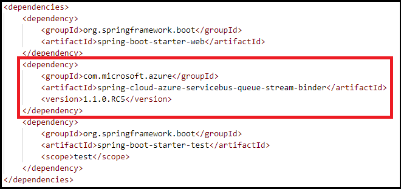
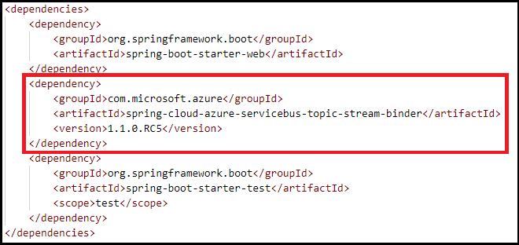

# How to use Spring Cloud Azure Stream Binder for Azure Service Bus

[!INCLUDE [spring-boot-20-note.md](../includes/spring-boot-20-note.md)]

## Overview

Azure provides an asynchronous messaging platform called [Azure Service Bus](https://docs.microsoft.com/azure/service-bus-messaging/service-bus-messaging-overview) ("Service Bus") that is based on the [Advanced Message Queueing Protocol 1.0](http://www.amqp.org/) ("AMQP 1.0") standard. Service Bus can be used across the range of supported Azure platforms.

This article demonstrates how to use the Spring Cloud Stream Binder to send messages to and receive messages from Service Bus `queues` and `topics`.

## Prerequisites

The following prerequisites are required for this article:

1. If you don't already have an Azure subscription, you can activate your [MSDN subscriber benefits](https://azure.microsoft.com/pricing/member-offers/credit-for-visual-studio-subscribers/) or sign up for a [free account](https://azure.microsoft.comfree/).

1. A supported Java Development Kit (JDK), version 8 or later. For more information about the JDKs available for use when developing on Azure, see <https://aka.ms/azure-jdks>.

1. Apache's [Maven](http://maven.apache.org/), version 3.2 or later.

1. If you already have a configured Service Bus queue or topic, ensure that the Service Bus namespace meets the following requirements:

    1. Allows access from all networks
    1. Is Premium (or higher)
    1. Has an access policy with read/write access for your queue and topic

1. If you don't have a configured Service Bus queue or topic, use the Azure portal to [create a Service Bus queue](https://docs.microsoft.com/azure/service-bus-messaging/service-bus-quickstart-portal) or [create a Service Bus topic](https://docs.microsoft.com/azure/service-bus-messaging/service-bus-quickstart-topics-subscriptions-portal). Ensure that the namespace meets the requirements specified in the previous step.

1. If you don't have a Spring Boot application, [create a **Maven** project with the Spring Initializer](https://start.spring.io/). Remember to select **Maven Project** and, under **Dependencies**, add the **Web** dependency.

## Use the Spring Cloud Stream Binder starter

1. Locate the *pom.xml* file in the parent directory of your app; for example:

    `C:\SpringBoot\servicebus\pom.xml`

    -or-

    `/users/example/home/servicebus/pom.xml`

1. Open the *pom.xml* file in a text editor.

1. Add the following code block under the **&lt;dependencies>** element, depending on whether you're using a Service Bus queue or topic:

    **Service Bus queue**

    ```xml
    <dependency>
        <groupId>com.microsoft.azure</groupId>
        <artifactId>spring-cloud-azure-servicebus-queue-stream-binder</artifactId>
        <version>1.1.0.RC5</version>
    </dependency>
    ```

    

    **Service Bus topic**

    ```xml
    <dependency>
        <groupId>com.microsoft.azure</groupId>
        <artifactId>spring-cloud-azure-servicebus-topic-stream-binder</artifactId>
        <version>1.1.0.RC5</version>
    </dependency>
    ```

    

1. Save and close the *pom.xml* file.

## Configure the app for your service bus

You can configure your app based on either the connection string or a credentials file. This tutorial uses a connection string. For more information about using credential files, see the [Spring Cloud Azure Stream Binder for Service Bus queue Code Sample](https://github.com/microsoft/spring-cloud-azure/tree/release/1.1.0.RC4/spring-cloud-azure-samples/servicebus-queue-binder-sample#credential-file-based-usage
) and [Spring Cloud Azure Stream Binder for Service Bus topic Code Sample](https://github.com/microsoft/spring-cloud-azure/tree/release/1.1.0.RC4/spring-cloud-azure-samples/servicebus-topic-binder-sample#credential-file-based-usage).

1. Locate the *application.properties* file in the *resources* directory of your app; for example:

   `C:\SpringBoot\servicebus\src\main\resources\application.properties`

   -or-

   `/users/example/home/servicebus/src/main/resources/application.properties`

1. Open the *application.properties* file in a text editor.

1. Append the appropriate code to the end of the *application.properties* file depending on whether you're using a Service Bus queue or topic. Use the [Field Descriptions table](#fd) to replace the sample values with the appropriate properties for your service bus.

    **Service Bus queue**

    ```yaml
    spring.cloud.azure.servicebus.connection-string=<ServiceBusNamespaceConnectionString>
    spring.cloud.stream.bindings.input.destination=examplequeue
    spring.cloud.stream.bindings.output.destination=examplequeue
    spring.cloud.stream.servicebus.queue.bindings.input.consumer.checkpoint-mode=MANUAL
    ```

    **Service Bus topic**

    ```yaml
    spring.cloud.azure.servicebus.connection-string=<ServiceBusNamespaceConnectionString>
    spring.cloud.stream.bindings.input.destination=exampletopic
    spring.cloud.stream.bindings.input.group=examplesubscription
    spring.cloud.stream.bindings.output.destination=exampletopic
    spring.cloud.stream.servicebus.topic.bindings.input.consumer.checkpoint-mode=MANUAL
    ```

    **<a name="fd">Field Descriptions</a>**

    |                                        Field                                   |                                                                                   Description                                                                                    |
    |--------------------------------------------------------------------------------|----------------------------------------------------------------------------------------------------------------------------------------------------------------------------------|
    |               `spring.cloud.azure.servicebus.connection-string`                |                                        Specify the connection string you obtained in your service bus namespace from the Azure portal.                                   |
    |               `spring.cloud.stream.bindings.input.destination`                 |                            Specify the Service Bus queue or Service Bus topic you used in this tutorial.                         |
    |                  `spring.cloud.stream.bindings.input.group`                    |                                            If you used a Service Bus topic, specify the topic subscription.                                |
    |               `spring.cloud.stream.bindings.output.destination`                |                               Specify the same value used for input destination.                        |
    | `spring.cloud.stream.servicebus.queue.bindings.input.consumer.checkpoint-mode` |                                                       Specify `MANUAL`.                                                   |
    | `spring.cloud.stream.servicebus.topic.bindings.input.consumer.checkpoint-mode` |                                                       Specify `MANUAL`.                                                   |

1. Save and close the *application.properties* file.

## Implement basic Service Bus functionality

In this section, you create the necessary Java classes for sending messages to your service bus.

### Modify the main application class

1. Locate the main application Java file in the package directory of your app; for example:

    `C:\SpringBoot\servicebus\src\main\java\com\example\ServiceBusBinderApplication.java`

   -or-

   `/users/example/home/servicebus/src/main/java/com/example/ServiceBusBinderApplication.java`

1. Open the main application Java file in a text editor.

1. Append the following lines to the file:

    ```java
    package com.example;

    import org.springframework.boot.SpringApplication;
    import org.springframework.boot.autoconfigure.SpringBootApplication;

    @SpringBootApplication
    public class ServiceBusBinderApplication {

        public static void main(String[] args) {
            SpringApplication.run(ServiceBusBinderApplication.class, args);
        }
    }
    ```

1. Save and close the file.

### Create a new class for the source connector

1. Using a text editor, create a Java file named *StreamBinderSource.java* in the package directory of your app.

1. Add the following lines of code to the new file:

    ```java
    package com.example;

    import org.springframework.beans.factory.annotation.Autowired;
    import org.springframework.cloud.stream.annotation.EnableBinding;
    import org.springframework.cloud.stream.messaging.Source;
    import org.springframework.messaging.support.GenericMessage;
    import org.springframework.web.bind.annotation.PostMapping;
    import org.springframework.web.bind.annotation.RequestParam;
    import org.springframework.web.bind.annotation.RestController;

    @EnableBinding(Source.class)
    @RestController
    public class StreamBinderSource {

        @Autowired
        private Source source;

        @PostMapping("/messages")
        public String postMessage(@RequestParam String message) {
            this.source.output().send(new GenericMessage<>(message));
            return message;
        }
    }
    ```

1. Save and close the *StreamBinderSources.java* file.

### Create a new class for the sink connector

1. Using a text editor, create a Java file named *StreamBinderSink.java* in the package directory of your app.

1. Add the following lines of code to the new file:

    ```java
    package com.example;

    import com.microsoft.azure.spring.integration.core.AzureHeaders;
    import com.microsoft.azure.spring.integration.core.api.Checkpointer;
    import org.springframework.cloud.stream.annotation.EnableBinding;
    import org.springframework.cloud.stream.annotation.StreamListener;
    import org.springframework.cloud.stream.messaging.Sink;
    import org.springframework.messaging.handler.annotation.Header;

    @EnableBinding(Sink.class)
    public class StreamBinderSink {

        @StreamListener(Sink.INPUT)
        public void handleMessage(String message, @Header(AzureHeaders.CHECKPOINTER) Checkpointer checkpointer) {
            System.out.println(String.format("New message received: '%s'", message));
            checkpointer.success().handle((r, ex) -> {
                if (ex == null) {
                    System.out.println(String.format("Message '%s' successfully checkpointed", message));
                }
                return null;
            });
        }
    }
    ```

1. Save and close the *StreamBinderSink.java* file.

## Build and test your application

1. Open a command prompt.

1. Change the directory to the location of your *pom.xml* file; for example:

    `cd C:\SpringBoot\servicebus`

    -or-

    `cd /users/example/home/servicebus`

2. Build your Spring Boot application with Maven and run it:

    ```shell
    mvn clean spring-boot:run
    ```

3. Once your application is running, you can use *curl* to test your application:

    ```shell
    curl -X POST localhost:8080/messages?message=hello
    ```

    You should see "hello" posted to your application's log:

    ```shell
    New message received: 'hello'
    Message 'hello' successfully checkpointed
    ```

## Clean up resources

When no longer needed, use the [Azure portal](http://ms.portal.azure.com/) to delete the resources created in this article to avoid unexpected charges.

## Next steps

To learn more about Spring and Azure, continue to the Spring on Azure documentation center.

> [!div class="nextstepaction"]
> [Spring on Azure](/java/azure/spring-framework)