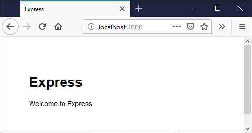

# Create the app code using Express

[Previous step: prerequisites](tutorial-vscode-azure-cli-node-01.md)

In this step, you create a simple Node.js app with [Express](https://www.expressjs.com) using the [Express Generator](https://expressjs.com/en/starter/generator.html).

1. Install the Express Generator using the following command from a terminal or command prompt. (The `-g` switch installs the Express Generator globally on your computer so you can run it from anywhere.)

    ```bash
    npm install -g express-generator
    ```

1. Scaffold a new Express app called "myExpressApp" by running the following command. (The `--view pug --git` parameters tell the generator to use the [pug](https://pugjs.org/api/getting-started.html) template engine, formerly known as Jade, and to create a *.gitignore* file.)

    ```bash
    express myExpressApp --view pug --git
    ```

1. Navigate into the app folder and install the app's dependencies by running the following commands:

    ```bash
    cd myExpressApp
    npm install
    ```

1. Start the app server by running the following command:

    ```bash
    npm start
    ```

1. Open a browser to [http://localhost:3000](http://localhost:3000) to see the running app:

    

1. When you're done testing the app, stop the server by pressing **Ctrl**+**C** in the terminal where you ran `npm start`.

> [!div class="nextstepaction"]
> [I create the app](tutorial-vscode-azure-cli-node-03.md) [I ran into an issue](https://www.research.net/r/PWZWZ52?tutorial=node-deployment&step=express)
