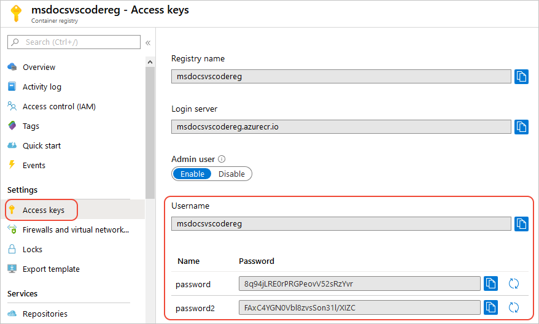
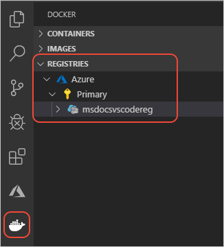

# Use a container registry

[Previous step: prerequisites](tutorial-vscode-docker-node-01.md)

In this step, you set up a suitable container registry for your app image. Container-capable hosting services like Azure App Service then pull the images from the registry.

This tutorial uses the [Azure Container Registry](https://azure.microsoft.com/en-us/services/container-registry/) (ACR), a private, secure, hosted registry for your images. The tools and processes shown here, however, also work with other registries like [Docker Hub](https://hub.docker.com/).

## Create an Azure Container Registry

1. Sign in to the [Azure portal](https://portal.azure.com), then select **Create a resource** > **Containers** > **Container Registry**.

    

1. In the **Create container registry** form that appears, enter appropriate values:

    - **Registry name** must be unique across Azure and contain 5-50 alphanumeric characters.
    - Select your subscription in **Subscription**.
    - **Resource group** needs to be unique only within your subscription.
    - In location, **Location**, selecting a region close to you.
    - Leave **Admin user** as **Enable**.
    - Select **Basic** for **SKU**.

    

1. Select **Create** to create the registry.

1. Once the registry is created, open the notifications on the portal and select **Go to Resource** for the registry:

    

1. On the registry page, select **Access Keys**, then under **Admin User** select **Enable**.

    

1. At a command prompt or terminal, log in to Docker using the command below, replacing `<registry_name>` with the name of your registry, and `<username>` and `<password>` from with the values shown in the Azure portal for the admin user:

    ```bash
    docker login <registry_name>.azurecr.io -u <username> -p <password>
    ```

1. In Visual Studio Code, open the **Docker** explorer and ensure that the registry endpoint that you just setup is visible under **Registries**:

    

> [!div class="nextstepaction"]
> [I've created a registry](tutorial-vscode-docker-node-03.md) [I ran into an issue](https://www.research.net/r/PWZWZ52?tutorial=docker-extension&step=create-registry)
