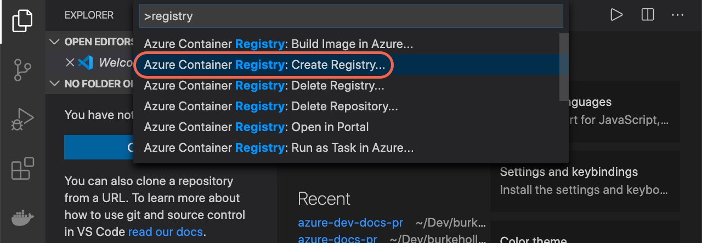
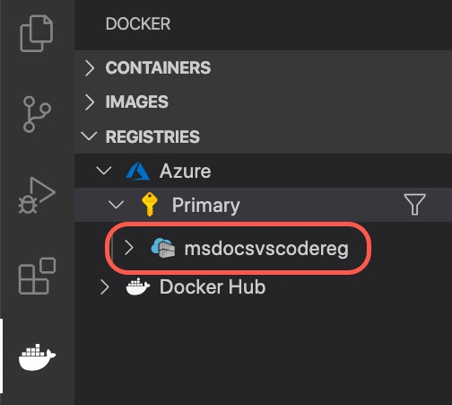

# Use a container registry

[Previous step: Introduction and prerequisites](tutorial-vscode-docker-node-01.md)

In this step, you set up a suitable container registry for your app image. Container-capable hosting services like Azure App Service then pull the images from the registry.

This tutorial uses the [Azure Container Registry](https://azure.microsoft.com/services/container-registry/) (ACR), a private, secure, hosted registry for your images. The tools and processes shown here, however, also work with other registries like [Docker Hub](https://hub.docker.com/).

## Create an Azure Container Registry

1. In Visual Studio Code, press <kbd>F1</kbd> to open the **Command Palette**.

1. Type "registry" in the search box and select **Azure Container Registry: Create Registry**.

   

1. Provide the following values in the prompts...

    - **Registry name** must be unique across Azure and contain 5-50 alphanumeric characters.
    - Select **Basic** for **SKU**.
    - **Resource group** needs to be unique only within your subscription.
    - In location, **Location**, selecting a region close to you.

    Visual Studio Code will begin the process of creating the registry in Azure. When complete, you will see a notification like the one below, confirming that the registry has been successfully created.

   

1. Open the **Docker** explorer and ensure that the registry endpoint that you just setup is visible under **Registries**:

   

## Sign in to Azure Container Registry

While you can see your Azure registries in the Docker extension, you won't be able to push images to them until you log-in to Azure Container Registry (ACR).

1. Press <kbd>Ctrl + `</kbd> to open the **Integrated Terminal** in VS Code.

1. Execute the following Azure CLI command to login to ACR. Replace "<your-registry-name>" with the name of the registry you just created.

    ```bash
    az acr login --name <your-registry-name>
    ```

> [!div class="nextstepaction"]
> [I've created a registry](tutorial-vscode-docker-node-03.md) [I ran into an issue](https://www.research.net/r/PWZWZ52?tutorial=docker-extension&step=create-registry)
