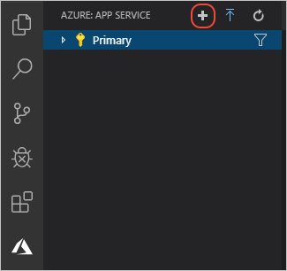
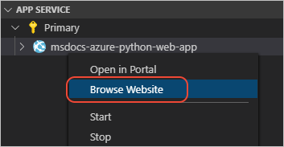

# Create the App Service

[Previous step: prerequisites](tutorial-deploy-app-service-on-linux-01.md)

1. In the **Azure: App Service** explorer, select the **+** command to create a new App Service, or open the Command Palette (**F1**) and select **Azure App Service: Create New Web App**. (In App Service terminology, a "web app" is a **host** for web app code, not the app code itself.)

    

1. In the prompts that follow:

    - Enter a name for your app, which must be globally unique on App Service; typically you use your name or company name followed by the app name.
    - Select **Linux** for the operating system.
    - Select **[Preview] Python 3.7** as the runtime.

1. After a short time you see a message that the new App Service was created, along with the question **Deploy to web app?**. Answer **No** at this point because you need to change the deployment source to Git. Otherwise the "Deploy to Web App" command only copies your files to the server using a ZIP file and doesn't install your dependencies.

    

1. To confirm that the App Service is running properly, expand your subscription in the **Azure: App Service** explorer, right-click the App Service name, and select **Browse website**:

    

1. Because you haven't deployed your own code to the App Service yet, you should see only the default app:

    

## (Optional) Upload an environment variable definitions file

If you have an environment variable definitions file, you can use that file to configure the App Service environment as well. (To learn more about such files, which typically have the *.env* extension, refer to [Visual Studio Code - Python Environments](https://code.visualstudio.com/docs/python/environments#environment-variable-definitions-file).)

1. In the **Azure: App Service** explorer, expand the node for the desired App Service, then right-click the **Application Settings** node and select **Upload Local Settings**.

1. VS Code prompts you for the location of your *.env* file, then uploads it to the App Service.

1. Once the upload is complete, you can expand the **Application Settings** node to see the individual values. You can also view them on the Azure portal by navigating to the App Service and selecting **Configuration**.

1. If you create settings directly on the Azure portal, you can save them in a definitions file by right-clicking the **Application Settings** node and selecting **Download Remote Settings**. This process makes sure that you have those settings in your repository and not only on the portal.

> [!div class="nextstepaction"]
> [Next: Create the App Service](tutorial-deploy-app-service-on-linux-03.md) [I ran into an issue](https://www.research.net/r/PWZWZ52?tutorial=vscode-appservice-python&step=02-create-app-service)
