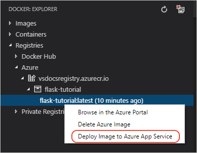

# Tutorial: Deploy a container image to Azure App Service

[Previous step: prerequisites](tutorial-deploy-containers-01.md)

With a container image in a registry, you can use the Docker extension in VS Code to easily set up an Azure App Service running the container.

1. In the **Docker** explorer, expand **Registries**, expand the node for your registry (such as **Azure**), then expand the node for your image name until you see the image with the `:latest` tag.

    

1. Right-click the image and select **Deploy Image to Azure App Service**.

    

1. Follow the prompts to select an Azure subscription, select or specify a resource group, specify a region, configure an App Service Plan (B1 is the least expensive), and specify a name for the site. The animation below illustrates the process.

    

    A **Resource Group** is a named collection the different resources that make up an app. By assigning all the app's resources to a single group, you can easily manage those resources as a single unit. (For more information, see the [Azure Resource Manager overview](https://docs.microsoft.com/azure/azure-resource-manager/resource-group-overview) in the Azure documentation.)

    An **App Service Plan** defines the physical resources (an underlying virtual machine) that hosts the running container. For this tutorial, B1 is the least expensive plan that supports Docker containers. (For more information, see [App Service plan overview](https://docs.microsoft.com/azure/app-service/azure-web-sites-web-hosting-plans-in-depth-overview) in the Azure documentation.)

    The name of the App Service must be unique across all of Azure, so you typically use a company or personal name. For production sites, you typically configure the App Service with a separately registered domain name.

1. Creating the app service takes a few minutes, and you see progress in VS Code's Output panel.

1. Once completed, you **must** also add a setting named `WEBSITES_PORT` (notice the plural "WEBSITES") to the App Service to specify the port on which the container is listening. (If you're using an image from the [Create a Python container in VS Code](https://code.visualstudio.com/docs/python/tutorial-create-container) tutorial, for example, the port is 5000 for Flask and 8000 for Django ). To set `WEBSITES_PORT`, switch to the **Azure: App Service** explorer, expand the node for your new App Service (refresh if necessary), then right-click **Application Settings** and select **Add New Setting**. At the prompts, enter `WEBSITES_PORT` as the key and the port number for the value.

    

1. The App Service restarts automatically when you change settings. You can also right-click the App Service and select **Restart** at any time.

1. After the service has restarted, browse the site at `http://<name>.azurewebsites.net`. You can use **Ctrl**+ click (or **Cmd** + click on macOS) on the URL in the Output panel, or right-click the App Service in the **Azure: App Service** explorer and select **Browse Website**.

> [!div class="nextstepaction"]
> [I deployed the image](tutorial-deploy-containers-03.md)

[I ran into an issue](https://www.research.net/r/PWZWZ52?tutorial=vscode-appservice-containers&step=02-deploy-container)
